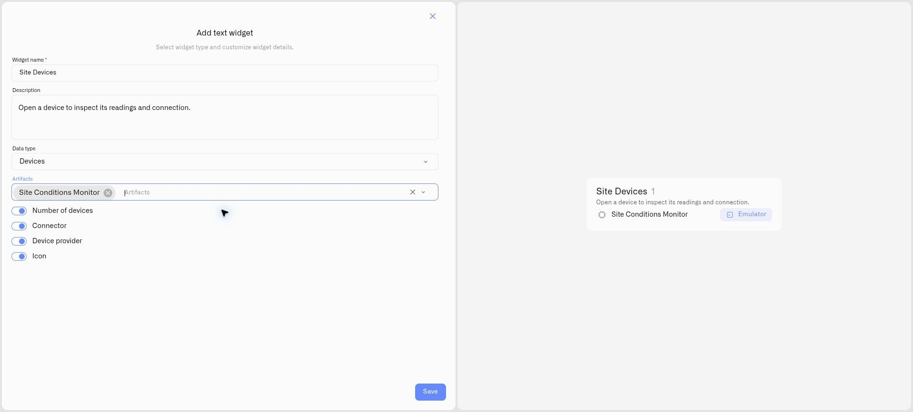
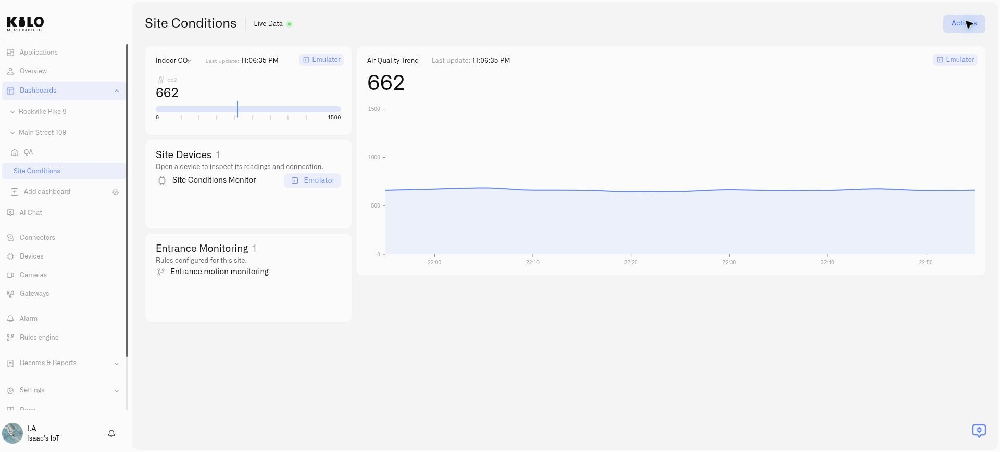

# Text widget

A **Text widget** adds headings and instructions to an operations dashboard. It can also list selected devices, rules, or alarm definitions, so operators can see the equipment and automation behind the readings they monitor.

Use a device list next to a site’s air-quality charts, a rule list for entrance monitoring, and an alarm list showing the severity of the definitions used by the team. These lists describe configured resources; they do not replace measurement widgets or the alarm inbox.

## Add a heading or a resource list

1. Open the dashboard and choose **Actions → Edit dashboard**. You need permission to edit it and access to the resources you want to display.
2. Choose **Add widget → Text**.
3. Enter **Widget name**, the heading shown on the tile, and an optional **Description** below it.
4. Select **Data type**. Keep **None** for a heading and note, or choose **Devices**, **Rules**, or **Alarms** for a resource list.
5. For a list, select the entries in **Artifacts**. You can choose several; remove an individual selection to leave it out.
6. Set the display options below, check the preview, and select **Save**.
7. Move or resize the tile, then **Save** the dashboard layout.

<figure><figcaption>
Choose the data type and resources, then check the preview before saving.
</figcaption></figure>

## Display options

| Data type | Options |
|---|---|
| None | Widget name and optional description only. |
| Devices | **Number of devices**, **Connector**, **Device provider**, and **Icon**. |
| Rules | **Number of rules** and **Icon**. |
| Alarms | **Number of alarms**, **Alarm severity**, and **Icon**. |

Counts refer to the selected resources available to the widget. An alarm count is the number of selected alarm definitions, not the number of open incidents. **Alarm severity** displays the definition's severity. Connector and provider details help distinguish device sources where that information is available.

<figure><figcaption>
Keep the selected resources beside the readings they support.
</figcaption></figure>

## Use and maintain the list

Open a device by selecting its row in the saved dashboard. Rules and alarms are displayed as list entries; open their platform sections to manage them. Adding a resource to a widget does not change its Application membership or start its automation.

Entries follow the configured selection order. If a selected resource is deleted or is no longer returned to the widget, its entry is omitted and the count reflects the remaining available entries. Edit **Artifacts** to revise the selection as your setup changes.

Organization resource lists are hidden in public/kiosk viewing. Use ordinary headings and notes for information that must appear on a public display.

## When alarm choices do not load

The **Alarms** data type can show **No options** in **Artifacts** even when the organization has alarm definitions. If this happens, use **Alarm → Alarm definitions** to inspect them and **Alarm** to monitor incidents. Device and rule lists can still be configured separately. Do not use an empty alarm-list tile as evidence that the site has no alarms.

## Related tasks

- [Adding Widgets](../adding-widgets.md)
- [Application dashboards](../../applications/using-application-dashboards.md)
