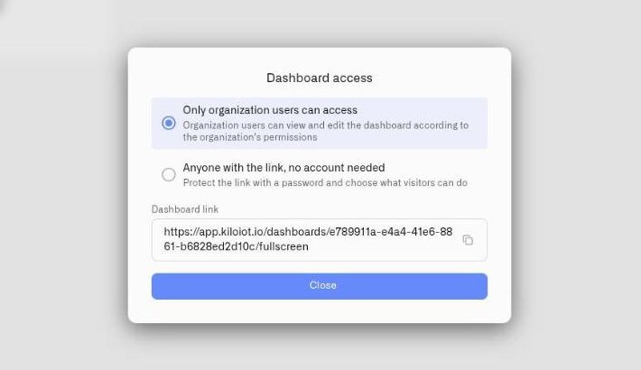
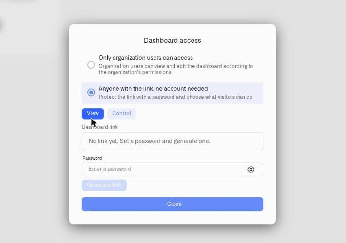

# Sharing Dashboards

Not everyone who needs to see your data should have an account on the Kilo IoT Server. An auditor reviewing twelve months of cold chain records, a client checking the conditions in the warehouse space they lease, a tablet bolted to a wall on the factory floor — none of them need a seat in your organization, and provisioning one for them is administrative overhead you will have to unwind later.

A **share link** solves this. It publishes one dashboard — not your deployment, not your device inventory, not your settings — behind a password you set, at a URL you can rotate or destroy at any moment. Visitors open the link, enter the password, and get the dashboard in a full-screen, kiosk-style view. They see live data. They see nothing else.

The link is scoped to a single dashboard and carries its own permission level, independent of your organization's access policies. That separation is the point: sharing a dashboard with an outside party never widens what that party can reach.

This page covers creating, protecting, rotating, and revoking share links. To build the dashboard you intend to share, see [Creating Dashboards](creating-dashboards.md) and [Adding Widgets](adding-widgets.md).

## Opening the sharing dialog

1. Open the dashboard you want to share.
2. Click the **actions menu** (three-dot icon) in the dashboard header.
3. Select **Share dashboard**.

The **Dashboard access** dialog opens, with the helper text **"Protect the link with a password and choose what visitors can do"**.

Before you have created a link, the dialog shows **"No link yet. Set a password and generate one."** — nothing is published, and nothing is reachable from outside your organization, until you generate a link yourself.

## Choosing who can reach the dashboard

The dialog offers two access options:

- **Only organization users can access** — described as *"Organization users can view and edit the dashboard according to the organization's permissions"*. This is the closed state. The dashboard behaves exactly as it always has: your organization's permissions decide who sees it and who can change it. No external link exists.
- **Anyone with the link, no account needed** — this is the shared state. Anyone holding the link and the password reaches the dashboard without signing in.

Treat the second option the way you would treat any credential you hand outside the building. The link is not guessable, but it is bearer access — whoever has it, and the password, gets in. That is what makes it useful for a contractor's tablet, and what makes rotation discipline matter.

<figure><figcaption></figcaption></figure>

## Choosing what visitors can do

Once the dashboard is shared by link, choose the permission level the link carries:

- **View** — *"Can view the dashboard, but cannot edit widgets"*. Visitors read the data. They cannot reconfigure a widget, change a threshold, or alter the dashboard in any way.
- **Control** — visitors can operate devices from the dashboard's [Control widgets](adding-widgets/control-widget.md).

**Control is an actuation permission, not a viewing permission.** A Control link lets an anonymous visitor press a button, throw a switch, or move a slider that sends a real command to real hardware. If the dashboard carries a Control widget bound to a ventilation damper, a pump, or a door release, then everyone with that link and password can operate it.

Grant Control only when operating the equipment *is* the job the link exists for — a floor tablet that adjusts a line, a maintenance station that resets a machine. For everyone whose job is to look at numbers, use **View**. If a dashboard mixes read-only monitoring with control surfaces and you only want to expose the monitoring half, build a separate dashboard with the Control widgets left out and share that one instead.

## Setting the password and generating the link

The link cannot exist without a password — there is no unprotected mode.

1. In the **Password** field (placeholder **"Enter a password"**), enter the password visitors will use.
2. A minimum length is enforced. If the password is too short, the dialog rejects it and tells you the minimum number of characters required.
3. Click **Generate link**.
4. The link is created and a toast confirms: **"Share link created"**.
5. Click **Copy link**. A toast confirms **"Link copied to clipboard"**.

The link points at a URL of the form `/dashboards/{dashboard-id}/fullscreen?t=…` and opens the dashboard full screen — no sidebar, no navigation, no platform chrome. That kiosk-style presentation is deliberate: it is what makes the link suitable for a wall display in an operations center or a permanently mounted tablet, not just for sending to a person.

Send the link and the password over separate channels. A link pasted into an email alongside its own password is a single interception away from being useless as a control.

<figure><figcaption></figcaption></figure>

## Changing the password

To rotate the password while keeping the same URL in circulation:

1. Open **Share dashboard** on the dashboard.
2. Enter the new password in the **Password** field.
3. Click **Change password**. A toast confirms **"Password changed"**.

Everyone still holding the link now needs the new password. The URL itself is unchanged, so displays and bookmarks pointing at it stay valid — you only redistribute the password. This is the lighter of the two rotation options and the right one when the link itself has not leaked.

## Regenerating the link

Regenerating mints a new URL and destroys the old one.

1. Open **Share dashboard** on the dashboard.
2. Click **Regenerate link**.
3. A confirmation appears: **"Regenerate share link?"** — **"The previous link will stop working immediately."**
4. Confirm. A toast confirms **"Share link regenerated"**.
5. Click **Copy link** to copy the new URL and distribute it to the people who should still have access.

The break is immediate and total. Anything pointing at the old URL — a bookmarked tab on a wall display, a link in a contractor's ticket, a saved page on a floor tablet — stops working the moment you confirm. That is the intended behavior, but it means regeneration is a planned operation: know which screens you will need to re-point before you click.

**When to regenerate rather than change the password:** regenerate when the URL itself may be in the wrong hands — a device was lost, a link was forwarded outside the intended group, or a person with the link has left the project. Changing the password alone does not help if the URL has spread further than you can account for.

## Revoking the link

Revoking ends external access entirely and cannot be undone.

1. Open **Share dashboard** on the dashboard.
2. Click **Revoke**.
3. A confirmation appears: **"Revoke share link?"** — **"The link will stop working immediately and cannot be restored."**
4. Click **Yes, revoke**. A toast confirms **"Share link revoked"**.

The dashboard itself is untouched — its widgets, data, and history all remain, and your organization's users keep working with it normally. Only outside access ends.

Revoke rather than regenerate when the sharing arrangement is over: the audit closed, the contract ended, the pilot finished. Leaving a live link in place for a relationship that has ended is the most common way dashboard access outlives its reason to exist.

## What visitors see

When someone opens the link, the platform asks for the password: **"Password required"** — **"This dashboard is protected. Enter the password to continue."** After entering the correct password, the dashboard loads full screen with live data.

Messages a visitor may encounter:

| Message | What it means |
|---|---|
| **"Wrong password"** | The password is incorrect. If you rotated it with **Change password**, send the visitor the current one. |
| **"Too many attempts. Please try again later."** | Repeated failed attempts have been rate-limited. Access recovers after a wait — this is brute-force protection working as intended. |
| **"This share link is no longer valid"** | The link was revoked, or regenerated and replaced. Send the current link, or generate a new one. |
| **"This dashboard session has expired. Please reopen the link you were given."** | The visitor's session has aged out. Reopening the link and re-entering the password restores access. On an unattended wall display, this is what you will see if the screen has been sitting on the dashboard for a long period. |
| **"Access denied"** / **"You do not have permission to access this dashboard"** | The visitor is attempting something the link's permission level does not allow — most often operating a control on a **View** link. If they legitimately need to actuate devices, raise the link to **Control**. |

## Share to TV — a different mechanism

The same area offers a separate, longer-standing option: **Share to TV**, described as *"Open this dashboard on a TV or tablet with a non-expiring key. Create an API key in Settings → API Keys (with device control scope to operate devices), then paste it here."*

The two are for different problems. A **share link** is password-protected, revocable, and session-based — it is for *people*: an auditor, a client, a contractor, someone whose access should end when their reason for having it ends. **Share to TV** is built from an [API key](../settings/api-keys.md) and does not expire — it is for a *permanently mounted display* that should come back up on its own after a power cut without anyone walking over to re-enter a password. If that display needs to operate devices rather than just show them, its API key needs device control scope.

Reach for the share link by default. Reach for Share to TV when the screen is fixed, unattended, and expected to stay logged in indefinitely.

## Tips and best practices

- **Match the permission to the job.** View for anyone who reads data; Control only where operating equipment is the actual purpose of the screen. The default assumption for an outside party should be View.
- **Split dashboards by audience, not by convenience.** A client-facing dashboard with only the metrics that client is entitled to see is safer and clearer than sharing your internal operations view and hoping nobody scrolls. Building a second, narrower dashboard costs minutes — see [Creating Dashboards](creating-dashboards.md).
- **Separate the link from the password in transit.** Different channel, different message.
- **Rotate on personnel change.** When someone with a link leaves the project or the contractor rotates staff, regenerate the link. Do not rely on them forgetting the URL.
- **Keep an inventory of what is shared.** Share links are per-dashboard and easy to create; that is exactly why they accumulate. Periodically open the dashboards you have shared and confirm each live link still has a reason to exist. Revoke the ones that do not.
- **Plan regeneration around your displays.** Know which wall screens and tablets point at a link before you break it, so you are not chasing dead screens across a site afterward.
- **Prefer Change password for routine hygiene.** It rotates the secret without disturbing any mounted display that already has the URL loaded.

## Related pages

- [Creating Dashboards](creating-dashboards.md) — Build and name the dashboard before you share it.
- [Adding Widgets](adding-widgets.md) — Choose what a visitor will actually see.
- [Control Widget](adding-widgets/control-widget.md) — What a Control link lets a visitor operate.
- [API Keys](../settings/api-keys.md) — Create the scoped key that Share to TV uses.
</content>
</invoke>
