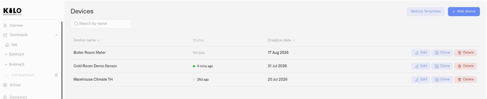

# Devices

Every device registered on the Kilo IoT Server becomes a Digital Twin — a complete digital representation that captures the device's identity, sensor configuration, telemetry history, photos, and connection binding in one persistent model. Most twins are backed by physical hardware; some are driven by the platform itself, so a deployment can be built and proven before any sensor is installed.

The Devices section covers the full device lifecycle, from registration to day-to-day operation.

<figure><figcaption></figcaption></figure>

## In this section

- [Registering Devices](registering-devices.md) — the shared registration flow, and the fields each connector type asks for.
- [Device Management](device-management.md) — editing a registered device, copying one, and re-binding its connection.
- [Device Diagnostics](device-diagnostics.md) — why a device is silent: reception status, pipeline, and the event feed.
- [Metric Templates](metric-templates.md) — units, metric keys and templates that normalize raw sensor data across manufacturers.
- [Payload Decoding and Connector Keys](payload-decoding.md) — see which fields a device reports and what values they carry.
- [MIOTY Devices](mioty-devices.md) and [MIOTY Blueprints](mioty-blueprints.md) — commissioning MIOTY endpoints and decoding their payloads.
- [Emulated Devices](emulated-devices.md) — devices that generate their own data, so you can build before the hardware arrives.
- [Device Commands](commands/README.md) — defining, confirming and dispatching the actions a device can perform.
