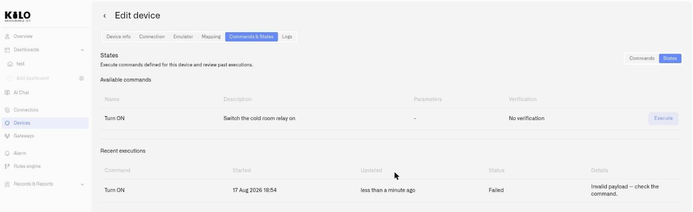

# Executing Commands

Once a device has commands defined, the **States** sub-tab of the **Commands & States** tab is where you operate it. It shows what you can run, lets you dispatch a command with its parameters, and records the outcome of everything you've sent.

<figure><figcaption></figcaption></figure>

## Available commands

The **Available commands** table lists every command defined on the device:

| Column | Shows |
| --- | --- |
| **Name** | The command's action-oriented name |
| **Description** | What it does |
| **Parameters** | How many typed inputs it takes |
| **Verification** | How the platform confirms the result |
| **Execute** | The action that dispatches the command |

If the table is empty, the device has no commands yet — open the **Commands** sub-tab and define one (see [Creating Commands](creating-commands.md)).

## Executing a command

Click **Execute** on a command to open the **Execute command** dialog.

* If the command has no parameters, the dialog simply confirms there is nothing to set — press **Execute** to send it.
* If it takes parameters, fill in each **Value**. Numeric inputs show their allowed range (for example `Min: 0 - Max: 100`), and the dialog enforces the limits defined on the command, so you can't dispatch a value the device would reject.
* Click **Execute** to dispatch, or **Cancel** to back out.

The command is sent to the device and the platform begins tracking it according to the command's verification strategy.

## When a device is offline

If the device hasn't been heard from within its expected window, a banner appears at the top of the States tab indicating the device is offline, along with when it was last seen. Commands can't be executed against an offline device interactively — but queued commands are sent automatically when the device reconnects, so control intent is never silently lost.

## Recent executions

Every dispatch is logged in the **Recent executions** table, giving you a running history of control activity on the device:

| Column | Shows |
| --- | --- |
| **Command** | Which command was run |
| **Started** | When it was dispatched |
| **Updated** | When its status last changed |
| **Status** | The lifecycle outcome (below) |
| **Details** | A plain-language note on the result |

### Execution status

The platform collapses the full delivery lifecycle into five clear outcomes:

* **Pending** — In flight. The command has been dispatched and is moving through delivery and (if configured) verification.
* **Confirmed** — Verified success. Verification was configured, and the device's reported state matched what was expected.
* **Delivered** — The downlink was accepted for delivery, but the command uses **No verification**, so the platform isn't checking whether the device acted on it. The command went out; its effect is unverified by design — distinct from the verified **Confirmed**.
* **Soft warning** — Delivered and acknowledged, but the platform could not confirm the effect within the convergence window. Treat this as "couldn't verify," not "definitely failed" — worth a look, but the command may well have worked.
* **Failed** — The command did not go through. The **Details** column explains why — for example a validation failure or a full device downlink queue.

The **Details** text gives the human-readable reason behind each status, so triaging a problematic command rarely requires leaving the page.

### Common reasons in the Details column

When a command lands on **Soft warning** or **Failed**, the Details column names the cause in plain language. The ones you'll see most often:

| What Details says | What it means |
| --- | --- |
| Device downlink queue is full. | The device's pending-downlink queue is saturated — wait or clear it before re-sending. |
| Validation failed. | The request didn't pass validation — check the command's parameters and payload. |
| Payload too large for the device. | The encoded payload exceeds what the device accepts at its current data rate. |
| Sent, but the device didn't confirm receipt. | The downlink went out but no acknowledgment came back (confirmed downlinks). |
| Sent, but the device didn't confirm the expected state in time. | Delivered, but the expected sensor state didn't arrive within the convergence window. |
| Device offline — command not delivered in time. | The device wasn't reachable within its receive window. |
| No gateway available to reach the device. | No gateway was in range to transmit the downlink. |
| Broker authentication failed. | The MQTT connection rejected the publish — check the connector's credentials. |
| The command couldn't be sent. Please try again later. | A transient dispatch error — retry. |
| Invalid payload — check the command. | The payload was malformed for the device — revisit the encoder or template. |

These are the common cases; other messages can appear, and the platform passes through the underlying reason when it has a more specific one.

## Operating commands from a dashboard

For day-to-day control, you don't have to open the device detail page at all. Add a [Control widget](../../dashboards/adding-widgets/control-widget.md) to a dashboard, bind it to a controllable device's command, and anyone with access to that dashboard can operate the device with a single Switch or Button — backed by the same execution pipeline and history described here.

You can also dispatch a command by asking. The built-in [IoT AI Assistant](../../ai-assistant/README.md) will list a device's commands, run one after showing you what it is about to send and waiting for your confirmation, and then report the delivery status — and an external client connected over the [MCP Server](../../api/mcp-server.md) can do the same. Either way the dispatch runs through the pipeline described on this page and lands in the same history.

## Related

* [Creating Commands](creating-commands.md) — define the actions a device can perform
* [Confirming Commands](verification.md) — set how the platform verifies a result
* [Example: Smart Socket](smart-socket-example.md) — build and verify two commands end to end
* [Control widget](../../dashboards/adding-widgets/control-widget.md) — put a command on a dashboard
* [Building with AI](../../ai-assistant/building-with-ai.md) — run a command by asking the assistant
* [MCP Server](../../api/mcp-server.md) — run a command from ChatGPT, Claude or another AI client
