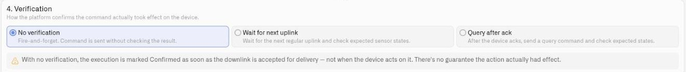

# Confirming Commands

Sending a command and knowing it worked are two different things. A downlink can be accepted for delivery and still never change the physical device — the device might be asleep, out of range, or simply ignore it. The **Verification** section of the command editor lets you tell the platform how to confirm that a command actually took effect, so an execution is only marked successful when there is real evidence behind it.

Verification is configured per command, in **section 4** of the [command editor](creating-commands.md). Choose one of three strategies.

<figure><figcaption></figcaption></figure>

## No verification

Fire-and-forget. The command is sent and the platform does not check the result.

With this strategy, an execution is marked **Delivered as soon as the downlink is accepted for delivery — not when the device acts on it.** (The green **Delivered** status means exactly that: sent, but unverified — distinct from **Confirmed**, which only a verification strategy can produce.) There is no guarantee the action had any effect. This is appropriate for non-critical, idempotent actions where a missed command is harmless and will be re-sent anyway, but never rely on it as proof that something physically changed.

## Wait for next uplink

After the command is sent, the platform waits for the device's next regular uplink and checks it against the **expected sensor states** you define. When the reported values match, the execution is confirmed.

This suits devices that report on a schedule and reflect their state in normal telemetry — for example, a controller that includes its current setpoint or relay position in every uplink.

## Query after ack

The most thorough option. After the device acknowledges the command, the platform sends a **query command** — a small read that pokes the device for its current state — and matches that query's uplink response against the expected states.

On a LoRaWAN device, turn **Confirmed downlink** on in section 2 (Routing) before choosing this strategy. The query is sent once the device acknowledges the command, so there has to be an acknowledgment to wait for — the command will not save otherwise. If you would rather not use a confirmed downlink, choose *Wait for next uplink*.

* **Query command** — Select an existing query command, or **create a new one** inline. A query command is a dedicated, lightweight command type: a **state-polling read with no operator parameters**, so there is nothing to fill in at execute time. It is always itself set to **No verification** — the query *is* the verification step, and its uplink is what gets checked, so it carries no verification block of its own. Any command that takes no parameters and uses No verification can serve as a query command and appears in this list. Once saved it appears in the Commands list, flagged as suitable as a query, and can be reused by any other command's *Query after ack*.
* In the **New query command** dialog you define the payload that polls the device. For MQTT devices, choose whether to **Send as-is** (deliver the payload exactly as written) or **Process with encoder** (run it through the device's encoder first).
* The query runs after the device acks, and its response is evaluated against the expected states below.

Use this when a device does not volunteer its state in routine uplinks but will answer a direct read.

## Expected sensor states

Both *Wait for next uplink* and *Query after ack* check the device's reported telemetry against the states you declare here. Click **Add State** to add a row, and fill in the two fields below. Add at least one row — the command will not save without it.

### Metric

Select the sensor that the command changes. A command that switches a relay is checked against the sensor reporting the relay's state, not against battery level or signal strength.

The dropdown lists the device's sensors under the names you gave them when mapping — the same names you see on dashboards and in rules. Those names are not the field names inside your decoder: a decoder that outputs `socket_status` may appear here as *Socket status*. To see which sensor carries which decoded field, open the device's Mapping section — see [Payload Decoding and Connector Keys](../payload-decoding.md).

Choose a sensor that is already mapped and receiving readings. Unmapped sensors also appear in this list, and a command checked against one never receives a value to compare, so it finishes as *Soft warning* every time. If the device has no sensors mapped yet, the editor links you to the Mapping section to set them up first.

### Expected value

Enter the value the sensor should report once the command has taken effect. Write it exactly as the device reports it — open the device's Mapping section and read the sensor's current value to see the form to copy.

**For a text state**, type it directly. Capitalization does not matter, so `on` matches a device reporting `ON`.

**For a number or a true/false state**, reference a command parameter instead of typing the value: enter `{{ parameterName }}` and declare that parameter as Integer, Float, or Boolean in the payload section. A value you type is always treated as text, so a typed `1` looks for the text `1` and will not match a device reporting the number 1.

**To follow the operator's input**, use the same `{{ parameterName }}` reference — a "set brightness" command can check that the device now reports whatever brightness was requested. The name must match a parameter defined in the payload section; the editor flags it if it does not.

| The sensor reports | Enter |
| --- | --- |
| `on` or `ON` | `on` |
| `open` | `open` |
| `60` (a number) | `{{ level }}`, with **level** declared Integer |
| `true` (true/false) | `{{ state }}`, with **state** declared Boolean |

If a command keeps finishing as *Soft warning* even though the device clearly responded, check this field first: compare what you entered against the value the sensor is actually reporting in the Mapping section.

## Convergence timeout

The **Convergence timeout** is how long the platform waits for the reported state to match before it gives up.

* Leave it empty to use the platform default of **1.5 × the device's data sending interval**. Set that interval accurately on the device first — where it is missing, the default works out to a 90-minute window, which is far longer than most commands need.
* Or enter a value of your own, up to 24 hours.
* If the window passes without a match, the execution is marked **Soft warning** rather than Failed — the command was delivered and acknowledged, but the platform could not confirm the effect within the expected time. This distinction matters operationally: a soft warning is "we couldn't confirm," not "it definitely failed."
* A command that is not confirmed within its window is not sent again. Run it again yourself, or let a rule do it.

## Choosing a strategy

| Strategy | Confirms | Best for |
| --- | --- | --- |
| No verification | Delivery only | Low-stakes, repeatable actions |
| Wait for next uplink | Reported state on the next scheduled message | Devices that report their state routinely |
| Query after ack | Reported state from a direct query | Devices that answer reads but don't volunteer state |

Once verification is set, move on to [Executing Commands](executing-commands.md) to dispatch the command and watch the result. For the whole sequence on one device — payload, verification and execution — see [Example: Smart Socket](smart-socket-example.md).
