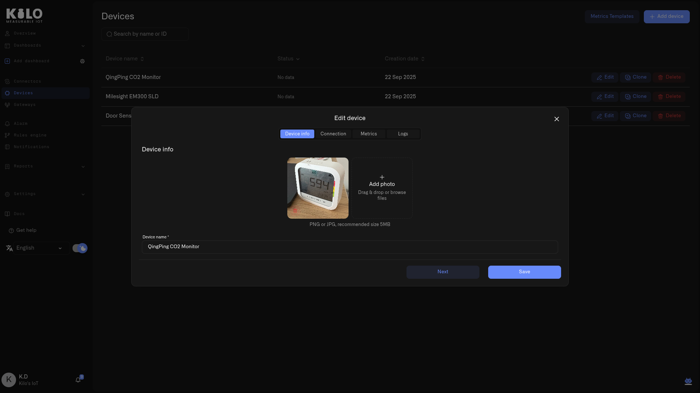
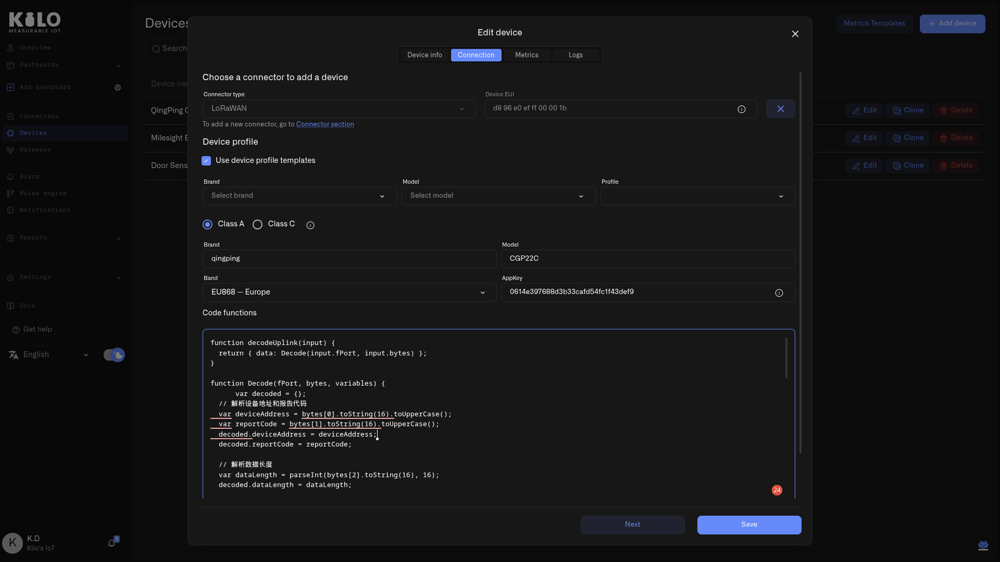
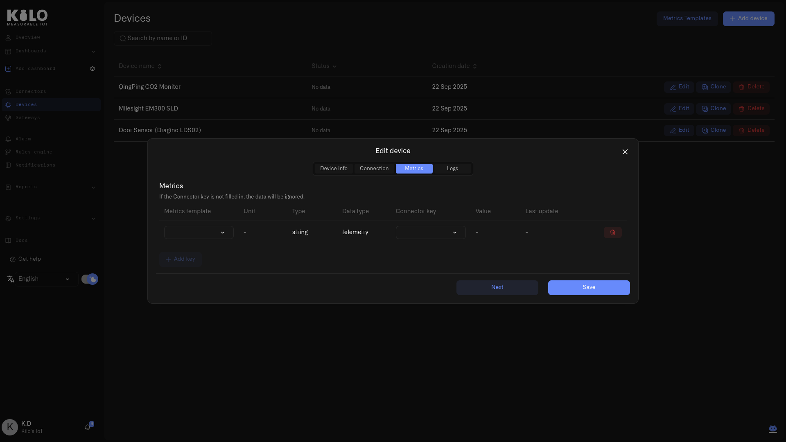

# Device Management

Once a device is registered, its Digital Twin is a living record that you can update, reconfigure, and inspect at any time. The device detail page is the ongoing management interface — every device property, connection setting, metric mapping, and data log is accessible from there.

## Opening a device's detail page

There are several ways to open the detail page for an existing device:

* **From Devices** — Click any device row in the **Devices** list in the sidebar. The device detail page opens showing that device's current state.
* **From the Connectors page** — Click the **+ Add device** button on a connector row to register a device with that connector pre-selected.
* **Edit button** — Click the edit icon (pencil) on any device row to go directly to the device detail page.

## Device info tab

The Device info tab contains the device's identity and visual reference:

* **Device photos** — Upload, replace, or remove photos of the physical device. Photos help operations teams identify hardware during site visits or troubleshooting.
* **Device name** — Update the display name at any time. A consistent naming convention (e.g., including location or device type) helps when managing large fleets.
* **Location** — A device's location is fully editable after it is first set: reassign it when hardware moves between sites, or remove it entirely when a device is pulled from service and awaiting redeployment. See [Locations](../settings/locations.md).

<figure><figcaption></figcaption></figure>

## Connection tab

The Connection tab manages the link between the Digital Twin and the device that feeds it. The available fields depend on the connector type.

<figure><figcaption></figcaption></figure>

### Connector selection

The **Connector type** dropdown shows available connectors in your organization. A link below the dropdown directs you to the [Connectors](../connectors/) section if you need to add a new connector.

Changing the connector re-binds the device to a different data source, and is offered **only for pairs that involve the Emulator** — emulator to real, or real back to emulator. Swapping directly between two physical connector types is not offered, because the identifiers and payload mappings differ enough that the mapping has to be rebuilt anyway. See [Emulated Devices](emulated-devices.md#going-live-swapping-to-a-real-device).

### For LoRaWAN devices (LNS connector)

* **Device EUI** — The device's unique LoRaWAN identifier. This field is locked once a physical device is bound. To change it, you must first detach the physical device. The DevEUI is matched without regard to upper- or lower-case, so enter it consistently — if a device is added with one casing and a binding or connector key uses another, both still resolve to the same device.
* **Detach physical device** — Click the detach button (X icon) next to the Device EUI to unbind the physical device from this Digital Twin. The Digital Twin and its history are preserved; only the live connection is severed. You can then re-bind a different physical device.
* **Use device profile templates** — Toggle this checkbox to switch between template-based and manual configuration:
  * **Template mode:** Select **Brand**, **Model**, and **Profile** from dropdowns that filter based on your selections.
  * **Manual mode:** Enter Brand, Model, and Band as free text, choose **Class A** (battery-powered, uplink-first, power-efficient) or **Class C** (continuous listening, can receive downlinks at any time, typically mains-powered), and enter the **AppKey**. For full details on Class A vs Class C, band options, and the template flow, see [Registering Devices](registering-devices.md). Setting a LoRaWAN device to **Class C** also unlocks its **Commands & States** tab, so you can send it downlink commands — see [Device Commands](commands/).
* **Code functions** — The device's payload codec: JavaScript logic that decodes raw LoRaWAN uplink data into the named fields that appear as connector keys in the Metrics tab. When a device profile template is selected, this field is pre-filled with the template's codec. If the decoded output is missing fields or producing incorrect values, you can edit the code directly. Alternative codecs can often be found in the device manufacturer's documentation or community repositories. For the full codec explanation, see [Registering Devices](registering-devices.md); to check what the decoder is currently producing, see [Payload Decoding and Connector Keys](payload-decoding.md).
* **Data sending interval** — Where you tell the platform how often this device transmits. A device's transmission schedule is set on the device itself and varies by manufacturer — sometimes preconfigured at the factory, sometimes set during commissioning — so enter the schedule the device is actually configured for. Set a device that transmits once a day to **1 day**, one that transmits monthly to **1 month**. The field defaults to **1 hour**, but that is only a placeholder — the platform cannot read the device's real schedule. If no message arrives within the configured interval, the device is marked offline in the device list; entering the correct schedule keeps a healthy low-frequency device from being flagged. Choose a number and a unit (minute, hour, day, week, or month). On an [emulated device](emulated-devices.md) this field works the other way round: it is the schedule the platform emits on.

### For vehicle trackers (Tracker connector)

* **Unique ID** — The tracker's device identifier. Locked once bound.
* **Device model** — Search and select from the tracker model library.
* **Url for GPS tracker** — The endpoint URL displayed after selecting a model. Copy this URL and configure the physical tracker to send data to it.

## Metrics tab

The Metrics tab maps the device's raw sensor output to your normalized metric templates. This is where you control what data the device contributes to dashboards and automation rules.

<figure><figcaption></figcaption></figure>

**Table columns:** Metrics template, Unit, Type, Data type, Connector key, Value, Last update, Actions.

**Working with metric mappings:**

* **Metrics template** — Select a metric template from the dropdown. Each template can only be assigned once per device. The dropdown shows all available templates from the [Metric Templates](metric-templates.md) area, with already-assigned templates grayed out.
* **Connector key** — Map the raw key that the device firmware sends (e.g., `temp_c`) to the selected metric template. This is the bridge between the device's native output and your normalized data model.
* **Value** — Shows the most recent value received for this connector key.
* **Last update** — Shows when the last value was received.
* **Add a row** — Click the add button to create a new metric mapping row.
* **Remove** — Click the remove button on a row to delete that mapping. Removing a metric template row takes effect on the server immediately. Other changes are saved when you click **Save**.

### User metadata

Below the telemetry metrics table, a separate **User Metadata** section allows you to define custom key-value pairs that are user-assigned properties (not reported by the device). These are useful for operational annotations like installation date, maintenance notes, or asset tags.

## Commands & States tab

For devices that can receive downlinks — MQTT devices, Class C LoRaWAN devices, and emulated devices with **Support commands** enabled — a **Commands & States** tab appears. This is where you define the actions a device can perform and dispatch them on demand, turning the Digital Twin from a read-only record into a control surface. The full workflow has its own section: see [Device Commands](commands/).

## Logs tab

The Logs tab displays the raw event history received from the device, providing a detailed record of every data point the server has processed. A status indicator in the device header reflects its live connection and logging activity, so you can tell at a glance whether new data is currently flowing in.

**Log entries are grouped by the minute.** All readings received within the same minute are collected under a single group header — so even when several batches arrive in the same minute, the view stays tidy. Click a group header to expand or collapse the readings inside it. Each entry within a group shows:

| Column     | Description                                               |
| ---------- | --------------------------------------------------------- |
| **Key**    | The raw key name from the device payload                  |
| **Type**   | The data type of the value                                |
| **Value**  | The received value                                        |
| **Status** | Processing status (currently empty for standard readings) |

**Date filtering:** Click the date button in the top-right corner of the Logs section to open a date range picker. You can select a preset range (e.g., "Last week") or define a custom date range to narrow the log view. This is especially useful for investigating specific incidents or reviewing data from a particular time window.

The logs description notes: _"This tab displays the latest registered data (Telemetry, Metadata) received from the device, including its value, type, and processing status by the platform."_

The Logs tab shows you the readings themselves. If the readings are missing and you need to know *why* — whether messages reached the platform at all, whether their keys matched your sensors, and whether the values were stored — read the reception status, pipeline, and event feed on the **Connection** tab. See [Device Diagnostics](device-diagnostics.md).

## Copying a device

Click the copy icon on a device row to create a new device pre-filled from that one. The form arrives carrying the original's **name**, its **metric-template rows**, its **connection selection and settings**, and its **images**. Identity is deliberately not carried: give the copy its own name and its own device identifier before saving.

Two things need doing by hand afterwards, and it is worth knowing before you start:

- **Sensor mappings are not saved with the copy.** They appear pre-filled in the form, but the new device is created without them — recreate the mappings on the copy once it exists.
- **An emulated device's emulator specification is not carried at all.** Its generated signals, reporting interval, command support and preset-derived commands must be configured again, or the copy will emit no readings. See [Emulated Devices](emulated-devices.md#copying-an-emulated-device).

Copying is still the quickest route to a device that resembles an existing one — just treat it as a starting point rather than a finished duplicate.

## Common management tasks

| Task                                   | Where           | How                                                                               |
| -------------------------------------- | --------------- | --------------------------------------------------------------------------------- |
| Rename a device                        | Device info tab | Edit the Device name field and save                                               |
| Re-bind to a different physical device | Connection tab  | Detach the current physical device, then enter new identifiers                    |
| Change from manual to template profile | Connection tab  | Check "Use device profile templates" and select Brand/Model/Profile               |
| Add a new measurement type             | Metrics tab     | Add a row, select a metric template, map the connector key                        |
| Investigate missing data               | Logs tab        | Filter to the expected time range and review the entries                          |
| Copy a device configuration            | Device list     | Click the copy icon on a device row to create a new device with the same settings |
| Delete a device                        | Device list     | Click the delete icon on a device row and confirm                                 |

For metric template setup, see [Metric Templates](metric-templates.md). For organizing devices by location, see [Locations](../settings/locations.md).
