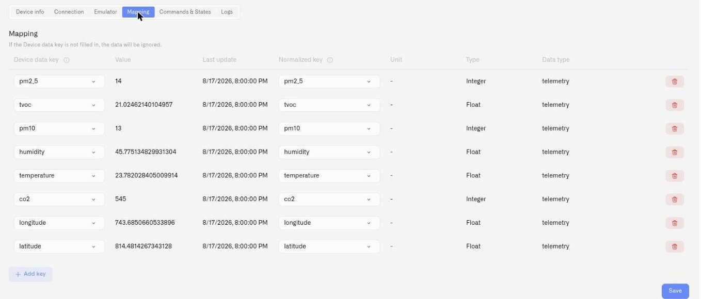

# Device Management

A digital device is the lasting record of the asset or monitoring point you manage. Its physical source can change while the twin keeps its name, measurements, and stored history. Open the device to update its details, replace hardware, check incoming readings, or review history. For the full concept and refrigeration example, see [Devices](README.md).

## Opening a device's detail page

There are several ways to open the detail page for an existing device:

* **From Devices** — Click any device row in the **Devices** list in the sidebar. The device detail page opens showing that device's current state.
* **From a connector** — Open its connected-device list and select the existing device. **+ Add device** starts a new registration; it is not the replacement workflow.
* **Edit button** — Click the edit icon (pencil) on any device row to go directly to the device detail page.

## Replace a physical sensor

Use this procedure when the monitored asset stays the same but its hardware needs replacing. For example, keep **Refrigerator 1** when replacing a temperature probe that has failed or no longer meets your calibration requirements.

You need permission to edit devices, the replacement hardware's identifiers and connection settings, and access to the connector it will use. Record the existing measurement names, units, connector keys, and the time of the change. Arrange any necessary monitoring coverage during the replacement: the platform cannot record measurements that no device sends.

1. Open **Devices** and select the existing digital device, such as **Refrigerator 1**.
2. Check its measurement rows and recent **Logs**. Keep the temperature measurement that already contains the refrigerator's history.
3. Open **Connection**. For a bound LoRaWAN probe, click the X control labelled **Detach physical device** beside **Device EUI**. Detaching takes effect immediately; it is not deferred until the next **Save**. The digital device and its measurement channels remain, while the old physical binding and source mappings are removed.
4. Enter the replacement's **Device EUI**, **AppKey**, and matching device profile. Check its decoder and **Data sending interval**, then click **Save**. For another supported source type, use that connector's identifier and configuration fields.
5. Open **Mapping**. For each existing measurement, select the replacement's incoming **Connector key** and click **Save**. For example, change the source of the existing temperature measurement from `temp_c` to `temperature`. Check that the new value is in the same unit and format.
6. Wait for a new transmission. Confirm that **Value** and **Last update** change, and use the **Connection** diagnostics if they do not.
7. In **Logs**, choose a date range spanning the change. Check readings from before and after replacement, then check the dashboard and any rules using those measurements.

**Keep the existing measurement rows.** Change their connector keys instead of removing the rows and creating new ones. Stored history and dashboard/rule references belong to those measurements; reusing a name is not the same as retaining the original measurement.

Detaching hardware is also different from deleting the digital device. If a replacement fails to connect, keep the twin and use [Device Diagnostics](device-diagnostics.md) to check reception and mapping. Earlier readings remain subject to your [retention period](../settings/subscription.md#data-retention).

For an emulator-to-hardware change, use the dedicated [go-live workflow](emulated-devices.md#going-live-swapping-to-a-real-device), which changes the source without first detaching it.

## Device info tab

The Device info tab contains the device's identity and visual reference:

* **Device photos** — Upload, replace, or remove photos of the asset or its hardware. A refrigerator photo can remain useful after its probe is replaced.
* **Device name** — Update the display name at any time. A consistent naming convention (e.g., including location or device type) helps when managing large fleets.
* **Application** — Choose the solution this device belongs to, or **Default** for no named application.

## Connection tab

The Connection tab manages the twin's current data source. The source's hardware identifier belongs here; the asset's lasting name belongs in **Device info**. The available fields depend on the connector type.

### Connector selection

The **Connector type** dropdown shows available connectors in your organization. A link below the dropdown directs you to the [Connectors](../connectors/) section if you need to add a new connector.

Changing the connector re-binds the device to a different data source, and is offered **only for pairs that involve the Emulator** — emulator to real, or real back to emulator. Swapping directly between two physical connector types is not offered, because the identifiers and payload mappings differ enough that the mapping has to be rebuilt anyway. See [Emulated Devices](emulated-devices.md#going-live-swapping-to-a-real-device).

### For LoRaWAN devices (LNS connector)

* **Device EUI** — The device's unique LoRaWAN identifier. This field is locked once a physical device is bound. To change it, you must first detach the physical device. The DevEUI is matched without regard to upper- or lower-case, so enter it consistently — if a device is added with one casing and a binding or connector key uses another, both still resolve to the same device.
* **Detach physical device** — Click the detach button (X icon) next to the Device EUI to unbind the physical device from this Digital Twin. The Digital Twin and its retained measurement history remain. Re-bind the replacement and reconnect its source mappings as described above.
* **Use device profile templates** — Toggle this checkbox to switch between template-based and manual configuration:
  * **Template mode:** Select **Brand**, **Model**, and **Profile** from dropdowns that filter based on your selections.
  * **Manual mode:** Enter Brand, Model, and Band as free text, choose **Class A** (battery-powered, uplink-first, power-efficient) or **Class C** (continuous listening, can receive downlinks at any time, typically mains-powered), and enter the **AppKey**. For full details on Class A vs Class C, band options, and the template flow, see [Registering Devices](registering-devices.md). A saved LoRaWAN attachment supports the **Commands & States** tab. Class A receives downlinks after an uplink; Class C can listen between uplinks — see [Device Commands](commands/).
* **Code functions** — The device's payload codec: JavaScript logic that decodes raw LoRaWAN uplink data into the named fields that appear as connector keys in the Mapping tab. When a device profile template is selected, this field is pre-filled with the template's codec. If the decoded output is missing fields or producing incorrect values, you can edit the code directly. Alternative codecs can often be found in the device manufacturer's documentation or community repositories. For the full codec explanation, see [Registering Devices](registering-devices.md); to check what the decoder is currently producing, see [Payload Decoding and Connector Keys](payload-decoding.md).
* **Data sending interval** — Where you tell the platform how often this device transmits. A device's transmission schedule is set on the device itself and varies by manufacturer — sometimes preconfigured at the factory, sometimes set during commissioning — so enter the schedule the device is actually configured for. Set a device that transmits once a day to **1 day**, one that transmits monthly to **1 month**. The field defaults to **1 hour**, but that is only a placeholder — the platform cannot read the device's real schedule. Reception diagnostics uses this interval to judge whether readings are overdue. The command screen has a separate last-seen check; see [Executing Commands](commands/executing-commands.md#when-a-device-is-offline). Choose a number and a unit (minute, hour, day, week, or month). On an [emulated device](emulated-devices.md) this field works the other way round: it is the schedule the platform emits on.

### For vehicle trackers (Tracker connector)

* **Unique ID** — The tracker's device identifier. Locked once bound.
* **Device model** — Search and select from the tracker model library.
* **Url for GPS tracker** — The endpoint URL displayed after selecting a model. Copy this URL and configure the physical tracker to send data to it.

## Mapping tab {#metrics-tab}

The Mapping tab maps the device's raw sensor output to your normalized metric templates. This is where you control what data the device contributes to dashboards and automation rules.

<figure><figcaption></figcaption></figure>

**Table columns:** Metrics template, Unit, Type, Data type, Connector key, Value, Last update, Actions.

**Working with metric mappings:**

* **Metrics template** — Select a metric template from the dropdown. Each template can only be assigned once per device. The dropdown shows Telemetry metrics from the [Metrics](metric-templates.md) catalog, with already-assigned templates grayed out.
* **Connector key** — Map the raw key that the device firmware sends (e.g., `temp_c`) to the selected metric template. This is the bridge between the device's native output and your normalized data model.
* **Value** — Shows the most recent value received for this connector key.
* **Last update** — Shows when the last value was received.
* **Add a row** — Click the add button to create a new metric mapping row.
* **Remove** — Click the remove button on a row to delete that mapping. Adding a template, changing the template on an existing row, and removing a row update its measurement assignment immediately. Selecting a different template removes the previous measurement association. Save changes to **Connector key** with **Save**. For a hardware replacement, keep the template and change only the connector key.

## Asset identification {#user-metadata}

Use the device name, photo, and application assignment to identify the monitored asset. Keep calibration certificates, installation notes, and maintenance records in your organisation's record-keeping system; device measurement history is not a maintenance log.

## Commands & States tab

For devices that can receive downlinks — MQTT devices, LoRaWAN devices, and emulated devices with **Support commands** enabled — a **Commands & States** tab appears. This is where you define the actions a device can perform and dispatch them on demand, turning the Digital Twin from a read-only record into a control surface. The full workflow has its own section: see [Device Commands](commands/).

## Logs tab

The Logs tab displays stored readings for the digital device's attached measurements, within the available retention period. It can therefore show readings from an earlier physical source as well as its replacement when you keep those measurements. A status indicator in the device header reflects its live connection and logging activity, so you can tell at a glance whether new data is currently flowing in.

**Log entries are grouped by the minute.** All readings received within the same minute are collected under a single group header — so even when several batches arrive in the same minute, the view stays tidy. Click a group header to expand or collapse the readings inside it. Each entry within a group shows:

| Column     | Description                                               |
| ---------- | --------------------------------------------------------- |
| **Key**    | The measurement's normalized key                  |
| **Type**   | The data type of the value                                |
| **Value**  | The received value                                        |
| **Status** | Processing status (currently empty for standard readings) |

**Date filtering:** Click the date button in the top-right corner of the Logs section to open a date range picker. You can select a preset range (e.g., "Last week") or define a custom date range to narrow the log view. This is especially useful for investigating specific incidents or reviewing data from a particular time window.

The Logs tab shows you the readings themselves. If the readings are missing and you need to know *why* — whether messages reached the platform at all, whether their keys matched your sensors, and whether the values were stored — read the reception status, pipeline, and event feed on the **Connection** tab. See [Device Diagnostics](device-diagnostics.md).

## Copying a device

Click the copy icon on a device row to create a new device pre-filled from that one. The form arrives carrying the original's **name**, its **metric-template rows**, its **connection selection and settings**, and its **images**. Identity is deliberately not carried: give the copy its own name and its own device identifier before saving.

For a physical device, the copy creates new measurement rows from the selected templates. Open the saved copy and assign its **Connector keys**; pre-filled source mappings are not saved onto the new measurement identities.

An emulator copy also carries its generated signal configuration, reporting interval, command-support setting, and preset commands. Give it a new **Device ID** before saving. See [Copying an emulated device](emulated-devices.md#copying-an-emulated-device).

Copying creates another digital device with its own measurements and history. It does not transfer historical readings. Use the original twin when replacing hardware on the same asset.

## Common management tasks

| Task                                   | Where           | How                                                                               |
| -------------------------------------- | --------------- | --------------------------------------------------------------------------------- |
| Rename a device                        | Device info tab | Edit the Device name field and save                                               |
| Re-bind to a different physical device | Connection tab  | Detach the current physical device, enter new identifiers, then reconnect existing measurements                    |
| Change from manual to template profile | Connection tab  | Check "Use device profile templates" and select Brand/Model/Profile               |
| Add a new measurement type             | Mapping tab     | Add a row, select a metric template, map the connector key                        |
| Investigate missing data               | Logs tab        | Filter to the expected time range and review the entries                          |
| Copy a device configuration            | Device list     | Click the copy icon on a device row to create a new device with the same settings |
| Delete a device                        | Device list     | Click the delete icon on a device row and confirm                                 |

For metric template setup, see [Metrics](metric-templates.md). Use an asset-oriented name and application assignment to keep related devices recognizable.

## Organize the device in an application

On **Device Info**, use **Application** to associate this device with an operational solution. Choose **Default** to leave it outside named applications, then save. The device can belong to one application at a time. See [Organizing Content](../applications/organizing-content.md).
