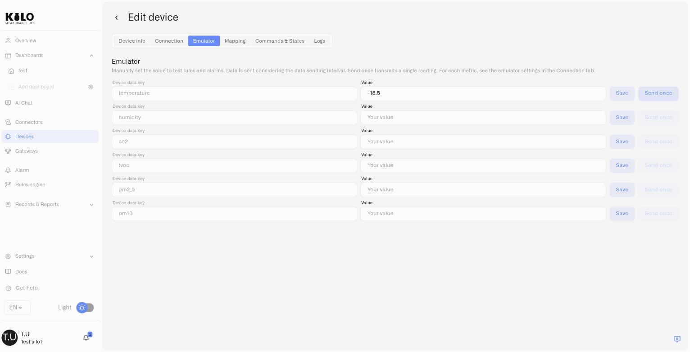

# Emulated Devices

An emulated device registered on the Kilo IoT Server is a Digital Twin like any other — same profile, same dashboards, same rules, same alarms. What is specific to it is that the platform generates its telemetry instead of receiving it from hardware. That makes it the way to build and prove a deployment before any sensor exists.

This page covers the Emulator-specific fields on the device form and the Emulator tab. The surrounding registration workflow — naming the device, the Metrics tab, the Logs tab, saving — is the shared flow documented in [Registering Devices](registering-devices.md).

<figure><figcaption></figcaption></figure>

## Prerequisites

- **An Emulator connector.** One per organization, with nothing to configure. See [Emulator Connector](../connectors/emulator-connector.md).
- **Nothing else.** No credentials, no identifiers from a manufacturer, no gateway, no radio coverage. That is the point of it.

## Selecting the connector

On the device form, open the **Connection** tab and choose the Emulator connector as the connector type. The form then presents the fields below.

| Field | What it does |
|---|---|
| **Device ID** | The identifier this emulated device reports under. 1–64 characters, using letters, digits, spaces, `.`, `_` and `-`. It must be **unique across the whole platform**, not just within your organization, so a readable but specific value such as `cold-room-01` works better than `sensor1`. |
| **Data sending interval** | How often the device emits a reading, as a number plus a unit (for example 10 minutes). Choose something close to the real sensor's reporting rate so your rules behave realistically. |
| **Support commands** | Turn this on to give the device a **Commands & States** tab, so you can define and run commands against it exactly as you would against physical hardware. See [Device Commands](commands/README.md). |
| **Use device preset** | Start from a real device model instead of typing metrics by hand. |

Unlike every other connector, the interval here is not a description of a schedule the hardware already keeps — it is the schedule. The platform emits on it.

## Starting from a device preset

Ticking **Use device preset** opens a list of real sensor models. Pick the one you have — or the one you have on order — and the platform fills in that model's actual measurements for you.

A multi-sensor preset, for instance, fills in its full set of readings — temperature, humidity, air quality and the rest — each with the right data type, and sets a sensible reporting interval. It is the fastest way to get a realistic device, and it means the metric names you build dashboards against are the ones the real sensor will send.

> **A preset replaces what is already there.** Selecting one overwrites metrics you typed by hand and resets the interval to the preset's own. Pick the preset first, then adjust.

**Device presets are not [device profile templates](registering-devices.md#for-lorawan-devices-lns-connector).** A LoRaWAN device profile template configures how a physical device talks to the network — class, band, codec. A device preset describes what an emulated device *measures*, and exists only on the Emulator.

## Defining metrics by hand

Without a preset — or alongside one — use **Add device data key** to define each measurement:

- **Device data key** — the metric name, such as `temperature`. This is what dashboards, rules and mappings refer to.
- **Data type** — `Float` for anything with decimals, `Integer` for whole numbers, and the other supported types for booleans and text. See [Metrics](metric-templates.md) for how types normalize across a deployment.

Choose the data type deliberately. An **Integer** metric truncates decimals: send `1.5` and the device reports `1`. If a reading needs decimal precision, it must be a **Float**.

## Sending values

Once the device is saved, its **Emulator** tab lists every metric with two controls:

- **Save** pins a value. The device keeps reporting that value on its interval, which is how you hold a tank at 8% or a freezer at −18 °C while you watch a rule react.
- **Send once** transmits a single reading immediately, without changing what the device reports afterwards. This is the one to use when you want to trip a threshold on demand.

<figure><figcaption></figcaption></figure>

Sending a value is a **write action** — it feeds history, rules and alarms exactly as real telemetry does. A user with read-only access can view an emulated device but cannot inject readings into it. See [Users and Permissions](../account/users-and-permissions.md).

## Running commands against an emulated device

With **Support commands** enabled, the device gets a **Commands & States** tab and behaves like controllable hardware. This is what lets you build and rehearse a closed loop before the equipment exists: a rule detects a condition, sends a command, and the alarm records that it happened — with no risk of actuating anything real.

Defining and running commands works the same way it does on a physical device. See [Creating Commands](commands/creating-commands.md) and [Executing Commands](commands/executing-commands.md).

## Going live: swapping to a real device

This is the step the Emulator is built around. When the hardware arrives, open the device's **Connection** tab and change the connector from **Emulator** to the real one — LoRaWAN, for instance — then supply the identifiers the physical device needs.

Everything else about the device stays: its name, its place on your dashboards, the rules bound to it, its alarm definitions and escalation chains. You are replacing the source of the data, not rebuilding the deployment.

The swap is deliberately restricted to pairs that involve the Emulator — emulator to real, or real back to emulator. Swapping directly between two physical connector types is not offered, because the device identifiers and payload mappings differ enough that the mapping has to be rebuilt anyway.

> Going the other way is just as useful: move a real device onto the Emulator to reproduce a problem, then move it back.

## Copying an emulated device

Copying a device gives you a head start on the device record, but **it does not carry the emulator setup**. The new device is pre-filled with the original's name, metric-template rows, connection selection and settings, and images. Everything that makes it *emulate* has to be set up again:

- **The emulator's signal definitions** — the metrics it generates and their data types.
- **The reporting interval**, which returns to its default rather than the original's.
- **Support commands**, which returns to off.
- **Preset-derived commands.** Selecting the original's preset again is the quickest way back.

Until you do that, the copy reports nothing at all — it is a device bound to the Emulator with an empty specification. **Sensor mappings are not carried either**, so recreate them on the copy after saving.

See [Device Management](device-management.md#copying-a-device).

## Ask the assistant to do it

The whole workflow above is available in plain language through the [IoT AI Assistant](../ai-assistant/README.md). It can list the available device presets, provision an emulated device, read and update its configuration and interval, send a one-off reading, and take the device live onto a real **LoRaWAN** connection when your hardware arrives. It can also move any real device onto the Emulator. Swapping an emulated device onto a Mioty, Tracker or MQTT connector is a manual step on the Connection tab — the assistant does not offer it.

## What's next

- **Build automations against emulated data** so they are proven before go-live. See [Rules Engine](../rules-engine/README.md).
- **Rehearse an escalation chain** end to end without waiting for a real failure. See [Alarms](../alarm/README.md).
- **Complete the shared registration flow** — device info, Metrics, Logs. See [Registering Devices](registering-devices.md).
