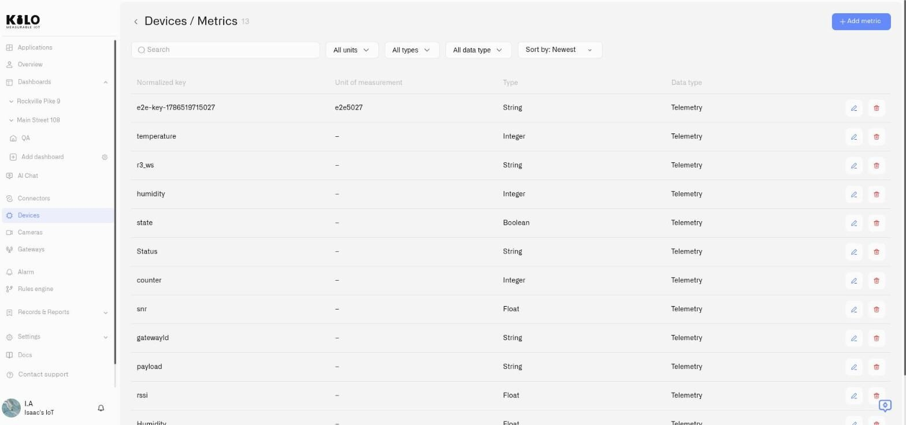
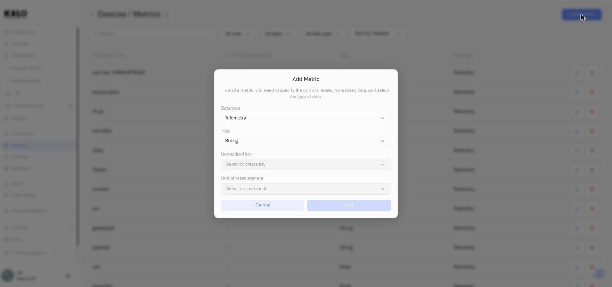

# Metrics

The metric catalog defines the measurement vocabulary for your whole Kilo IoT Server deployment. It is what makes data from devices built by different manufacturers, speaking different protocols, running different firmware, land in one consistent model — so a dashboard, a rule or a query works the same way no matter which device produced the reading.

Without it, every device reports in its own dialect. One temperature sensor sends `temp_c`, another `temperature`, a third `t_celsius`. The catalog maps all three onto a single **normalized key** — `temperature` — with a unit and a data type attached. Add a new device type later and you map its raw keys onto templates that already exist; nothing downstream has to change.

## Where to find it

Open **Devices** and go to the **Metrics** tab.

Everything lives on this one page: the metrics themselves, and — inside the form — the units and normalized keys they are built from.

<figure><figcaption></figcaption></figure>

## The metric list

The list shows every metric defined in your organization, with its normalized key, unit of measurement, type and data type.

Above it are the controls for finding things in a catalog that grows quickly on a real deployment:

- **Search** — matches the **normalized key** as you type. It does not search units, types or the device's own raw key name.
- **All units** — filter by unit of measurement. This filter is itself searchable, which matters once a deployment carries dozens of units, and it has a bucket for metrics that carry no unit at all.
- **All types** — filter by how the value is stored: String, Integer, Float or Boolean.
- **All data type** — filter by what kind of measurement it is: Telemetry, Device metadata or Custom attributes.
- **Sort by** — **Newest** or **Oldest**. Sorting is by when the metric was added, so **Newest** is the quickest way back to something you have just created.

All three filters accept **more than one value at a time**, but they behave slightly differently: **Type** and **Data type** take effect the moment you tick a box, while **All units** collects your choices and applies them when you click **Apply**.

Rows you created carry **Edit** and **Delete**. **Metrics supplied with the platform carry neither** — they are shared across every deployment, so they are not yours to change.

## Adding a metric

Click **Add metric** in the page header. The **Add Metric** dialog opens, and it is the same form used for editing, so there is one place where the rules live.

The dialog states what it needs — a unit of measurement, normalized data, and the type of data — and asks for four things, in this order.

<figure><figcaption></figcaption></figure>

### Data type

What kind of measurement this is:

| Data type | What it holds |
|---|---|
| **Telemetry** | Ordinary sensor readings that change over time — temperature, humidity, battery level, pressure. The common case. |
| **Device metadata** | Information the device reports about itself and rarely changes — firmware version, hardware revision. |
| **Custom attributes** | Properties you attach yourself, never reported by the device — installation date, asset tag, maintenance interval. |

The distinction is not cosmetic. **Device metadata and custom attributes are deliberately kept out of the telemetry mapping selects**, so when you map a device's incoming payload you are only offered things a device could actually send.

### Type

How the value is stored:

| Type | Use it for |
|---|---|
| **Float** | Readings with decimals — 22.5 °C, 67.3 %, 3.28 V. The most common choice for sensors. |
| **Integer** | Whole numbers — battery 85, signal −120, packet count 42. |
| **String** | Text — `"open"`, `"1.2.3"`, `"standby"`. |
| **Boolean** | True or false — motion detected, alarm active. |

> **This choice decides where the metric can be used.** Chart and Last Data widgets only offer **numeric** metrics, so a reading stored as String or Boolean will not appear in a widget's metric list. If a metric you expect is missing when you build a dashboard, its **Type** is the first thing to check — provided, of course, that the device really does send a number.

### Normalized key

The standard name for what is being measured, independent of what any device calls it.

Open the field and either pick an existing key or use **Create a new normalized key** and type the name. **This select is where normalized keys are managed** — creating, renaming and deleting them all happen here rather than on a separate screen. The same is true of units in the field below.

One limit applies to both: **keys and units supplied with the platform cannot be renamed or deleted.** They are shared across every deployment, so the rename and delete controls simply do nothing on them. Anything your organization created is yours to change.

Name the measurement, not the device: `soil_moisture`, not `sensor_3_value`. Lowercase with underscores keeps the catalog readable.

Each normalized key is used by one metric. If you pick one that is already taken, the form says so — *"A metric with this normalized key already exists."*

### Unit of measurement

The unit shown next to values wherever they appear — °C, %, lx, mV.

As with keys, you can pick an existing unit or choose **Create a new unit** and enter the symbol. **The symbol you type becomes the unit**, so enter it exactly as it should appear on a dashboard.

**Whether a unit is required depends on the Data type.** A **Telemetry** metric must have one — a reading without a unit is ambiguous wherever it is displayed. **Device metadata** and **Custom attributes** may leave it empty, which is usually right: a firmware version or an asset tag has no unit, and inventing one only adds noise.

Click **Add** to save the metric, or **Cancel** to discard it.

## Editing a metric — read the confirmation

The catalog is **shared across your whole organization**, not set per device. Every device mapped to a metric uses the same definition of it.

So editing one is not a local change. Kilo asks you to confirm, and the confirmation says what is about to happen: the devices the key is assigned to will update their settings to reflect the change.

That is exactly what you want when you are correcting a unit across a fleet, and exactly what you do not want when you meant to change one device. **If you only want a different measurement on one device, create a new metric and remap that device**, rather than editing the shared one.

The confirmation stays open until the server answers, so a refusal is never hidden behind a dialog that has already closed.

## Deleting a metric

Deleting also asks for confirmation.

If the metric is still mapped to devices, the delete is refused and Kilo tells you plainly — *"is used in other devices"* — with the remedy: unbind it from every device using it first, then delete it. Nothing is removed out from under a device that depends on it.

## How the catalog reaches your devices

When you register or edit a device, its **Metrics** tab is where the device's raw output keys — whatever its firmware happens to send — are mapped onto these definitions.

The payoff:

- A temperature sensor from one manufacturer and one from another both map to the same `temperature` metric.
- Dashboards and rules written against `temperature` work with either device, and with the next one you add.
- Onboarding a new device type is a mapping exercise, not a redesign.

## See also

- [Registering Devices](registering-devices.md) — mapping a device's raw keys onto these metrics
- [Device Management](device-management.md) — the per-device Metrics tab
- [Chart Widget](../dashboards/adding-widgets/chart-widget.md) — where the numeric-only rule bites
