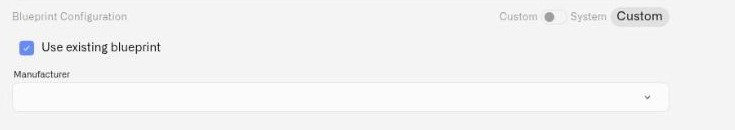

# MIOTY Blueprints

A blueprint is the decoder specification for a MIOTY endpoint: a JSON document, bound to a `typeEui`, that tells the Kilo IoT Server how to turn a raw payload into named fields. Telemetry from a MIOTY device is not decoded until a blueprint is selected for it — so binding a blueprint is what turns a registered endpoint into a device that produces usable data.

Blueprints are organized as a catalog: **Manufacturer → Device Model → Blueprint**. A manufacturer holds its models; a model holds its blueprint versions. Blueprint Configuration on the device form is where you either pick from that catalog or author a new entry.

## The idea that matters most: per-device snapshots

When you select a blueprint for a device, it is **copied onto that device as an independent snapshot**.

The device is not a live pointer into the catalog. It carries its own copy of the decoder. Which means:

- **Editing a catalog blueprint does not change devices already bound to it.** They keep running on the copy they were commissioned with.
- **Deleting a catalog entry does not break devices already using it.** They keep decoding on their snapshot; the entry simply disappears from the catalog and can no longer be chosen for new devices.
- **Two devices of the same model can run different blueprints.** A pilot batch on a corrected decoder and a production fleet on the proven one is a normal state, not a conflict.
- **A new version reaches a device only when you explicitly apply it.** Nothing about a catalog edit propagates on its own.

This is the same model the platform uses for LoRaWAN codecs, and it exists for a specific reason: on a fleet of several thousand endpoints, an accidental decoder edit that silently rewrote how every unit interpreted its payload would be an outage you would discover through your dashboards. The snapshot boundary means catalog work and production behavior are separate concerns. You improve a template freely; you roll it out on your schedule.

## System and Custom catalogs

The catalog is split into two, and the two are never mixed in one list — you switch between them.

| Catalog | Who can see and use it | Who can change it |
|---|---|---|
| **System** | Everyone — manufacturers, models, and blueprints are usable by any organization | Administrators only. Creating, editing, and deleting System entries requires an administrator. |
| **Custom** | Your organization | Yours to manage freely — create, edit, and delete without restriction |

Using a System blueprint on a device creates **only the snapshot on that device**. Nothing is copied into your Custom catalog, and your Custom catalog stays exactly as you built it.

The practical split: System covers the hardware the platform already knows. Custom is where your own decoders, your vendor-specific variants, and your firmware-revision corrections live.

## Using an existing blueprint

This is the path for hardware the catalog already covers.

<figure><figcaption></figcaption></figure>

1. On the device form, find **Blueprint Configuration**.
2. Turn **Use existing blueprint** **ON**.
3. Select the catalog — **System** or **Custom**.
4. Select the **Manufacturer**.
5. Select the **Device Model**. The list narrows to that manufacturer's models.
6. Select the **Blueprint Version**.

The decoder specification is displayed read-only for review, and the **Type EUI** auto-fills on the device form and is not editable — it comes from the blueprint. Save the device, and the blueprint is snapshotted onto it.

Once that has happened the device is labelled **Pinned snapshot**, so you can see at a glance that what you are reading belongs to this device rather than to the shared catalog entry. If the catalog blueprint it was copied from has since been deleted, the label reads **Pinned snapshot (source template deleted)** — the device is unaffected and keeps decoding on its own copy, but the label tells you there is no longer a catalog entry behind it to compare against.

The **first blueprint created for a model becomes the default for new devices of that model** — so once a model is set up correctly, commissioning the rest of the fleet is a matter of selecting the model.

## Authoring a new blueprint

Take this path when the catalog does not cover your hardware, or when a firmware revision decodes differently from the existing entry.

1. Turn **Use existing blueprint** **OFF**.
2. **Manufacturer** — select an existing one, or click **+ Add new manufacturer** and name it.
3. **New Device Model** — enter the model name. If it duplicates an existing model, the form flags it — check whether you actually want to add a version to that model instead.
4. **Blueprint version** — enter a version, for example `1.0.0`. Version deliberately, not incidentally; this string is what your team will use to tell two decoders apart in a year.
5. **Blueprint JSON** — paste the decoder specification. It must be valid JSON and must contain a `typeEui` of exactly 16 hexadecimal characters.
6. When the specification is valid, a helper displays the parsed value — **"Type EUI: …"** — confirming what the device will be bound to.
7. Click **Save Blueprint**. A toast confirms *"Blueprint created"*, and the new model, version, and Type EUI are filled into the device form.

### Validation messages

| Message | What it means |
|---|---|
| **"Blueprint specification must be valid JSON"** | The pasted text does not parse. Check for a trailing comma, a truncated paste, or smart quotes from a document. |
| **"typeEui must be 16 hex characters"** | The `typeEui` field is present but not exactly 16 hexadecimal characters. |
| A message directing you to **"Use existing blueprint"** | The `typeEui` is already used by an existing model. That payload type is already in the catalog — select it rather than creating a competing entry. |

That last one is worth understanding rather than working around. The `typeEui` identifies a payload type. If it already exists, the correct move is to use the existing model — and if you need a different decoder for it, add a version to that model.

## Decode preview

Before you save, use **Decode preview** to run the decoder against a sample payload and inspect the fields it produces.

Use it. A blueprint that parses as JSON is not the same thing as a blueprint that decodes correctly — scaling factors, byte order, and signed values are the classic places a decoder is syntactically perfect and semantically wrong. A sample payload with a known value takes a minute at the bench and saves you from discovering the problem as a temperature chart that reads plausibly and is off by a factor of ten. Take a payload from the device's own documentation, or from a unit you have already commissioned.

## Applying a new version

Because devices run on snapshots, a new blueprint version reaches a device only when you apply it:

1. Author the new version under the same manufacturer and model.
2. Open the device you want to move.
3. In Blueprint Configuration, select the new **Blueprint Version**.
4. Save.

Roll out to one device first and confirm its decoded fields against the live payload before you move the fleet. The snapshot model is what makes this staged rollout possible — the rest of the fleet is untouched while you verify.

## Deleting catalog entries

Deleting your own blueprint, model, or manufacturer from the Custom catalog is always allowed.

If devices are using the entry, you get a **warning with a count** of the affected devices. Those devices keep working — they are on their snapshots. What changes is the catalog: the entry disappears and can no longer be chosen for new devices.

Read the count before confirming. It is not a blocker, but it tells you how many device records now carry a decoder that no longer has a catalog entry behind it — which matters the next time someone tries to commission a matching unit and finds nothing to select.

Deleting a **System** entry requires an administrator.

## Tips

- **Author once, commission many.** For a fleet rollout, get the blueprint right on one unit with Decode preview, then let the model default carry the rest.
- **Version on firmware, not on dates.** When a vendor ships a firmware revision that changes the payload, that is a new blueprint version. Name it so the connection is obvious.
- **Prefer System where it fits.** If the System catalog covers your hardware, use it — you get the decoder without owning its maintenance, and your device still gets its own snapshot.
- **Map metrics after decoding.** A blueprint produces named fields; metric templates normalize those fields into a vocabulary shared across manufacturers. See [Metrics](metric-templates.md).

## What's next

- **Commission the endpoint** — the MIOTY device form section by section. See [MIOTY Devices](mioty-devices.md).
- **Normalize the decoded fields** — map them to your deployment's measurement vocabulary. See [Metrics](metric-templates.md).
