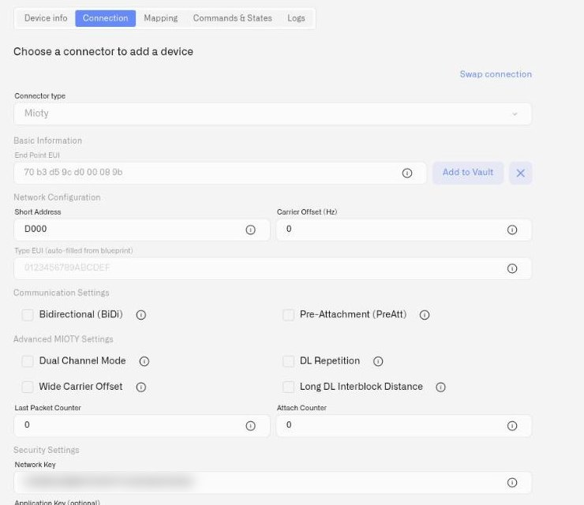

# MIOTY Devices

A MIOTY endpoint registered on the Kilo IoT Server becomes a Digital Twin like any other device — a persistent digital representation of its identity, configuration, telemetry history, and state. What is specific to MIOTY is the set of parameters that describe how the endpoint reaches your base stations, and the security material that lets the service center trust it.

This page covers the MIOTY-specific fields on the device form. The surrounding registration workflow — naming the device, the Metrics tab, the Logs tab, saving — is the shared flow documented in [Registering Devices](registering-devices.md).

## Prerequisites

- **A Mioty connector.** Without it, the MIOTY fields are unavailable and the form reports **"Create a Mioty connector first"**. See [MIOTY Connector](../connectors/mioty-connector.md).
- **At least one base station online.** Endpoints attach through base stations. See [MIOTY base stations](../gateways/mioty-base-stations/README.md).
- **Endpoint credentials from the manufacturer** — the End Point EUI and the Network Session Key, normally on the unit's label or in a shipped provisioning file.

## Selecting the connector

On the device form, select the Mioty connector as the connector type. The form then presents the MIOTY parameter sections described below.

<figure><figcaption></figcaption></figure>

## Basic

- **End Point EUI** — the endpoint's unique identifier, exactly 16 hexadecimal characters. This is the address the network knows the unit by. A value that is not 16 hex characters is rejected.

## Network

These fields describe how the endpoint places its telegrams on air.

- **Short Address** — the compact identifier the endpoint uses on the radio link, entered in hexadecimal. Valid values run from **0001** to **FFFF**; zero is not a valid short address and will be rejected. Assign short addresses deliberately across a site rather than at random — a scheme tied to zone or line makes a large rollout far easier to reason about later.
- **Carrier Offset** — optional. Shifts the endpoint's carrier within the band. Set it when the manufacturer's commissioning data or your site's frequency plan calls for it; leave it alone otherwise.
- **Type EUI** — read-only. This is filled in from the blueprint you select or author for the device, and identifies the endpoint's payload type. You do not enter it by hand. See [MIOTY Blueprints](mioty-blueprints.md).

## Communication

- **BiDi** — bidirectional communication. Enable it for endpoints that must receive as well as transmit.
- **PreAtt** — pre-attachment. Enable it where the endpoint is provisioned to attach ahead of its first uplink.

Both settings are properties of how the unit is configured and specified by the manufacturer. Match the form to the hardware rather than choosing preferences here.

## Advanced MIOTY

These parameters tune the endpoint's radio behavior and exist for deployments that need them. Set them to match the endpoint's own configuration:

- **Dual channel**
- **DL repetition** — downlink repetition
- **Wide carrier offset**
- **Long interblock distance**

If your commissioning sheet does not mention a parameter, the endpoint is not using it — leave it at its default. These are levers for difficult RF environments, not settings to explore on a working fleet.

## Counters

- **Last Packet** — the packet counter position.
- **Attach** — the attachment counter.

Both are **0** for a new device. They exist so that a device record can be aligned with an endpoint that already has history — for example when you are migrating a unit that has been running elsewhere. For a unit out of the box, leave them at zero.

Aligning the counters lines up the *record*. It does not move the endpoint onto your network. A MIOTY endpoint attaches to one network at a time, and a unit that was running on another service center is still attached there — it will not appear under your base stations because you created a device record for it. Reset the endpoint so it attaches again, following the manufacturer's procedure for your model. Once a base station picks it up, the device's **Connection** tab moves to *Reached network — waiting for data*. See [Device Diagnostics](device-diagnostics.md) for how that lifecycle reads on the platform.

## Security

- **Network Session Key** — required. Exactly 32 hexadecimal characters. This is the key that secures the endpoint's link to the network; without a valid one the device cannot be saved.
- **Application Key** — optional. Provide it where the endpoint's payload is application-encrypted.

### Add to Vault

Endpoint credentials have a way of ending up out of reach — on a label on a unit that is now sealed inside an enclosure on a pipe rack. Click **Add to Vault** on the device form to store the End Point EUI and Network Session Key pair in Key Vault, where they are recoverable independently of the hardware and the sticker.

Do it at commissioning, while the credentials are still in front of you. Recovering a unit whose Network Session Key you no longer have on file means opening the enclosure — and some manufacturers only give the key back over a wired connection, if they give it back at all. See [Key Vault](../reports/key-vault.md).

## Validation — what blocks a save

The form will not save until these hold:

| Field | Requirement | What you see if it fails |
|---|---|---|
| **End Point EUI** | Exactly 16 hexadecimal characters | The field reports that the EUI must be 16 hex characters |
| **Short Address** | Hexadecimal, in range **0001**–**FFFF** | The field is rejected; zero is not valid |
| **Network Session Key** | Exactly 32 hexadecimal characters, required | The device cannot be saved |

Registering an identifier that already exists in your organization returns **"A base station with this EUI already exists"**.

## Decoding telemetry

A MIOTY endpoint's telemetry is **not decoded until a blueprint is selected for it**. Until then the device is registered and attached, but its payloads are not turned into named measurements — which means nothing usable reaches dashboards, rules, or history.

Blueprint Configuration lives on the same device form. You can pick an existing blueprint from the catalog or author a new one from JSON, and the choice is copied onto the device as its own independent snapshot. That snapshot model is what makes it safe to change catalog templates on a production fleet. See [MIOTY Blueprints](mioty-blueprints.md).

## What's next

- **Bind a blueprint** so the endpoint's payloads decode into named fields. See [MIOTY Blueprints](mioty-blueprints.md).
- **Map metrics** to normalize decoded fields across manufacturers. See [Metric Templates](metric-templates.md).
- **Complete the shared registration flow** — device info, Metrics, Logs. See [Registering Devices](registering-devices.md).
