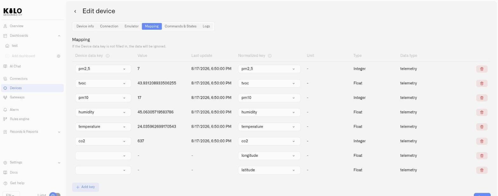

# Payload Decoding and Connector Keys

A device transmits a compact payload — a handful of bytes, or a small JSON message. A **decoder** turns that payload into named fields, and those fields are what the rest of the platform works with. When you write a rule, build a dashboard widget, or tell a command which sensor to check, you are working with values that came out of the decoder.

Two names are involved, and they are usually not the same:

* A **connector key** is the field name your decoder produces — `t`, `socket_status`, `humidity_pct`. It comes from the device's firmware and its codec.
* A **metric** is the name you gave that field when you mapped it — *Temperature*, *Socket status*. This is the name shown on dashboards, in rules, and in the command editor.

Knowing which connector key sits behind which metric — and what values it actually carries — is what lets you write a condition or a verification check that works the first time.

## See what your device is reporting

Open the device and go to its **Mapping** tab. The connector keys table lists every field the device has actually sent, with:

* the **field name** exactly as the device sends it
* its **current value**
* the **last update** time

This is live data from the device, refreshed as new messages arrive, and it is the quickest way to answer "what does this device report, and in what form?". Copy the value from here when you need to match it elsewhere — a rule condition, a dashboard condition, or the expected value on a command.

A device that has not transmitted yet shows nothing. Wait for its next scheduled message, or trigger one from the device itself.

<figure><figcaption></figcaption></figure>

## Where the decoder lives

For **LoRaWAN**, use **Code functions** on **Connection**. A device profile template supplies its codec; for a manual profile, provide the manufacturer's compatible codec. Save changes and inspect a fresh transmission.

For **MIOTY**, select a [blueprint](mioty-blueprints.md) on the connection form. For **MQTT**, configure the message format and field extraction in the MQTT mapping settings; a LoRaWAN Code functions field does not decode MQTT messages. Tracker fields come from the tracker integration, and emulator keys come from its configured signals.

See [Registering Devices](registering-devices.md) for connection-specific setup.

## Mapping keys to metrics

Mapping is what connects a connector key to a metric template, giving the raw field a readable name, a unit, and a type. Once mapped, that measurement appears under its metric name everywhere in the platform.

Do this from the same Mapping tab — see [Registering Devices](registering-devices.md#mapping-raw-fields-to-metric-templates) for the step-by-step, and [Metrics](metric-templates.md) to create a template that doesn't exist yet.

A connector key that is never mapped keeps arriving but has nowhere to go: it will not appear in rules, dashboards or command verification.

## How incoming values become stored measurements {#values-keep-the-form-the-device-sent}

The connector-key view shows incoming values. Before saving measurement history, Kilo applies the mapped metric's **Type**:

| Type | Accepted input and stored result |
|---|---|
| Float | A number or numeric text, such as `"22.5"`, becomes a numeric value. Non-numeric and non-finite values are rejected. |
| Integer | Numeric input becomes a whole number. Fractional parts are truncated toward zero: `22.9` becomes `22`, with a diagnostic warning. Use Float when decimals matter. |
| Boolean | Accepts true/false, text `true`/`false` regardless of case, and numeric or text `0`/`1`. Text such as `ON`, `OFF`, or `yes` is rejected. |
| String | Stores text; other input values are converted to text. |

A value incompatible with its mapped type is not stored for that measurement. Other valid fields can still be processed. Check the **Connection** event feed for type-mismatch or truncation details, and compare incoming values with **Logs**, which shows stored readings.

For a relay reporting `ON` and `OFF`, use a String metric or change the decoder to return a Boolean. Set rule conditions and [command verification](commands/verification.md#expected-value) to match the stored measurement type. Unit labels do not convert or rescale values.

## Testing a mioty decoder before you rely on it

MIOTY devices decode through a blueprint rather than a code function, and blueprints come with **Decode preview** — run the decoder against a sample payload and inspect the fields it produces before you attach it to real devices. See [MIOTY Blueprints](mioty-blueprints.md).

For LoRaWAN, save the codec and inspect the next message. For MQTT, save the extraction settings and generate a fresh publish. In both cases, inspect the incoming keys and stored measurements.

## When the fields aren't what you expected

**Keys are arriving but nothing appears in rules or dashboards.** The keys have not been mapped to metrics yet. Open the Mapping tab and map the ones you want to use.

**The keys are not the ones you expected.** The decoder is producing different field names than the sensors on the device are looking for — a common result of a codec written for a different firmware or hardware revision. Compare the names in the connector keys table against your mappings, and either update the mappings or replace the codec.

**Nothing is decoded at all.** Check that the device is transmitting, then check the codec itself. [Device Diagnostics](device-diagnostics.md) shows how many keys were decoded from the most recent messages.

## A new probe can use different field names

Replacing a refrigerator's probe may change its payload without changing what you measure. Decode the new payload first, then connect its temperature field to the twin's existing temperature row in **Mapping**. Keep the unit and value format consistent so historical and new readings remain comparable.

Use the connector keys table to confirm the replacement is reporting; use **Logs** to inspect stored measurement history. The live connector fields are not an archive of the old hardware's payloads. See [Device Management](device-management.md#replace-a-physical-sensor).

## Related

* [Registering Devices](registering-devices.md) — Device setup, codecs, and the mapping workflow
* [Metrics](metric-templates.md) — Normalized names, units, and value types
* [Device Diagnostics](device-diagnostics.md) — What the device last sent and whether it decoded
* [Confirming Commands](commands/verification.md) — Using a metric and its value to verify a command
