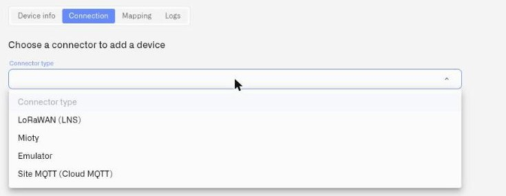
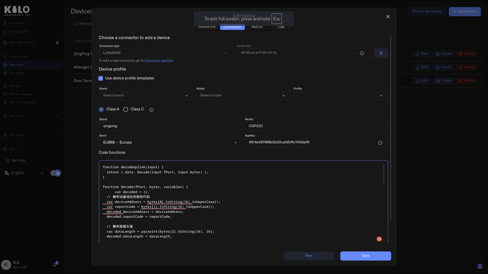

# Registering Devices

Every device registered on the Kilo IoT Server becomes a Digital Twin — a complete digital representation that mirrors the device's current state, configuration, telemetry history, and behavioral patterns. The Digital Twin persists even when the physical device is offline, giving you a continuous operational view of your entire deployment. Because the physical device binding is optional, you can create and fully configure a device profile before the hardware is connected — so setup and hardware commissioning don't have to happen at the same time. With the [Emulator](emulated-devices.md), you can go further and have the device produce data before the hardware exists at all.

Device registration is the process of creating this Digital Twin and linking it to a physical device through a connector. The registration flow guides you through naming the device, binding it to a connector, configuring its communication profile, and mapping the measurements it reports.

## Prerequisites

Before registering a device, you need:

- **A connector** — at least one LNS, Mioty, Tracker, MQTT (Cloud or External) or Emulator connector must be set up. See [Connectors](../connectors/) and the [MQTT Connector](../connectors/mqtt-connector.md) documentation.
- **Device identifiers** — for LoRaWAN devices: the Device EUI and AppKey (typically printed on the device or its packaging). For MIOTY endpoints: the End Point EUI and Network Session Key. For tracker devices: the Unique ID provided by the manufacturer. For MQTT devices: the device-level topic segment the device publishes under, used as the Device ID on the device record; it must match the published segment byte-for-byte (whitespace is stripped on input). **Emulated devices need none of this** — you choose the Device ID yourself.
- **For MQTT devices only — the device must be publishing before mapping can be completed.** The Connector key dropdown in the Mapping tab populates from payload keys actually received from the device. See the [MQTT-specific behavior section](#mqtt-specific-behavior) below for the two-pass workflow.

## Where to start

There are three entry points for device registration — all open the same Manage Device dialog:

1. **Devices** — Click **Devices** in the sidebar. This page shows all devices across all connectors. Click **Add device** in the top-right corner.
2. **Connector row action** — From the **Connectors** page, click the **+** (Add device) button on any connector row. The dialog opens with that connector pre-selected.
3. **LNS Connected Devices** — Open the LNS connector, switch to the **Connected Devices** tab, and click **Add device**.

The device form is laid out for small screens as well as desktop, so you can register hardware from a phone while standing at the installation point.

## Phase 1 — Create the device profile

The dialog opens in **Add device** mode, showing only the **Device info** section. No tabs or navigation are visible yet — the first step is simply to identify the device.

- **Device photos** — Optionally upload photos of the physical device for visual identification.
- **Device name** — Enter a descriptive name (required). Use a naming convention that scales across your deployment — for example, including the location or device type in the name.

Click **Save**. The Digital Twin is created with just the name and optional photo. The dialog automatically transitions to edit mode.

## Phase 2 — Configure connection, metrics, and logs

After the first save, the dialog reopens with **Device info**, **Connection**, **Metrics** and **Logs** tabs, and a **Next** button for navigating between them. This is where you bind the device to a connector and configure its data. Two more tabs appear when they apply: **Commands & States** on a device that can receive downlinks, and **Emulator** on a device bound to the Emulator connector.

### Connection tab

This tab binds the Digital Twin to the device that feeds it through a connector. The dropdown lists the connectors your organization actually has, by name and type, and the fields below it change to match the one you pick.

<figure><figcaption></figcaption></figure>

#### For LoRaWAN devices (LNS connector)

1. **Connector type** — Select the LNS connector from the dropdown. If only one LNS connector exists, it may be pre-selected.
2. **Device EUI** — Enter the device's unique LoRaWAN identifier (8-byte hexadecimal string, displayed as `HH HH HH HH HH HH HH HH`). This is typically printed on the device label or packaging. Once a physical device is bound, this field cannot be changed without detaching the device first.

   **Scan QR code** — Rather than transcribing sixteen hex characters from a label, click **Scan QR code** and point your laptop or phone camera at the QR code on the device or its packaging. The Device EUI is filled in from the code, and where the code also carries the AppKey, that field is populated too. This is the faster and safer path when commissioning devices in bulk — a single mistyped character in a DevEUI produces a device that silently never joins.

   If the browser cannot access a camera, the scanner reports **"QR code scanner is not found. Please try again."** Check that a camera is present and that the browser has been granted camera permission for the site, then try again — or enter the identifiers by hand.
3. **Use device profile templates** — Check this option to select from a library of known device profiles.

   Device profile templates are convenience presets for known LoRaWAN devices. Each template includes the device's LoRaWAN class, frequency band, and a **codec** — the payload-decoding logic that translates the device's raw binary uplink data into readable fields. Selecting a template is a two-step process:

   - **Brand** — Select the device manufacturer from the autocomplete list.
   - **Model** — Select the device model. The list filters based on the selected brand.
   - **Profile** — Select the template profile for this device. Options are derived from the model's supported regional bands.

   Once you select all three, the server fetches the matching template and applies its configuration to the form: the LoRaWAN **class**, **band**, and **codec** are filled in automatically. You can review and adjust these values before saving.

   Templates are provided as convenience helpers. Correct payload decoding is not guaranteed for every firmware version or hardware revision. If a template's codec produces missing or incorrect fields, you can edit the **Code functions** field directly (see below).

   If you do not use a template, configure the profile manually:

   - **Class** — Choose the LoRaWAN device class:
     - **Class A** — The device sleeps between transmissions and only opens brief receive windows after each uplink. This is extremely power-efficient — most battery-powered sensors use Class A and can run for years on a single battery.
     - **Class C** — The device keeps its receiver open continuously, allowing it to receive downlink commands from the server at any time. Because the radio is always listening, Class C devices consume significantly more power and are typically mains-powered. Choose Class C for devices that need to respond to commands immediately, such as actuators, switches, or displays.
   - **Brand** and **Model** — Enter the device manufacturer and model as free text.
   - **Band** — Select the LoRaWAN frequency band for your region. The band must match your gateway's configuration and your region's radio regulations. Available options: EU868 (Europe), US915 (USA), AU915 (Australia), AS923 (Asia), KR920 (South Korea), IN865 (India), RU864 (Russia), CN470 (China), CN779 (China), EU433 (Europe 433 MHz), ISM2400 (2.4 GHz global). For a complete list of frequency bands by country, see [LoRaWAN Frequencies](../connectors/lns-connector/lorawan-frequencies.md). For an introduction to LoRaWAN, see [What is LoRaWAN?](../connectors/lns-connector/what-is-lorawan.md).
   - **AppKey** — Enter the device's application key — the LoRaWAN encryption key used for over-the-air activation (OTAA). This is typically provided by the device manufacturer; check the device packaging or official documentation.

#### Add to Vault

Device credentials have a habit of ending up somewhere impractical: a sticker on a unit that is now mounted six meters up in a warehouse aisle. Click **Add to Vault** on the device form to store the device's EUI and key pair in Key Vault, where they are recoverable independently of the hardware and the label. For a LoRaWAN device, this stores the AppKey against the DevEUI.

Do this at registration, while the credentials are in front of you. Re-provisioning a device whose AppKey you no longer have on file means getting back to the unit itself — and whether the key can be read out of it at that point is down to the manufacturer, and may mean a wired connection to the board. See [Key Vault](../reports/key-vault.md).

#### Code functions (codec)

The **Code functions** field contains the device's payload codec — JavaScript logic that decodes the device's raw LoRaWAN uplink payload into named fields. These decoded fields become the **connector keys** visible in the Metrics tab.

When you select a device profile template, this field is automatically populated with the template's codec. If you configure manually, this field starts empty — you may need to paste a codec from the device manufacturer's documentation or a community codec repository.

If the decoded output doesn't match what you expect — for example, if fields are missing, values look wrong, or field names don't match your sensor's documentation — you can edit the code directly. The editor is a multiline text area with monospace formatting.

<figure><figcaption></figcaption></figure>

#### Data sending interval

A device transmits on a fixed schedule — every few minutes, once a day, once a month — and that schedule is configured **on the device itself**. It varies from one manufacturer to the next: some devices ship with the interval already set by the manufacturer, others require you to set it when you commission the device. Either way, the schedule is a property of the device. The **Data sending interval** field is where you tell the platform what that schedule is, so it knows when to expect data.

Set it to match how the device is actually configured to transmit. If the device sends once per day, set this to **1 day**; once per month, set it to **1 month**. The field starts at **1 hour** by default only because the platform needs an initial value — it has no way to read the device's real schedule, so treat that default as a placeholder to replace.

If no message arrives within the configured interval, the device is marked offline in the device list and flagged on the Overview page's Devices card. Setting the interval to match the device is what keeps a healthy, low-frequency device from being marked offline simply because it is quiet between scheduled reports.

Choose a number and a unit: **minute**, **hour**, **day**, **week**, or **month**.

> **Emulated devices are the exception.** On a device bound to the Emulator connector, this field is not a description of a schedule the hardware already keeps — it *is* the schedule the platform emits on. See [Emulated Devices](emulated-devices.md).

#### For vehicle trackers (Tracker connector)

1. **Connector type** — Select the Tracker connector from the dropdown.
2. **Unique ID** — Enter the tracker's unique device identifier.
3. **Device model** — Search and select from the tracker model library. Start typing to filter the list.
4. **Url for GPS tracker** — After selecting a model, a panel appears showing the endpoint URL. Click the copy button to copy it, then configure your tracker to send data to this URL.

#### For MIOTY endpoints (Mioty connector)

Select the Mioty connector from the dropdown and the form presents the MIOTY parameter set — End Point EUI, short address, network session key and counters. These fields, their valid ranges and the blueprint that decodes the endpoint's payloads are documented in full on [MIOTY Devices](mioty-devices.md).

#### For emulated devices (Emulator connector)

Select the Emulator connector and the device generates its own telemetry instead of receiving it — no identifiers, no credentials, no hardware. You give it a Device ID, choose what it measures (by hand or from a device preset), and set how often it reports. An extra **Emulator** tab then lets you drive its values directly.

This is how you build a deployment before the sensors arrive, and swap the same device onto real hardware when they do. See [Emulated Devices](emulated-devices.md).

### Metrics tab

This tab maps the device's raw sensor data to normalized measurement definitions. If metric templates have been configured for the device type, the mappings may populate automatically. Otherwise, you can assign metric templates manually.

#### Connector keys — see what the device sends

Once the device is connected and transmitting, the Metrics tab displays a **connector keys table** showing every field in the device's raw payload. Each row shows the field name (exactly as the device sends it — e.g., `t`, `temp1`, `humidity_pct`), its current value, and the last update timestamp. This is the live payload from the device, updated in real time.

Come back to this table whenever you need to know what a device reports and in what form — writing a rule condition, or setting the expected value on a command. See [Payload Decoding and Connector Keys](payload-decoding.md).

#### Mapping raw fields to metric templates

This is where you turn cryptic device output into meaningful, labeled measurements. When you map a raw connector key (like `t`) to a metric template (like "Temperature", unit: °C, type: Float), you are giving that raw field a human-readable identity. From that point on, dashboards, automation rules, alerts, and historical queries all display "Temperature (°C)" — not the raw field name the device firmware sends.

To normalize a raw field:

1. **Add a metric** — Click **Add key** and select a metric template from the dropdown (e.g., "Temperature", unit: °C, type: Float). The Unit, Type, and Data type columns auto-fill from the template. If the template you need does not exist, create one in [Metric Templates](metric-templates.md) first.
2. **Select the connector key** — In the **Connector key** dropdown for that metric, choose the raw field name that corresponds to this measurement (e.g., select `t` for a device that sends temperature as `t`).
3. **Save** — The mapping takes effect immediately. Normalized data flows through dashboards, automation rules, alarm evaluations, and historical queries.

If the Connector key is not filled in, the data for that metric will be ignored.

Repeat for each measurement the device reports. Multiple metrics can be mapped in a single session.

#### Any device, any payload format

This workflow accepts data from any device the server can receive — including prototype hardware with evolving payload schemas, sensors from niche manufacturers with undocumented telemetry formats, and legacy field equipment that transmits encoded identifiers rather than human-readable field names. If the device sends data, the connector keys table displays it and you can map it.

For details on setting up metric templates, see [Metric Templates](metric-templates.md).

#### MQTT-specific behavior

For devices ingested through the [MQTT connector](../connectors/mqtt-connector.md), two registration-flow specifics apply:

- **Connector key dropdown is empty until the first publish arrives.** The dropdown is populated from payload keys actually received from the device, not from a free-text input. For a brand-new MQTT device record, this requires a two-pass save: add a row per metric with the normalized key selected and the Data type set, leave Connector key empty, save, confirm the device is publishing, reopen the device record — the Connector key dropdown is now populated, match each row, save again.
- **Mapping tab Value column vs Logs tab history.** The Value column is a live snapshot of the most recent payload (updates on every accepted publish, regardless of whether Connector keys are populated). The Logs tab is per-sensor history (populated only by publishes that arrive *after* Connector keys are saved). After completing the second pass, generate a fresh publish to populate the Logs tab — older publishes are not retroactively normalized.
- **Mapping is iterative.** Initial registration rarely captures every useful payload key. Once live data has been arriving for a representative period, reopen the device record, review the Connector key dropdown and Value column to see what's actually being published, add Mapping rows for any additional fields you want to track, save, and trigger a fresh publish so the Logs tab starts recording history for the new mappings.

See [Topics and device routing](../connectors/mqtt/topics-and-device-routing.md) for the full MQTT-specific registration workflow.

### Logs tab

The Logs tab is initially empty. After the device begins sending data, this tab displays the raw event log with timestamps and payload details.

Click **Save** again to persist the connection and metrics configuration.

## After saving

The device appears in the device lists across the server — in the connector's device table, in Devices, and in any dashboards or automation rules that reference it.

For LoRaWAN devices, data begins flowing once the physical device sends a join request and the server accepts it. For tracker devices, data begins flowing once the tracker starts sending data to the configured URL endpoint.

Registering a device here does not make it join. A LoRaWAN device joins one network at a time, so a unit that was previously commissioned elsewhere — returned from another site, bought used, or run on a different platform — stays joined to that network until it is reset and sends a fresh join request. Factory-fresh hardware joins on its own; anything with a history usually needs a reset first. See [Before anything arrives: joining the network](device-diagnostics.md#before-anything-arrives-joining-the-network).

If the device is registered but no data is arriving, open its **Connection** tab and read the reception status — it reports whether the device has reached the network, whether messages are being received, and whether the values in them are being stored, with the specific next step for each case. See [Device Diagnostics](device-diagnostics.md).

## What's next

- **Configure metric templates** before or after registration to control how raw data is normalized. See [Metric Templates](metric-templates.md).
- **Edit device properties** at any time through the same dialog. See [Device Management](device-management.md).
- **Diagnose a silent device** from its Connection tab. See [Device Diagnostics](device-diagnostics.md).
- **Register a MIOTY endpoint** and its protocol-specific fields. See [MIOTY Devices](mioty-devices.md).
- **Start without hardware** and swap to the real device when it arrives. See [Emulated Devices](emulated-devices.md).
