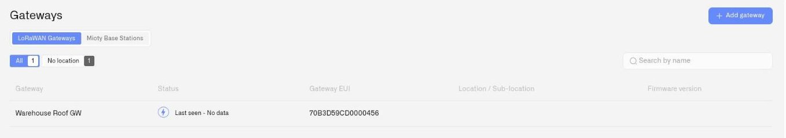

# Gateways

Gateways are the connectivity infrastructure that brings field devices into the Kilo IoT Server. Different protocols use different gateway architectures, but they share the role of receiving telemetry at the network edge and forwarding it to the platform over an authenticated, encrypted channel.

This section is organized by gateway type. Each category groups the hardware and software that connects a particular field-protocol family into the platform.

In the app, **Gateways** in the sidebar covers the two radio categories: a **LoRaWAN Gateways** tab and a **Mioty Base Stations** tab, each with its own list, location filters, and **Add gateway** action. MQTT edge gateways are not registered here — they publish through an [MQTT connector](../connectors/mqtt-connector.md) instead.

<figure><figcaption></figcaption></figure>

## In this section

### [LoRaWAN gateways](lorawan-gateways/README.md)

Radio infrastructure for LoRaWAN and LR-FHSS deployments. A single gateway covers hundreds of devices across distances from 2–5 km in urban environments to 15 km or more in open areas, with backhaul options including Ethernet, Wi-Fi, LTE, and satellite. Required for any deployment using LoRaWAN-based sensors, meters, or asset trackers.

- [Deploying a LoRaWAN gateway](lorawan-gateways/deploying-a-lorawan-gateway.md)
- [Monitoring LoRaWAN gateways](lorawan-gateways/lorawan-gateway-monitoring.md)
- [Supported LoRaWAN gateways](lorawan-gateways/supported-lorawan-gateways.md)

### [MIOTY base stations](mioty-base-stations/README.md)

Radio infrastructure for MIOTY (ETSI TS 103 357) deployments. Unlike a packet-forwarding gateway, a base station is an addressed peer that holds a persistent, mutually authenticated session to a service center over BSSCI. Telegram splitting gives it thousands of low-power endpoints per station and strong interference resistance — the category for high-density metering rollouts and RF-hostile industrial sites.

- [Registering a base station](mioty-base-stations/registering-a-base-station.md)
- [Base station monitoring](mioty-base-stations/base-station-monitoring.md)

### [MQTT edge gateways](mqtt-edge-gateways/README.md)

Protocol-bridging hardware and software that publishes MQTT — Modbus-to-MQTT, BACnet-to-MQTT, OPC-UA-to-MQTT, Sparkplug B edge gateways, and Zigbee2MQTT hubs. The infrastructure that lives at the network edge, translates non-MQTT field equipment into MQTT publishes, and feeds the platform's MQTT connector with a uniform topic and payload model.

- [Zigbee2MQTT Hubs](mqtt-edge-gateways/zigbee2mqtt-hubs.md)

## Choosing the right gateway category

For most commercial Kilo IoT Server deployments, the question is not "which category" but "how many" — the deployment topology is driven by the device fleet's protocol mix, coverage requirements, and operational redundancy needs. LoRaWAN gateways handle long-range, low-power radio fleets directly. MIOTY base stations handle the segments where endpoint density and interference dominate the design. MQTT edge gateways handle every other protocol family (Modbus, BACnet, OPC-UA, Sparkplug B, Zigbee, vendor-specific) by translating it into MQTT before the platform consumes it. Multi-protocol deployments routinely run more than one category side by side.

## Transport security

Different gateway paths have different transport-security profiles. Match each to the path you actually use:

- **LoRaWAN gateways** — the platform requires the LoRa Basics Station protocol with certificate authentication. The legacy UDP Packet Forwarder, which transmits data without encryption, is not supported.
- **MIOTY base stations** — the BSSCI session between the station and the service center is mutually authenticated with certificates (mTLS). Each station is issued its own certificate pair during registration, and there is no unauthenticated path.
- **MQTT edge gateways via Cloud MQTT** — when the platform provisions the broker, the connection uses MQTTS (TLS) on port 1884 with credentials scoped to the connector. Encrypted and authenticated by default.
- **MQTT edge gateways via External MQTT** — security is determined by the broker you operate. The broker URL can be `mqtt://` or `mqtts://` on any port, and the authentication method (anonymous, basic, certificate, or JWT) is chosen during connector setup. For production deployments, configure your broker for TLS and require authentication before exposing it on the public internet — anonymous brokers reachable from the internet accept publishes and subscriptions from anyone who finds them.

In every case the operator is responsible for verifying that the chosen path matches the deployment's security requirements; the platform does not silently downgrade to plaintext, but it also cannot enforce TLS or authentication on a broker it does not own.
