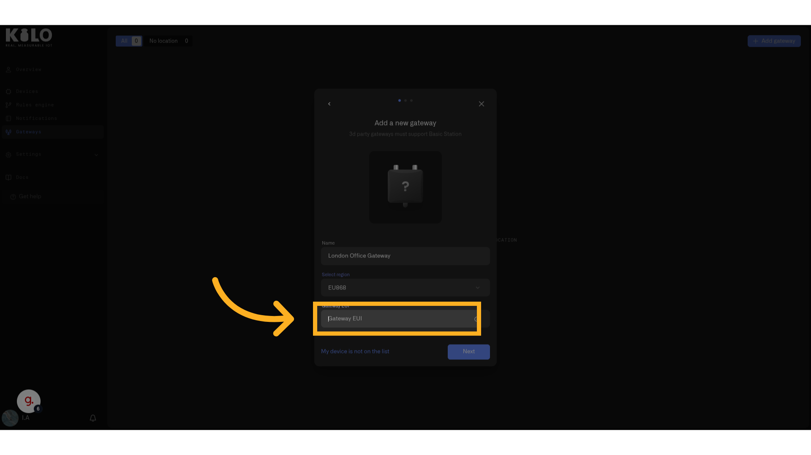

# Deploying a LoRaWAN Gateway

This page walks through registering a new LoRaWAN gateway with the Kilo IoT Server and configuring the hardware to connect.

## Prerequisites

- A LoRaWAN gateway that supports the **Basics Station** protocol
- The gateway's **Gateway EUI** — a unique 16-character hexadecimal identifier, typically printed on a label on the device
- The gateway installed where it has a suitable power source and an internet connection or backhaul (for example Ethernet, Wi-Fi, LTE, or satellite, depending on the model)

## Step-by-step

### Register the gateway

1. Click **Gateways** in the left sidebar.
2. Click the **Add gateway** button.

<figure><figcaption></figcaption></figure>
3. Enter a **Name** for the gateway — something that identifies its location or purpose (e.g., "Warehouse A — Loading Dock").

<figure><figcaption></figcaption></figure>

4. Select the **region** from the dropdown. This must match the LoRaWAN frequency band supported by your gateway hardware and used for the deployment. If the gateway was purchased for use in your country, the common regional band is often correct, but you should still verify the hardware specification.

   | Region | Typical selection |
   |---|---|
   | EU868 | Most deployments in Europe |
   | US915-0 / US915-1 | United States deployments; select the variant that matches your network plan |
   | AU915-0 | Australia deployments |
   | AS923 / AS923-2 | Asia-Pacific deployments where these bands are used |
   | IN865 | India deployments |
   | KR920 | South Korea deployments |
   | RU864 | Russia deployments |
   | EU433 | Special-case 433 MHz deployments; use only if the gateway hardware is specifically built or configured for EU433 |

<figure><figcaption></figcaption></figure>

5. Enter the **Gateway EUI** — the 16-character identifier from the gateway hardware. This is not the same as a device's Device EUI; it uniquely identifies the gateway itself.

<figure><figcaption></figcaption></figure>

6. Click **Next**.

### Download certificates and LNS address

After submitting the gateway details, the next screen displays:

7. Your gateway's **Name**, **Region**, and **Gateway EUI** for confirmation.
8. The **LNS Address** — click the copy icon to copy it to your clipboard. This is the server endpoint your gateway will connect to.
9. The **certs.zip** file — click the download icon to save the certificate bundle. These TLS certificates authenticate the gateway's Basics Station connection.

<figure><figcaption></figcaption></figure>
10. Click **Continue**.

A confirmation screen appears: *"Gateway successfully added. This gateway will appear in your list soon, it can take couple minutes."*

<figure><figcaption></figcaption></figure>

### Configure the gateway hardware

With the LNS address and certificates in hand, you now configure the gateway itself:

1. Access the gateway's management interface — this may be a local web interface, a device IP on your network, or a vendor-managed portal, depending on the gateway model.
2. Navigate to the LoRaWAN or Basics Station configuration section.
3. Enter the **LNS Address** you copied from the server.
4. Upload or point to the **TLS certificates** from the downloaded `certs.zip`.
5. Save the configuration and restart the gateway if required.

The exact steps vary by gateway manufacturer — refer to your gateway's documentation for its specific Basics Station configuration interface.

<figure><figcaption></figcaption></figure>

### Verify the connection

Once the gateway establishes its Basics Station connection, it will appear in the **Gateways** list with an online status.

<figure><figcaption></figcaption></figure> This typically takes a few minutes after configuration.

If the gateway does not come online:
- Verify the LNS Address was entered correctly (no extra spaces or characters)
- Confirm the certificates were uploaded to the correct location on the gateway
- Check that the gateway has internet access and can reach external endpoints
- Ensure the gateway firmware supports Basics Station (some older firmware versions may need an update)

These steps describe the current gateway registration path. Other options in the interface related to crypto-based onboarding programs are unrelated to IoT gateway deployment and are excluded from this documentation.

## Tips

- **Placement matters.** Gateways work best when elevated — mounted on a wall, placed on a high shelf, installed on a mast, or mounted on a rooftop. LoRaWAN signals pass through walls but lose strength with each barrier.
- **One gateway can cover a lot.** In a typical indoor deployment, a single gateway covers an entire floor or small building. Start with one and add more only if you see coverage gaps in device connectivity.
- **Remote deployment is possible.** Some gateways can operate with autonomous power systems such as solar and use cellular or satellite backhaul, making them practical for remote industrial locations where no local LAN is available.
- **Keep certificates secure.** The `certs.zip` file authenticates your gateway. Store it securely and do not share it. If a certificate is compromised, you can regenerate it from the gateway's Settings page.
