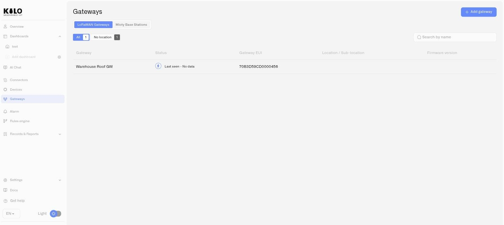

# LoRaWAN Gateway Monitoring

Once LoRaWAN gateways are deployed, the Gateways section gives you a fleet-level view of their health and performance, plus detailed information for each individual gateway.

## The gateway list

Click **Gateways** in the left sidebar to see all gateways connected to your organization.

<figure><figcaption></figcaption></figure>

### Table columns

| Column | What it shows |
|---|---|
| **Gateway** | The gateway name you assigned during setup |
| **Status** | Current connectivity — online or offline, with last-seen timestamp |
| **Public name** | An optional public alias for the gateway |
| **Location / Sub-location** | The assigned location hierarchy for the gateway, based on your organization's Locations settings |

The list is sorted by favorites first (starred gateways appear at the top), then by most recently seen.

## Gateway detail page

Click any gateway in the list to open its detail page. The page has two tabs: **Overview** and **Settings**.

### Overview tab

The Overview tab provides real-time operational metrics:

- **Availability** — The percentage of time the gateway has been online over a selected period. A consistently high availability indicates reliable infrastructure; drops may signal power issues, network instability, or hardware problems.
- **Traffic** — The volume of data the gateway is handling, shown as transmitted (Tx) and received (Rx) counts. This tells you how much device communication is passing through the gateway.
- **Map** — The gateway's position on a map when location data is available.

### Settings tab

The Settings tab lets you manage the gateway's configuration:

- **Private name** — The internal name for the gateway (editable).
- **Location and Sub-location** — The assigned place in your organization's location hierarchy. Used for filtering and organization in the gateway list.
- **Gateway EUI** — The unique identifier for this gateway (read-only after registration).
- **LNS Address** — The server endpoint the gateway connects to. Click the copy icon to copy it.
- **Certificates** — Download the current certificate bundle (`certs.zip`) or regenerate certificates if needed. Regenerating certificates invalidates the previous set — the gateway will need to be reconfigured with the new certificates.
- **Photos** — Upload or manage photos of the gateway for visual identification.
- **Delete** — Remove the gateway from your organization. This action requires confirmation.

## Operational tips

- **Check availability regularly** for gateways in critical locations. A gateway serving a cold storage facility or a security zone should maintain near-100% uptime.
- **Use locations consistently** so you can quickly filter the gateway list by site or building.
- **Regenerate certificates** if you suspect a security issue or if a gateway has been physically accessed by unauthorized personnel. The gateway will go offline until reconfigured with the new certificates.
- **Monitor traffic patterns** to understand gateway utilization. A gateway with unusually low traffic may have coverage issues; one with very high traffic may benefit from a second gateway to share the load.
