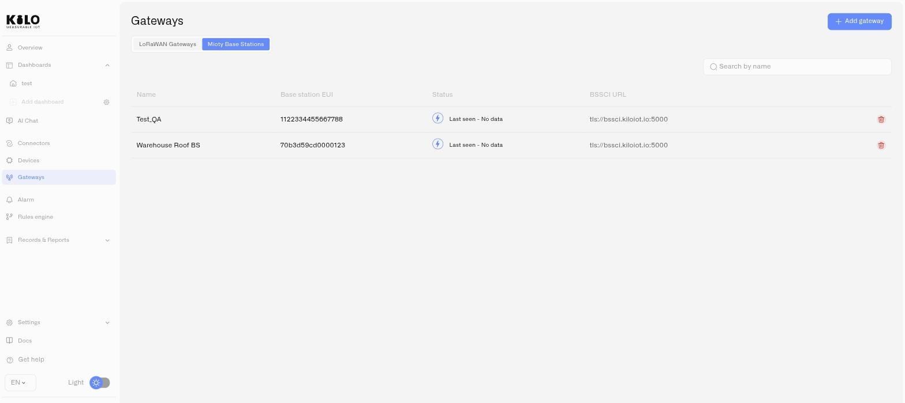

# MIOTY Base Station Monitoring

Once MIOTY base stations are deployed, the **Mioty Base Stations** tab on the Gateways page gives you a fleet view of the radio infrastructure, and each station's detail page gives you its operational state and configuration.

## The base station list

Click **Gateways** in the left sidebar and open the **Mioty Base Stations** tab.

<figure><figcaption></figcaption></figure>

### Table columns

| Column | What it shows |
|---|---|
| **Name** | The station name you assigned during registration |
| **BS EUI** | The station's 16-character hexadecimal identifier |
| **Status** | Current connectivity — online or offline |
| **BSSCI URL** | The service center endpoint this station holds its session to |
| **Last seen** | When the station last communicated |

Before your first station is registered, the tab shows **"No base stations yet"**.

**Status and last seen read together.** Status tells you the session state right now; last seen tells you how long a problem has been running. A station that went offline four minutes ago during a scheduled reboot and one that went offline nine days ago are the same status and very different incidents.

## Base station detail page

Click any row to open that station's detail page. It has two tabs: **Overview** and **Settings**.

### Overview tab

The Overview tab is the operational read on a single station:

- **Status** — an online/offline indicator showing the current state of the station's BSSCI session.
- **Description** — the notes you captured at registration: mounting details, antenna type, work order.
- **BSSCI URL** — the service center endpoint for this station. A copy control puts it on the clipboard, with a toast to confirm.
- **Creation date** — when the station was registered.
- **Last seen** — the most recent communication from the station.
- **Map** — once coordinates are set, the station appears as a marker in its real position.

### Settings tab

The Settings tab is where you change what the station is and how it authenticates.

**Editable fields:**

- **Name** — the station's display name across the fleet view.
- **Description** — free-text detail.
- **Coordinates** — latitude, longitude, and altitude. Altitude is worth entering accurately on multi-story or mast installations; a station on a 40 m stack and one at grade cover very different footprints from the same map pin.

Click **Save changes**. A toast confirms *"Base station updated"*. If the change cannot be applied, the toast reads *"Failed to update base station"* — the station's stored configuration is unchanged, so correct the input and save again.

**Read-only identity:** the **Base station EUI** is fixed after registration. It has a copy control, with a toast on copy, as does the BSSCI address.

**Regenerate certificate** — issues a fresh `certs.zip` for this station and downloads it. A card remains on the page so you can download the bundle again without repeating the operation. The station must be reconfigured with the new certificate pair; until it is, it cannot re-establish its BSSCI session.

**Delete base station** — removes the station from your organization. You are returned to the gateways list, and a toast confirms *"Base station deleted"*. If the operation fails, the toast reads *"Failed to delete base station"* and the station remains.

## Operational tips

- **Set coordinates at commissioning, not later.** The map is the fastest way to answer "which station covers this endpoint" during an incident, and it only works if the pins are real. A fleet of stations at 0,0 is a list with extra steps.
- **Treat regeneration as a planned outage.** Regenerating a certificate does not take the station down by itself, but it does mean the station must be reconfigured before it can reconnect after its next session drop. Schedule it with a technician who can install the new bundle, rather than issuing it and walking away.
- **Regenerate after physical exposure.** If a station has been accessed by unauthorized personnel, or its `certs.zip` has been handled outside your controls, issue a new pair. The old certificates are what an attacker would present.
- **Watch last seen across the fleet, not per station.** Several stations going quiet in the same window is rarely a radio problem — look at the site's backhaul or power before you look at the hardware.
- **Delete only when the hardware is retired.** A deleted station's endpoints lose the path they were attaching through. If you are relocating a station rather than decommissioning it, update its name and coordinates instead.
