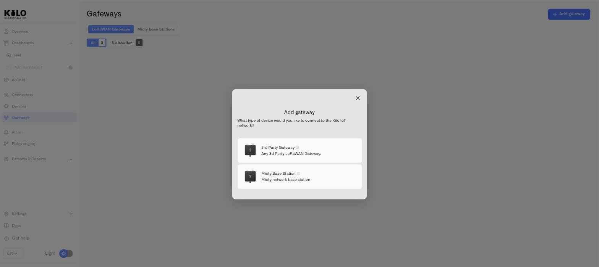
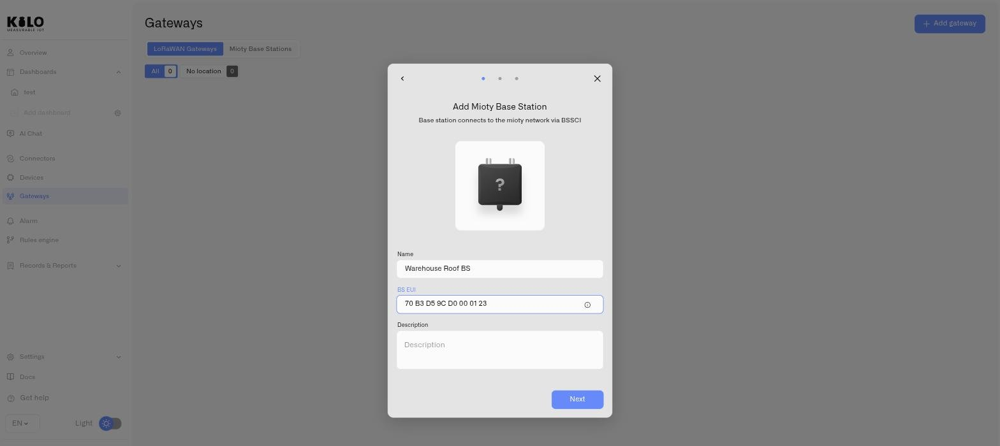
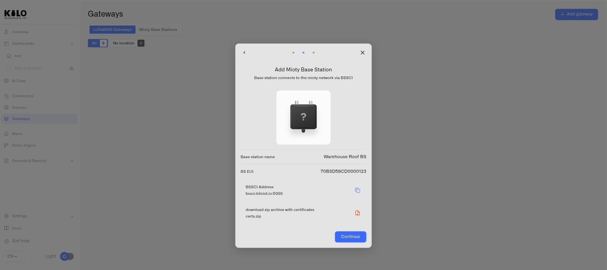
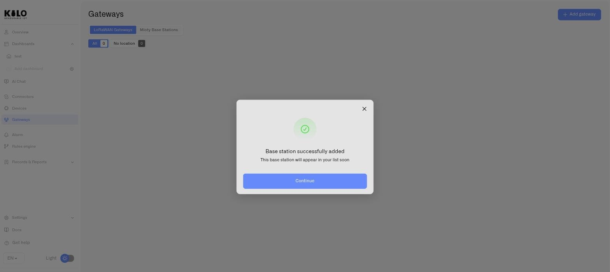

# Registering a MIOTY Base Station

This page walks through registering a MIOTY base station with the Kilo IoT Server and handing the hardware what it needs to establish its BSSCI session.

Registration is a three-step flow. It produces two artifacts you must carry to the hardware: the **BSSCI address** your organization's stations connect to, and a **certs.zip** certificate bundle that authenticates this specific station. Neither is optional — the BSSCI session is mutually authenticated, so a station without its certificates has no way in.

## Prerequisites

- **A Mioty connector** on your organization. Without it, the **Mioty Base Stations** tab does not appear and the flow cannot be started. See [MIOTY Connector](../../connectors/mioty-connector/README.md).
- **The station's BS EUI** — exactly 16 hexadecimal characters, normally printed on the hardware label or supplied in the vendor's commissioning sheet.
- **The station installed** with power and a backhaul path to the internet.

## Step-by-step

### Step 1 — Details

1. Click **Gateways** in the left sidebar.
2. Open the **Mioty Base Stations** tab.
3. Click **Add gateway**, then choose **Mioty Base Station** — the dialog asks which kind of device you are connecting.

<figure><figcaption></figcaption></figure>

4. Enter a **Name**. Use something that identifies the physical position rather than the hardware — for example "Plant 2 — Rack Hall North". This is the label you will read at 3 a.m. when a station drops.
5. Enter the **BS EUI** — the 16-character hexadecimal identifier from the station. The field accepts exactly 16 hex characters; a shorter value or one containing non-hex characters is rejected and the step will not advance. It must also be unique within your organization — registering a BS EUI that already exists returns **"A base station with this EUI already exists"**.
6. Enter a **Description** — optional, but the right place for mounting height, antenna type, or the work order that installed it.
7. Click **Next**.

<figure><figcaption></figcaption></figure>

### Step 2 — BSSCI address and certificates

The second step presents everything the hardware needs. Do not skip past it — this is where the certificate bundle is produced.

1. Copy the **BSSCI Address** using the copy control. A toast confirms: *"Url has been successfully copied"*. This is the service center endpoint your station will hold its session to.
2. Download **certs.zip**. The bundle contains the certificate pair this station presents when it authenticates over mTLS.

<figure><figcaption></figcaption></figure>

Store `certs.zip` with the same care you give any production credential. It identifies the station; anyone holding it can present as that station. If it is ever mishandled, you can issue a fresh pair from the station's Settings — see [Base station monitoring](base-station-monitoring.md).

### Step 3 — Confirmation

The final screen confirms **"Base station successfully added"**. Click **Continue**.

<figure><figcaption></figcaption></figure>

The station now appears in the **Mioty Base Stations** tab. It will show as offline until the hardware completes its BSSCI session.

## Configure the hardware

With the BSSCI address and certificates in hand, configure the station itself:

1. Open the station's management interface — a local web UI, a device IP on your network, or a vendor portal, depending on the model.
2. Find the BSSCI or service center configuration section.
3. Enter the **BSSCI address** you copied.
4. Install the certificate pair from `certs.zip` where the vendor's configuration expects it.
5. Save and restart the station if the model requires it.

The exact field names and file locations vary by manufacturer — consult the station's own documentation for its BSSCI configuration interface.

## Verify the connection

Return to the **Mioty Base Stations** tab. Once the station establishes its session, its status indicator turns online and the **last seen** column begins updating.

If the station stays offline:

- Re-check the BSSCI address for trailing spaces or a truncated paste.
- Confirm the certificate pair was installed in the location the vendor's firmware reads from, and that both files were extracted from `certs.zip`.
- Confirm the station has outbound internet access and is not blocked by a site firewall — the session is outbound from the station.
- Verify the **BS EUI** you registered matches the hardware label exactly. A station registered under the wrong EUI will never match the session the hardware opens.
- Check that the station firmware supports the BSSCI interface; some older builds require an update.

## Tips

- **Register before you climb.** The station record, its BSSCI address, and its certificates can all be produced from a desk. Do the paperwork first and arrive at the mast with the bundle already on the laptop.
- **Height buys density, not just range.** MIOTY's interference resistance is generous, but a station that hears more endpoints cleanly still needs fewer retransmissions. Mount above the racking, not inside it.
- **Set coordinates as part of commissioning.** They populate the map on the station's Overview and turn an alphabetical list into a site view. See [Base station monitoring](base-station-monitoring.md).
- **Name for position, describe for detail.** Names are what you scan under pressure; the description field is where mounting notes and asset tags belong.

## What's next

- **Monitor the station** — status, last seen, map, certificates, and settings. See [Base station monitoring](base-station-monitoring.md).
- **Commission endpoints** — with a station online, MIOTY endpoints have something to attach to. See [MIOTY Devices](../../devices/mioty-devices.md).
