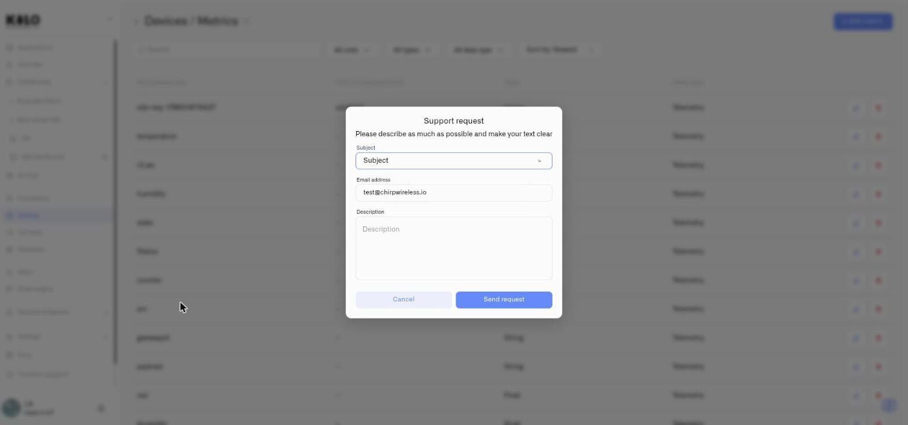

# Get Help

The support request dialog is available throughout the Kilo IoT Server interface. It sends your message — along with your account context — directly to the Kilo IoT support team.

## Opening the Dialog

Click the help or support option in the interface to open the contact form.

<figure><figcaption></figcaption></figure>

## Dialog Fields

| Field | Required | Description |
|---|---|---|
| **Subject** | Yes | A dropdown with three choices — **Bug report**, **Feature request** and **Integration request**. Pick whichever fits; it tells the team what kind of message they are reading before they open it. |
| **Email address** | Yes | Pre-filled with your account email. You can change it if you need the reply sent to a different address. The field validates for correct email format. |
| **Description** | Yes | A detailed explanation of what you need help with. The dialog reminds you: *"Please describe as much as possible and make your text clear."* |

### Which subject to choose

The three options are deliberately narrow, because each one goes somewhere different:

- **Bug report** — something in the platform behaves incorrectly. Say what you did, what happened, and what you expected instead; that trio is what makes a report reproducible.
- **Feature request** — the platform does not do something you need. Describing the outcome you are after is more useful than describing the control you imagine — it often turns out there is already a way, or a better one.
- **Integration request** — a device, protocol or external system you need Kilo to work with. Name the hardware or the service specifically, including model numbers.

## Sending the Request

Click **Send request** to submit. On success, a confirmation notification appears -- *"Request has been successfully sent"* -- the form clears, and the dialog closes automatically.

If something goes wrong during submission, an error notification is displayed so you can try again.

Click **Cancel** to discard the form and close the dialog without sending.
