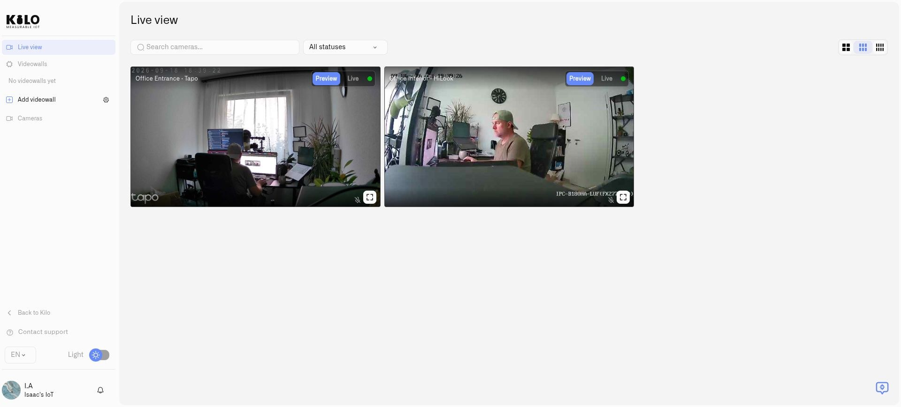
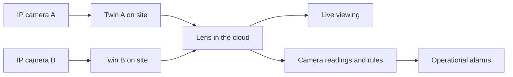

# Cameras

Open **Cameras** in the main navigation to use **Lens**, Kilo’s camera monitoring product.

**Lens** brings video cameras into Kilo IoT Server alongside devices, sensor readings, rules, and alarms. It gives teams a common place to view compatible cameras and use camera motion as an input to operational workflows.

Existing cameras need not become a separate replacement project. A business with different camera brands in New York, Washington, and London can connect compatible RTSP feeds to the same Kilo organization. Operators gain a shared platform for video and IoT information instead of relying on a different manufacturer's application for each installation.

<figure><figcaption>
Tapo and HiLook cameras connected to the same Kilo organization, shown in Preview mode.
</figcaption></figure>

## Lens in the cloud, Twin at the site

Lens runs in the cloud. **Twin** is a camera's digital twin running at the edge, on your premises, as a Docker container. Each Twin connects to **one camera**: twenty cameras require twenty Twin containers. Multiple containers can run on a suitable host, with separate configuration and enough processing, network, and storage capacity for the workload.

RTSP is a standard way for an IP camera to provide a video stream. A broad range of camera manufacturers support it. Twin connects to that stream; supported ONVIF cameras can also expose discovery and camera controls. Check your camera's stream settings and credentials before installation.

Twin is distinct from the platform's 3D Digital Building Twin visualization. Here, Twin specifically means the local runtime representing one camera.

## Where Lens fits

| Deployment | Practical use |
|---|---|
| Security and property management | Check entrances and shared areas while monitoring environmental or equipment readings. |
| Smart cities | Bring compatible cameras from public spaces into the same platform as other IoT infrastructure. |
| Traffic monitoring | Observe roads, junctions, or access points alongside relevant sensor information. |
| Public transportation | View stations, stops, and depots and configure responses to motion in selected areas. |
| Distributed enterprises | Reuse different camera brands across offices and facilities with organization-managed access. |

The per-camera Twin model lets deployments expand camera by camera and site by site. Size each site's host and connection for its actual feeds, and check organization subscription limits when expanding.

## Give an existing camera a useful new role

Suppose an entrance camera sees a busy pavement, stairs, and an office door. Drawing a motion zone around the doorway lets Twin detect movement there without using the entire scene as the trigger. The camera does not need built-in AI for this selected-area motion detection.

The resulting motion reading can start a Kilo rule. The rule can evaluate a condition and raise an alarm whose notification behavior you configure. This connects visual monitoring to the same automation system used by other IoT devices.

Use [motion zones](motion-zones.md) and [camera rules and alerts](camera-rules-and-alerts.md) together to build this example. Zone-based motion detects changing pixels; it does not identify people, vehicles, or the reason for movement.

## Keep operational views ready

Create [videowalls](videowalls.md) to save selected feeds in layouts tailored to a site or task. Arrange and resize panels for a security desk, transport hub, or property portfolio, then reopen the wall for routine monitoring.

## Connect the first camera

1. [Install Twin](installing-twin.md) at the camera's site.
2. [Connect and pair the camera](connecting-a-camera.md) with the correct Kilo organization.
3. [Open live video](watching-live-video.md).
4. Configure motion, a rule, and optional [local recording](local-recordings.md).

Download Twin from the official [chirpiot/lens-twin Docker Hub repository](https://hub.docker.com/r/chirpiot/lens-twin). Organization permissions control who can use Lens; [access and troubleshooting](access-and-troubleshooting.md) explains the current requirements.

For ongoing administration, see [Managing Cameras](managing-cameras.md). To connect an account-backed camera or HomeKit accessory, see [Provider Camera Sources](connecting-cloud-camera-sources.md).
