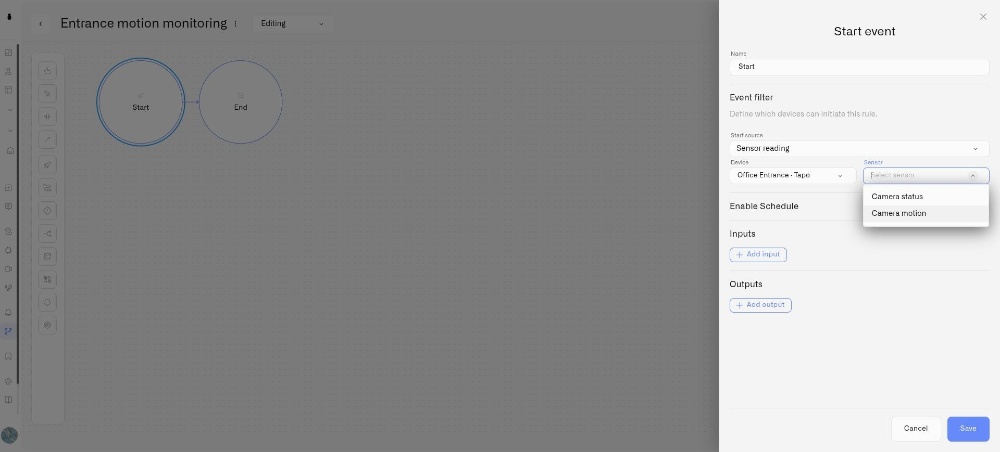

# Camera Rules and Alerts

A Lens camera supplies a motion reading that Kilo's Rules Engine can use like other sensor readings. This makes a camera part of an operational workflow: movement at a selected entrance can cause a rule to raise an alarm for the team responsible for that site.

First [connect the camera](connecting-a-camera.md) and [configure its motion zone](motion-zones.md). You also need permission to create rules and alarm definitions.

## Prepare the alarm definition

In **Alarm**, create the definition that the rule will raise. For example, name it `Entrance activity` and write a message that identifies the area requiring attention. Configure recipients, channels, schedule, and suppression for the intended response. Follow [Alarm Definitions](../alarm/notification-rules.md) for those settings.

## Build the motion rule

1. Open **Rules engine** and create a rule.
2. Configure **Start** with **Sensor reading**.
3. Select the camera in **Device**, then choose **Camera motion** in **Sensor**.
4. Add an **Exclusive Gateway** to distinguish detected movement from a false motion reading.
5. Set the outgoing condition for the motion branch to `vars.value == true`.
6. Connect that branch to **Set Alarm** and select the alarm definition you prepared.
7. Connect the action to **End**, and use a default route to End for the non-motion branch.
8. Save, build, and deploy the rule through the normal rule lifecycle.

`vars.value` is the value supplied by the selected sensor. For the camera's motion sensor it is a boolean: `true` means motion is detected. A `false` reading can mean no motion, but it is also sent when the camera goes offline; use **Camera status** to distinguish a quiet scene from a disconnected camera.

<figure><figcaption>
The camera’s motion reading starts the rule; the following nodes decide how to respond.
</figcaption></figure>

## Verify before enabling notifications

Use the rule's debugging tools with external actions mocked or skipped while checking the flow. Then test the actual camera by moving inside and outside its selected area. Enable intended delivery only after confirming the rule and alarm configuration.

The simple rule above raises an alarm on motion. It does not automatically resolve an existing incident when the next reading is false. Configure the appropriate clear behavior if that is required, and review [trigger timing](../rules-engine/triggers/trigger-timing.md).

Manually resolving an incident does not change the camera's reading. A condition that continues to qualify can raise another alarm according to the configured trigger and suppression behavior.

## Monitor the connection as well

Create a separate rule with **Start → Sensor reading**, select the camera, and choose **Camera status**. This reading is text rather than a boolean. A branch with `vars.value == "offline"` can raise a connection alarm so a missing feed receives attention. Test the recovery path as well as the offline path before enabling notifications.

Camera sensors are selected through the **Sensor reading** trigger. Readings can be repeated periodically even when their value has not changed; they are not only motion-start or motion-stop events. Combine conditions with the rule's timing settings and alarm suppression to avoid unwanted repeated notifications. Clearing an alarm needs an explicit clear action; neither a false reading nor a restored connection automatically clears an incident raised by the example rule.
