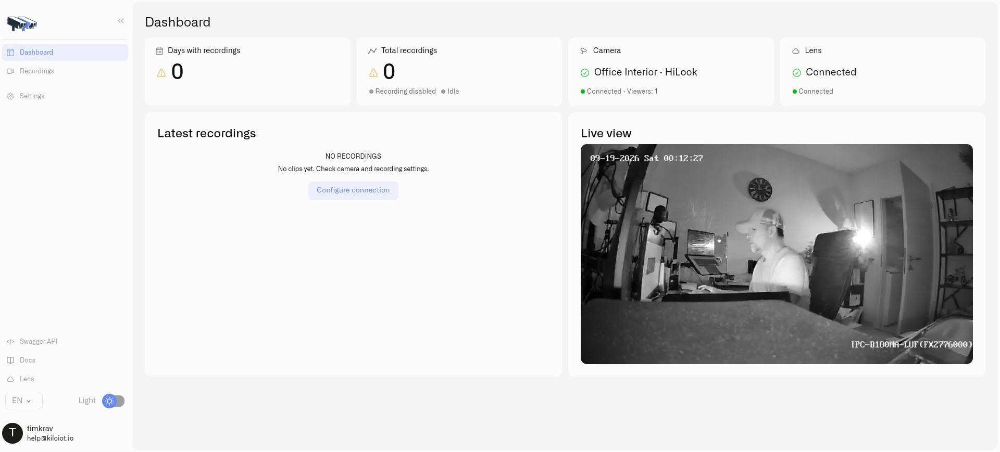

# Connecting a Camera

Connecting a camera has two parts: Twin must reach its local video source, then Lens must associate that Twin with your organization. The camera's password belongs in Twin's camera settings; the Lens connection token is a separate credential used for pairing.

Before starting, [install one Twin for this camera](installing-twin.md), have its stream details available, and select the intended organization in Kilo. You need permission to manage cameras and available device capacity.

For ready-to-adapt stream addresses, see [RTSP Camera URLs](rtsp-camera-urls.md), including Tapo and HiLook/Hikvision examples.

## Configure the local camera

1. Open Twin and sign in.
2. Open **Settings → Camera Connector**.
3. Enter the camera's RTSP address, including its local credentials, in **Main stream URL**. Select **Test main stream** to check it.
4. If the camera provides a substream, enter it in **Low-resolution stream URL** for lighter preview and motion processing. Leaving this empty uses the main stream.
5. Select **Save**, then verify the picture on the Twin dashboard.
6. For supported movement and preset controls, configure **ONVIF address**, **ONVIF username**, and **ONVIF password** in the ONVIF section. Select **Test ONVIF**, then that section's **Save**. **Discover ONVIF cameras → Scan** can help find cameras on the local network.

Use a name that identifies the camera's location and purpose, such as `Main office entrance`. Copy the **Twin Key** shown by Twin. It is generated for this installation and is not an editable camera serial number.

## Pair Twin with Lens

1. In Kilo, select **Cameras** to enter Lens.
2. Choose **Add camera**.
3. Enter the camera name and the **Twin Key**, then create the camera.
4. Copy the connection token shown after creation. Keep it private and complete the pairing before closing the setup.
5. In Twin, open **Settings → Lens Connector**.
6. Copy the **Lens API URL** from the Lens **Pairing token** dialog into Twin and paste its **Connection token**.
7. Select **Save**. Allow Twin to apply the connection settings, then return to Lens and check the camera's connection state.

Use the API URL supplied for your Lens environment, not the URL of the platform's ordinary web page. A development token and endpoint belong together; do not mix them with production.

<figure><figcaption>
Check both connection indicators and the camera picture after pairing.
</figcaption></figure>

## Verify the result

Open the camera and start live video. An online status confirms the connection, while a successful stream confirms that the full viewing path works. Check both before handing the camera over to operators.

Repeat this process for every camera with its own Twin and unique key. If the camera already exists and needs a new pairing token, use **Reconnect Twin** on that camera rather than creating a duplicate. See [Access and Troubleshooting](access-and-troubleshooting.md).
