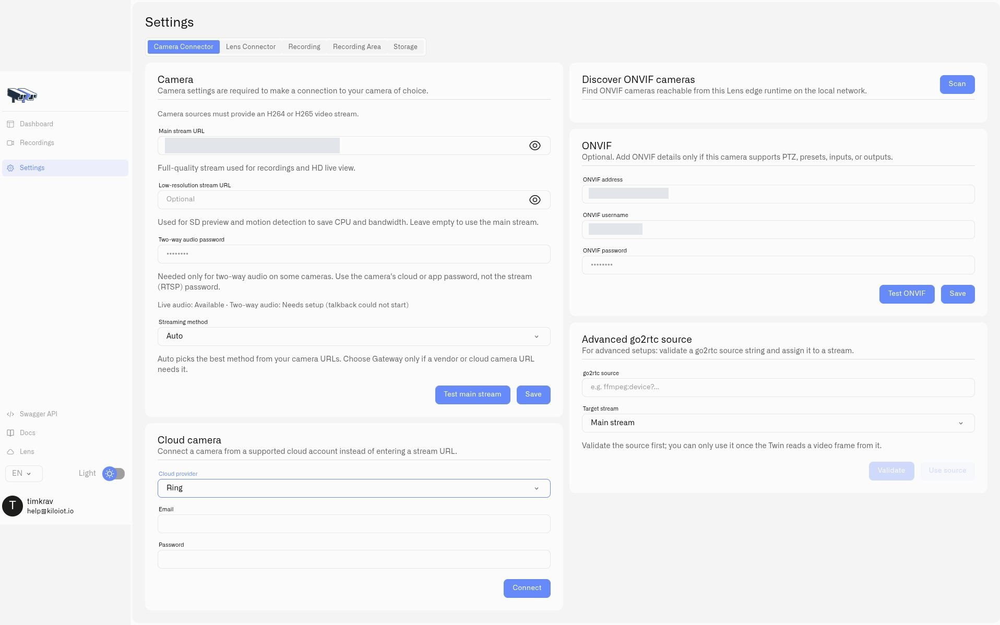

# Provider Camera Sources

Twin can obtain a camera feed through a supported provider connection as well as a local RTSP URL. This is useful when a camera is accessed through its provider account. HomeKit accessories use a local pairing workflow. Each Twin still represents one camera.

[Install Twin](installing-twin.md) first. You need the appropriate camera account or accessory credentials and network access to that source. Available providers and controls depend on the Twin version and camera; seeing a provider in the selector does not establish support for every model, PTZ, or two-way audio.

<figure><figcaption>
Select a provider to display its connection fields. This example shows the Ring sign-in form; private local-camera values are covered.
</figcaption></figure>

## Connect an account

1. In Twin, open **Settings → Camera Connector** and locate **Cloud camera**.
2. Choose **Cloud provider** and supply the fields for that provider.
3. Select **Connect**. If prompted, enter the verification code and select **Verify code**.
4. Under **Available cameras**, find the intended camera and select **Use as main stream**. Select a supported secondary source with **Use as sub stream** when needed.
5. Save the camera configuration, verify local video, then [connect Twin to Lens](connecting-a-camera.md).

| Provider | What to prepare | Connection steps |
|---|---|---|
| Ring | Account email, password, and access to its verification messages | Connect the account, then enter the requested two-factor code. |
| Wyze | Account email and password, API Key, API ID, and any required verification code | Enter the account and API details; complete verification if requested. |
| Roborock | Account email and the correct region | Choose the region, request the login code, then verify the emailed code. A custom region also requires its custom URL. |
| HomeKit | A reachable compatible accessory and its pairing PIN | Use the local discovery and pairing steps below. |

Obtain API credentials through the provider's account tools. These are different from your Twin administrator password and the Lens pairing token. If verification expires, restart the provider connection and request a fresh code.

## Pair a HomeKit accessory

1. Choose **HomeKit** as the provider and select **Discover accessories**.
2. Find the camera under **Discovered accessories** and select **Pair**.
3. Enter **Pairing PIN** and select **Pair accessory**.
4. Choose the resulting camera under **Available cameras**, apply it as the main stream, save, and verify video.

The Twin must be able to discover and reach the accessory on the local network. Check the accessory's own pairing requirements if discovery or pairing fails.

## Advanced source

Use **Advanced go2rtc source** when you already have a supported source string and need to configure it directly. This is the name of the advanced stream input shown in Twin.

1. Enter the source URI in **go2rtc source**.
2. Choose **Target stream**: **Main stream** or **Low-resolution stream**.
3. Select **Validate**. Twin must successfully read a video frame before the source can be used.
4. Select **Use source**, then **Save** the camera settings.

Keep embedded account credentials private. A validation failure leaves the new source unavailable for selection; check its format, access credentials, and network reachability before retrying.

For ordinary local IP cameras, [Connecting a Camera](connecting-a-camera.md) and the [RTSP Camera URLs](rtsp-camera-urls.md) reference provide the simpler setup path.
