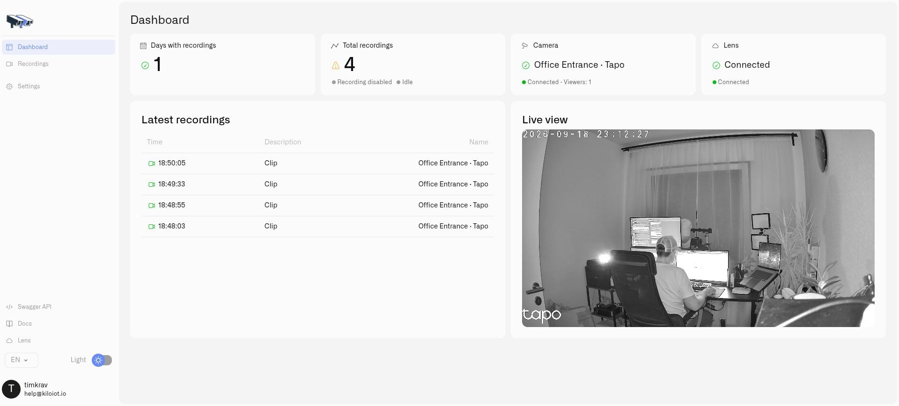

# Installing Twin

Twin is the edge digital twin of one camera. Install it on a Docker host at the customer's site so that it can reach the camera locally and connect to Lens in the cloud. A twenty-camera installation uses twenty containers, each with its own configuration and identity.

<figure><figcaption><p>A configured Twin shows the local camera and its connection to Lens.</p></figcaption></figure>


## Prepare the host

Use a Docker-capable host with an **amd64** or **arm64** processor. On Linux, run Docker Engine. On Windows or macOS, run Docker Desktop with Linux containers and keep Docker Desktop running while the cameras are in use. It needs access to the camera's RTSP stream, an internet connection for Lens, and sufficient CPU, memory, and bandwidth for the chosen feeds. If recording locally, allocate persistent storage and configure retention.

Obtain the camera's RTSP URL and camera credentials from its administrator or manufacturer. A substream can reduce the work required for previews and motion detection. Keep the local Twin administration interface on a trusted network.

The official image and available versions are on [Docker Hub: chirpiot/lens-twin](https://hub.docker.com/r/chirpiot/lens-twin).

## Start one Twin

The following Bash example publishes the administration interface only on the Docker host's loopback address. It prompts for a local login password rather than putting the password in shell history.

```bash
read -rsp 'Twin administrator password: ' TWIN_PASSWORD
printf '\n'
export TWIN_PASSWORD
docker run -d --name camera-01-twin --restart unless-stopped \
  -p 127.0.0.1:8080:80 \
  -e TWIN_USERNAME=admin -e TWIN_PASSWORD \
  -v camera-01-config:/home/twin/data/config \
  -v camera-01-recordings:/home/twin/data/recordings \
  chirpiot/lens-twin:1.0.1
unset TWIN_PASSWORD
```

Open `http://127.0.0.1:8080` on that host and sign in with `admin` and the password you supplied. On a remote server, use your established secure administrative access, such as an SSH tunnel, to reach this local port.

### First login and current password

Twin has **no default production username or password**. In the command above, `TWIN_USERNAME=admin` sets the initial username, and the password you type at the prompt becomes the initial password through `TWIN_PASSWORD`.

After signing in, Twin opens **Set your credentials**. Enter that same initial password in **Current password**, then enter **New password** and **Confirm new password**. You may also change **New username (optional)**. Select **Save and continue**, then sign in again with your new credentials. These credentials belong to this Twin, not your Kilo account or the camera itself.

If someone else installed Twin, obtain the initial credentials from that administrator. There is no universal factory password to enter. Use the initial password supplied when this particular Twin was installed.

Choose a new password with at least eight non-space characters, including uppercase and lowercase letters, a number, and a symbol. You can change your local login later by opening your user menu and choosing **Change password**.

The credential variables initialize a new installation only. Keep its persistent configuration volume when replacing or upgrading the container: it preserves the saved credentials, identity, and settings.

## Add more cameras

Repeat the setup with a different container name, host port, and both volume names for every camera. For example, `camera-02-twin` can use port `8081` and `camera-02-config` and `camera-02-recordings`.

Do not share or clone a populated configuration volume between Twins. Each instance generates its own **Twin Key** on first startup, and that key identifies it when paired with Lens. Keep the original configuration when restarting or upgrading the same camera's Twin.

Recording is off on a fresh installation. Complete [Connecting a Camera](connecting-a-camera.md), then enable [local recording](local-recordings.md) if required.

## Windows and macOS

Start Docker Desktop and ensure its engine is running before starting Twin. On macOS, use the Bash example above. On Windows, use this PowerShell equivalent:

```powershell
$twinInitialSecret = Read-Host 'Twin administrator password' -AsSecureString
$env:TWIN_PASSWORD = [System.Net.NetworkCredential]::new('', $twinInitialSecret).Password
docker run -d --name camera-01-twin --restart unless-stopped `
  -p 127.0.0.1:8080:80 `
  -e TWIN_USERNAME=admin -e TWIN_PASSWORD `
  -v camera-01-config:/home/twin/data/config `
  -v camera-01-recordings:/home/twin/data/recordings `
  chirpiot/lens-twin:1.0.1
Remove-Item Env:TWIN_PASSWORD
```

Open the same local address and complete the first-login steps. The Docker host must be able to reach the camera's private IP address. If automatic camera discovery does not reach the camera from Docker Desktop, enter the camera address or RTSP stream manually. A computer that sleeps or shuts down takes its Twins offline.

## Restart and upgrade

For a normal restart, run `docker restart camera-01-twin`. For an image upgrade:

1. Back up the Twin's persistent configuration and any recordings you need to keep.
2. Select the intended image version from the official Docker Hub repository and pull it with `docker pull chirpiot/lens-twin:<version>`.
3. Stop and remove only the old container with `docker stop camera-01-twin` and `docker rm camera-01-twin`.
4. Run the installation command again with the new image tag and the **same** configuration and recording volume names, port, and other installation options.
5. Sign in with the saved local credentials and verify local video and the Lens connection.

Do not remove the volumes during an upgrade. Replacing the container briefly interrupts its camera feed; the retained configuration keeps the camera's identity and pairing.
