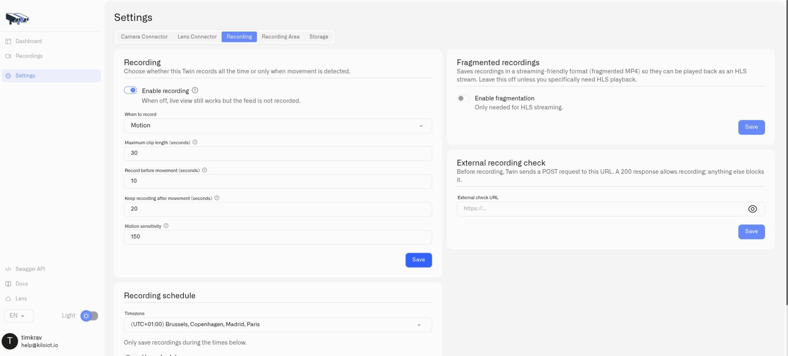
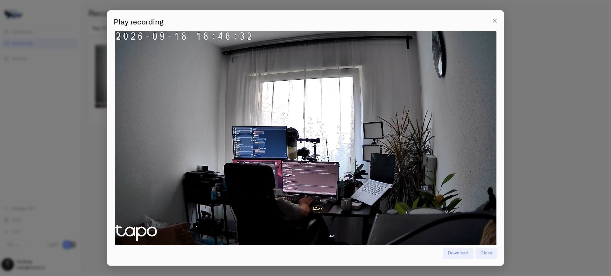

# Local Recordings

Twin can save video on the Docker host at the camera's site. Local recording is useful when the team needs clips to review after an event or a continuous record for a configured period. Recording is disabled on a new Twin until you enable it.

These settings and recordings are accessed through the camera's local Twin interface. Allocate persistent recording storage before enabling them; see [Installing Twin](installing-twin.md).

## Choose a recording mode

1. Open Twin and go to **Settings → Recording**.
2. Enable recording.
3. Under **When to record**, choose motion-based or continuous recording.
4. For motion recording, configure the pre-recording and post-recording periods and maximum clip length. These determine how much context surrounds detected activity and how clips are divided.
5. Save the configuration.

Choose motion mode when selected-area detection drives your workflow. Configure [Motion Zones](motion-zones.md) and sensitivity before relying on the resulting clips. Continuous recording saves video without waiting for movement and skips motion processing. Choose **Motion** when camera-motion readings drive your rules; you may leave recording disabled if you need motion readings without saved video.

### Clip timing and sensitivity

| Setting | Effect |
|---|---|
| Maximum clip length (seconds) | Caps the length of a saved clip. Continued movement can result in further clips. |
| Record before movement (seconds) | Includes buffered video from before the trigger. The amount available depends on the camera's keyframes and buffer. |
| Keep recording after movement (seconds) | Adds context after the trigger; further movement can extend the clip up to its maximum length. |
| Motion sensitivity | Threshold measured in changed pixels. Lower values detect smaller changes; a value around 150 is the balanced default. |

### Set a recording schedule

The shipped default timezone is **UTC**. Verify **Timezone** against the site's operating hours before turning on **Use schedule**: a different zone can move recording and motion-processing windows relative to local time. Retaining the configuration volume during an upgrade retains the saved timezone rather than resetting it to the shipped default.

In **Recording schedule**, select **Timezone**, enable **Use schedule**, and configure the active intervals for each relevant day. Each day supports two intervals, useful for a morning and evening monitoring period. Save the schedule and test both an active and an inactive period. Schedules also restrict motion processing, so use unrestricted operation for the initial motion-rule test.

<figure><figcaption>
Motion recording includes configurable video before and after detected movement.
</figcaption></figure>

## Control disk use

In **Settings → Storage → Automatic cleanup**, enable one or both limits:

- **Limit by total size**: set **Maximum recordings folder size (MB)**. The oldest recordings are removed when the folder exceeds this size.
- **Limit by age**: set **Delete clips older than (days)** to remove recordings after your retention period.

Select **Save**. When both limits are enabled, reaching either limit can remove a recording. Download clips you must retain separately before cleanup removes them.

Storage paths are paths inside the container. Keep the recording directory mounted to persistent host storage. A larger disk alone does not change the cleanup limits.

## Review or download a clip

Open **Recordings** in Twin, select the relevant date range, and open a recording. Use playback to inspect it and the download control to save the clip when needed.

<figure><figcaption>
Review the saved clip in Twin or download it for later inspection.
</figcaption></figure>

Check the recorded time, picture, and expected pre/post-event context during commissioning. A selected motion area determines what triggers a clip; it does not crop the saved image to that area.

## Use an external recording condition

**External recording check** lets an existing system permit or prevent processing—for example, an occupancy system can enable monitoring while a site is unattended. Enter its endpoint in **External check URL** and save. This is an advanced integration; test ordinary recording before enabling it.

Twin sends an HTTP POST containing `camera_id`, `camera_name`, `site_id`, and `timestamp`. HTTP **200** permits processing; other responses or request failures prevent it. The request times out after eight seconds. Results are cached for thirty seconds and refreshed in the background; processing is initially permitted before the first result arrives. This is therefore not an immediate or fail-closed access control. Use an endpoint you control and check its logs while testing both responses.
