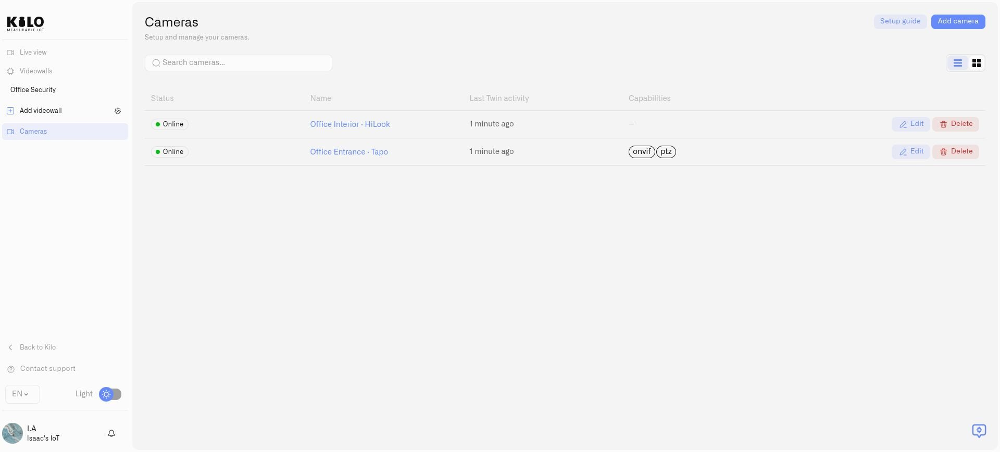

# Managing Cameras

The **Cameras** page is your inventory of cameras connected through Lens. Use it to find the camera for a named entrance, depot, or floor, check its connection, and maintain its identity without searching through separate manufacturer applications.

## Find and inspect a camera

1. Choose **Cameras** in the main navigation, then **Cameras** inside Lens.
2. Enter a name in **Search cameras...**. Switch between **List view** and **Grid view** to suit the number of cameras you manage.
3. Check **Status**, pairing information, and **Last Twin activity**. A registered camera can still be waiting for its Twin to connect.
4. Open a camera to see **Camera detail**. **Lens connection** shows its device identity, name, Twin key, and pairing state.

An online connection and successful video playback are separate checks. If a feed will not play, confirm local Twin video first, then use [Access and Troubleshooting](access-and-troubleshooting.md). A last-activity time describes the Twin's contact with the platform; it is not evidence that nobody has moved in the scene.

<figure><figcaption>
The inventory shows connection state and camera management actions.
</figcaption></figure>

## Rename a camera

Use **Edit camera**, enter **Camera name**, and select **Save**. Choose a name that identifies the view, such as an entrance or loading area, rather than only the camera model. Renaming updates the platform device name; it does not require a new Twin or pairing.

## Recover a lost pairing

Use **Reconnect Twin** when this Twin has lost its Lens pairing:

1. Open the camera's **Details** and select **Reconnect Twin** under **Lens connection**.
2. Read the confirmation, then generate the new one-time connection token. Any previous unused token becomes invalid.
3. Copy the **Lens API URL** and token shown by the dialog. Use these supplied values rather than a saved development address.
4. Open that camera's local Twin and enter them in **Lens Connector**, following [Connecting a Camera](connecting-a-camera.md).
5. Complete the connection before the displayed expiry, then check pairing and playback in the platform. If the token expires, generate another.

Keep the same Twin configuration volume when recovering or upgrading. A new empty volume creates a different Twin identity. Pairing tokens grant connection access: keep them private and do not include them in support screenshots.

## Remove a camera

Choose **Delete** for the camera and review the **Delete camera** confirmation. Removing it withdraws its platform connection; check dashboards, rules, and viewing arrangements that use it before confirming. This is different from removing a panel from a videowall, which leaves the camera available for other views.

Deleting a platform camera does not uninstall its Docker container or delete recordings on its local host. Manage those separately when retiring the physical installation.
