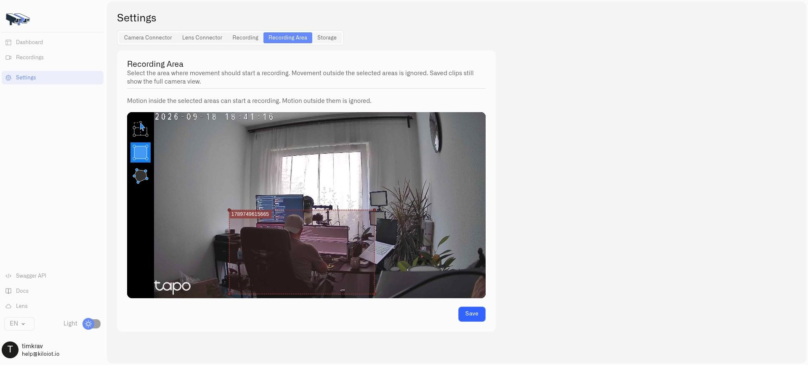

# Motion Zones

A motion zone limits the part of a camera image used for motion detection. It is useful when a camera sees both an area you care about and normal activity that should not trigger a response.

For example, a street-facing camera may show a pavement, stairs, and an office door. Select the doorway to detect activity at the entrance while excluding pedestrians elsewhere in the frame. Twin provides this detection even when the camera itself has no built-in AI.

<figure><figcaption>
This demonstration selects the desk area. For an entrance camera, draw the region around the doorway instead.
</figcaption></figure>

## Configure the detector in Twin

1. Open the camera's Twin and go to **Settings → Recording**.
2. Choose **Motion** under **When to record**. The motion workflow must be enabled rather than continuous mode.
3. For the first test, leave timetable and external-condition restrictions off so they do not prevent processing.
4. Open **Recording Area**.
5. Draw a rectangle around the doorway, or choose the polygon tool for a more precise outline.
6. Save the area and settings.

The area editor offers rectangle (**R**), polygon (**O**), and move/delete (**M**) tools. Use the current camera view to place boundaries accurately. Recheck the area after moving the camera or changing its position.

## Tune and test

Adjust the global pixel-change sensitivity in Twin. A lower threshold detects smaller changes and is more sensitive. Sensitivity is not an independent setting for each zone.

Test movement inside the selected area, then test movement outside it. Confirm that the motion reading changes for the intended activity. Shadows, reflections, rain, and lighting changes can also change pixels, so test under the conditions your deployment will encounter.

With no areas configured, detection uses the full frame. With several areas, qualifying movement in any selected area contributes to the camera's motion state. A zone restricts detection, not the picture shown in live video or a saved clip.

## Use motion without saving video

Motion telemetry can be used while saving recordings is disabled, provided motion processing remains configured. Enable recording separately when local clips are required. Timetables and external conditions can restrict when processing takes place, so configure them only after the basic behavior is verified.

Next, [use the motion reading in a rule](camera-rules-and-alerts.md), or configure [local recordings](local-recordings.md).
