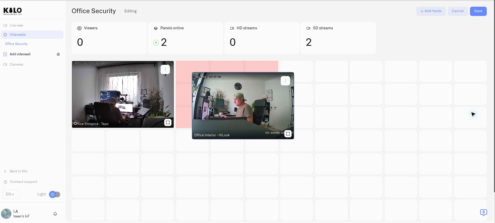
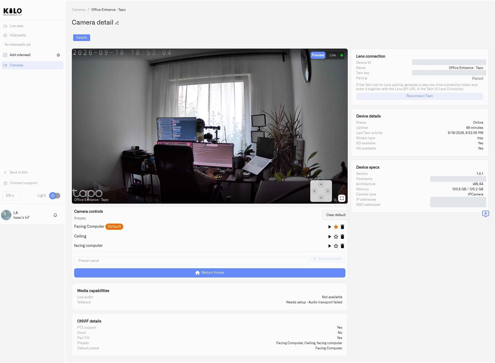

# Videowalls

A **videowall** is a saved arrangement of camera feeds inside Lens. It gives an operations team a repeatable view of the cameras relevant to a location or task, with panel sizes chosen for the scene rather than a fixed list of all cameras.

A security team could place a main entrance beside a loading bay. The same approach can group cameras at transport stops, road junctions, or several properties. Compatible cameras from different manufacturers can appear in the same wall once their Twins are connected to your organization.

## Group cameras around the way your team works

Use separate walls for different levels of a deployment: a city or regional office, an individual property, a floor, or an operational area such as reception and deliveries. A regional team can open the wall for the site it is checking, while an on-site operator can focus on the cameras covering one entrance or loading area.

The grouping can also follow a task rather than geography. A transport operator might bring station entrances together; a property team might group service entrances across several buildings. Choose recognizable wall names so operators can find the right set of views quickly. Each wall saves its own camera selection and panel arrangement.

## Before you start

[Connect the cameras](connecting-a-camera.md) and verify their [live video](watching-live-video.md). Select the organization that owns them and use an account with permission to manage cameras. Creating a wall selects cameras already in Lens; it does not pair new hardware.

## Create and arrange a wall

1. Open **Cameras** to enter Lens.
2. In the Lens sidebar, select **Add videowall**.
3. Enter a **Name**, such as `Station entrances`. Optionally select a **Folder** and add a **Description**, then select **Save**.
4. Open the wall's more menu and choose **Edit**.
5. Select **Add feeds**. Search for the cameras you need and select them. **Select all** applies to the current filtered selection; cameras already on the wall cannot be added twice.
6. Use the **Add … Feeds** button to place the selected cameras on the wall.
7. Drag panels into position and resize them from their corners. Give a busy entrance more space or align cameras for comparison.
8. Select **Save** to keep the composition and layout. **Cancel** discards the current editing changes.

Reopen **Edit** to add more feeds or remove a panel with its delete control. Save again when the arrangement is ready. Removing a panel removes it from that wall; it does not disconnect its camera.

<figure><figcaption>
In Edit mode, move and resize panels to arrange the cameras for the monitoring task.
</figcaption></figure>

## Monitor the selected cameras

Open a saved wall from the Lens sidebar. Each camera offers **Preview** and **Live** viewing modes. Preview displays periodically refreshed images; choose **Live** when you need continuous video. Use **Toggle fullscreen** to inspect a panel more closely.

The wall shows viewer, online-panel, and stream counters. A panel reported offline displays **Camera is offline** in place of its preview snapshot, so the last image is not retained as a current view. **No preview available** identifies a missing preview without establishing the camera's connection state; use the [connection-state guidance](watching-live-video.md#interpret-connection-state) to investigate. The **HD streams** and **SD streams** labels describe the wall's viewing modes; the camera's configured source still determines the actual available image detail.

Open an individual camera for supported audio or talkback controls. For ongoing responses to activity, combine the wall with [motion zones](motion-zones.md) and [camera rules and alerts](camera-rules-and-alerts.md).

## Restore normal coverage after following an incident

**Return All to Home** sends the supported cameras on the current videowall back to their individual home presets. A **PTZ camera** can pan, tilt, and zoom; a **preset** is a saved camera position. Each camera can have a different default position appropriate to its normal monitoring task.

For example, a security operator may steer several cameras to follow a person across a station or commercial property. When the incident ends, those cameras may be pointing away from their usual entrances, corridors, or platforms. Returning each camera by hand becomes tedious across a large wall. **Return All to Home** restores the chosen monitoring positions in one action, so the operator can resume normal coverage without repositioning every camera individually.

Set the intended home positions before using the command:

1. In Lens, open **Cameras** and select a PTZ camera.
2. Under **Camera controls → Presets**, find the position that should be its normal view. Use **Go to** to check that position if needed.
3. Select the star control, **Set as default**, beside that preset. The chosen position gains the **Default** label.
4. Repeat for the other supported cameras on the wall.
5. Open the saved videowall outside Edit mode and select **Return All to Home**.
6. Check the resulting camera views and notifications. The action applies to cameras on this wall, not every camera in the organization.

<figure><figcaption>
Choose the camera’s normal monitoring position as its default preset before returning the videowall cameras home.
</figcaption></figure>

If a camera has several presets but no default, Lens skips it and reports **multiple presets found, set a default**. Choose the intended preset and run the command again. For example, a camera might have one position looking up at a ceiling and another covering a reception desk; choosing the desk position makes the operational meaning of “home” explicit. A supported PTZ camera with exactly one available preset can use that position without an explicit default.

Cameras without PTZ support or a usable preset are skipped. Offline cameras and unsuccessful commands are reported separately, so check those cameras before assuming coverage has been restored. Supported camera controls require the camera's ONVIF connection to be configured in Twin; see [Connecting a Camera](connecting-a-camera.md).

## Organize and remove walls

Use the videowall management control in the Lens sidebar to create folders. Choose a folder when creating a wall to group related monitoring views, such as one folder per site. A folder must be empty before it can be deleted.

To remove a wall, open its more menu and choose **Delete videowall**. This removes the saved wall and its panels; the cameras and their Twins remain connected to Lens.
