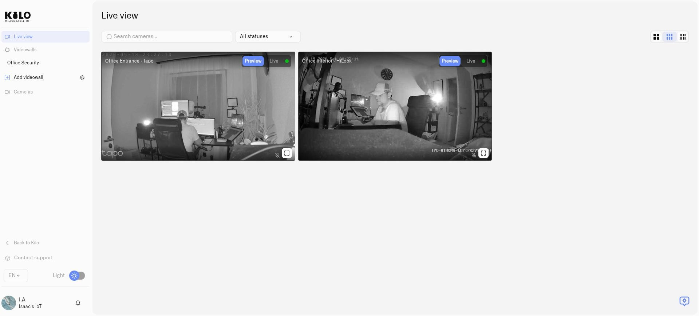

# Watching Live Video

Lens **Live view** lets operators inspect multiple connected cameras in one workspace. It is useful for comparing activity at an entrance, loading area, or remote facility without opening separate manufacturer applications.

<figure><figcaption>
Each camera has its own Preview and Live controls.
</figcaption></figure>

## Open the feeds

1. Select **Cameras** in Kilo's main navigation to open Lens.
2. Open **Live view**.
3. Find cameras by name and use connection-state filters when needed.
4. Choose a two-, three-, or four-column layout.
5. Start live video on each camera you want to watch.

A preview image and an active live stream are different viewing states. Start the stream when you need continuous video rather than assuming a preview is already live. Each tile has its own viewing controls, so two cameras can be watched together.

Use fullscreen when you need to examine one camera more closely. Return to the grid to compare views. Larger layouts and more simultaneous live streams require more network and viewing-device capacity.

## Camera controls

Available controls depend on the connected camera:

- **Audio:** listen when an audio stream is available; use mute when you do not need sound.
- **Talkback:** speak through a compatible camera when two-way audio is available and configured.
- **Pan, tilt, and zoom:** reposition a camera that exposes supported movement controls.
- **Presets:** use saved positions on supported cameras; authorized operators can manage those positions and return to the home position.

A camera without a supported capability will not gain physical movement or audio hardware through Lens. States such as **Needs setup** or **Not supported** help distinguish configuration from device capability.

<figure><figcaption>
Lens displays the images supplied by each camera, including its nighttime view.
</figcaption></figure>

## Interpret connection state

An offline camera cannot provide a current live feed. Check power, the local network, and Twin before treating a missing stream as an empty scene. If the camera is online but playback fails, inspect its video settings and the network path using [Access and Troubleshooting](access-and-troubleshooting.md).

For automated attention to a specific area, continue with [Motion Zones](motion-zones.md).

For a saved arrangement of selected feeds, create a [videowall](videowalls.md). Resize its panels to suit the monitoring task, and use [Return All to Home](videowalls.md#restore-normal-coverage-after-following-an-incident) to restore supported cameras after tracking activity.

## Listen and speak through a camera

Start the live stream and use its audio control to unmute or mute supported camera audio. For two-way audio, use the talkback control: allow microphone access when your browser asks, press and hold while speaking, and release to stop transmitting. A microphone permission denial, an unsupported camera, or incomplete camera audio setup prevents talkback. Check the displayed capability state before troubleshooting the microphone.

## Move a camera and save useful positions

**PTZ** means pan, tilt, and zoom. Open a supported camera's controls and use the directional and zoom controls to adjust the view. Save positions you will revisit:

1. Move the camera to the required view.
2. Under **Presets**, enter **Preset name** and select **Create preset**.
3. If **Preset update pending - refresh manually** appears, refresh after the camera has applied the update.
4. Use **Go to** beside a saved preset to recall that position.
5. Select its star, **Set as default**, to mark the normal monitoring position. The preset receives a **Default** label. **Clear default** removes that designation.

Use **Delete** beside a preset and confirm when a position is no longer needed. If it was the default, choose another default before relying on return-home actions. Recheck motion zones after changing a camera's view.

The [videowall return-home workflow](videowalls.md#restore-normal-coverage-after-following-an-incident) restores normal coverage after an operator follows activity with one or several cameras.
