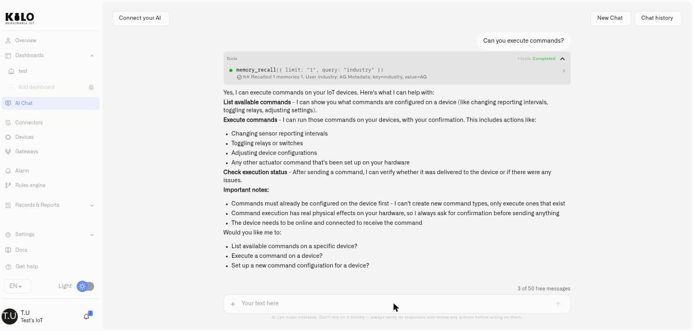

# Physical AI Platform for AI Agents

AI models can interpret goals and reason over complex information. Operating a building, machine, fleet, or remote site requires another layer: a dependable system that translates model intent into actions the physical infrastructure can accept, then reports what actually happened.

The Kilo IoT Server provides that Physical AI execution layer. It gives AI agents a consistent interface to heterogeneous devices while keeping device protocols, organization boundaries, permissions, operational safeguards, and result history inside the IoT system built to manage them.

## How AI agents control real-world devices

The AI model supplies intelligence: it interprets the request, evaluates context, and proposes what should happen. Kilo supplies physical-world operations: it maintains device state, constrains what can be changed, runs tested automation or device commands, and returns evidence about the result.

This separation matters because a generated answer and a physical action have different failure modes. A model should not have to improvise radio protocols, command payloads, device availability, access policy, or recovery behavior each time it acts.

## Safe AI device control lifecycle

Kilo supports a production lifecycle around real-world action:

1. **Observe** — read normalized telemetry, device state, alarms, and operating context.
2. **Reason** — give the AI grounded information from the deployment rather than disconnected payloads.
3. **Simulate** — test automation logic against representative inputs before deployment.
4. **Approve** — apply the signed-in user's permissions and require confirmation where the workflow calls for it.
5. **Act** — deploy a rule or execute a typed device command through the configured connection.
6. **Verify** — inspect command delivery, optional device confirmation, and the resulting state.
7. **Record** — retain the relevant execution or version history so operators can investigate and recover.

The [Rules Engine](rules-engine/README.md) provides debugging, simulation, controlled builds, deployment, version history, and restore. [Device Commands](devices/commands/README.md) provide named actions with typed parameters, dispatch status, and optional verification.

## Physical AI infrastructure for model providers

Kilo offers a way to add physical-world capabilities without rebuilding an IoT control plane. One integration can reach sensors, machines, actuators, buildings, fleets, and other connected assets across different manufacturers and protocols.

The IoT Server already provides the operational foundation around that integration: device models, connectivity, multi-organization access, dashboards, alarms, automation, remote control, cloud or on-premise deployment, and interfaces for AI clients and software. Model providers can focus on intelligence while Kilo handles the boundary where software meets physical operations.

Kilo is model-agnostic. Teams can use OpenAI, Anthropic, a compatible model endpoint, or another AI system without replacing the device and operations layer.

## Connect AI agents to IoT through MCP or APIs

### Connect an external AI client through MCP

The [Kilo MCP Server](api/mcp-server.md) lets a compatible AI client sign in with a Kilo account and discover the tools available to that user. The connection is scoped to the selected organization and inherits the user's permissions.

That toolset now includes device control. A connected client can list the commands configured on a device, execute one, and check whether it was delivered — `device_command_list`, `device_command_execute`, `device_command_status` — so an external model can complete the **Act** and **Verify** steps above without leaving the conversation. Execution runs behind a confirmation, uses command definitions that already exist on the device, and lands in command execution history like any other dispatch.

<figure><figcaption></figcaption></figure>

Use MCP when a person wants ChatGPT, Claude, Codex, Cursor, or another compatible client to work with a live Kilo deployment. The precise actions available depend on the tools exposed by the server and the signed-in user's access.

### Use the built-in AI Assistant

The [IoT AI Assistant](ai-assistant/README.md) operates inside Kilo. It can reason over live and historical deployment context and help provision devices, build and simulate rules, and configure alarms while showing consequential changes for confirmation.

Use the built-in assistant when operators want AI inside the same interface as their devices, rules, alarms, and dashboards.

### Integrate a service through REST or gRPC

The [Kilo IoT Platform API](api/README.md) is for software your team builds, including agent backends, reporting systems, industrial integrations, and unattended workflows. API keys carry explicit scopes and organization context.

Use an API when you need a deterministic application integration rather than a user-authorized conversational client.

## Enterprise controls for Physical AI

- **Permission boundaries:** AI access remains within the connected user's role and organization.
- **Test before deployment:** automation can be debugged and simulated before it reaches live infrastructure.
- **Controlled releases:** rule builds are deployed explicitly and previous versions can be restored.
- **Constrained commands:** typed parameters define the inputs a device action accepts.
- **Result verification:** commands retain dispatch status and can require device confirmation where supported.
- **Traceable histories:** rule versions and executions, device-command executions, and organization access changes retain their own corresponding records.
- **Deployment choice:** the same operating model is available through Kilo Cloud or an on-premise IoT Server.

These controls do not make every physical action automatically safe. The organization still decides which devices are controllable, which parameter ranges are appropriate, who may act, and where human approval is required.

## Connect an AI agent through the IoT MCP server

1. Open [Kilo IoT MCP Server for AI Agents](api/mcp-server.md) and add the published endpoint to a compatible client.
2. Sign in with your usual Kilo account and authorize the connection.
3. Begin with a read-only request, such as listing devices or summarizing alarms.
4. Confirm the selected organization and the tools available to your account.
5. Test a proposed automation before approving its deployment.
6. Review the corresponding rule or command history after a physical action.

For a custom backend, begin with the [Public REST API](api/public-rest-api.md) and create a scoped key under **Settings → API Keys**.

## See also

- [IoT AI Assistant](ai-assistant/README.md)
- [Kilo IoT MCP Server for AI Agents](api/mcp-server.md)
- [Rules Engine](rules-engine/README.md)
- [Device Commands](devices/commands/README.md)
- [Users and Permissions](account/users-and-permissions.md)
- [Audit Trail](reports/audit-trail.md)
