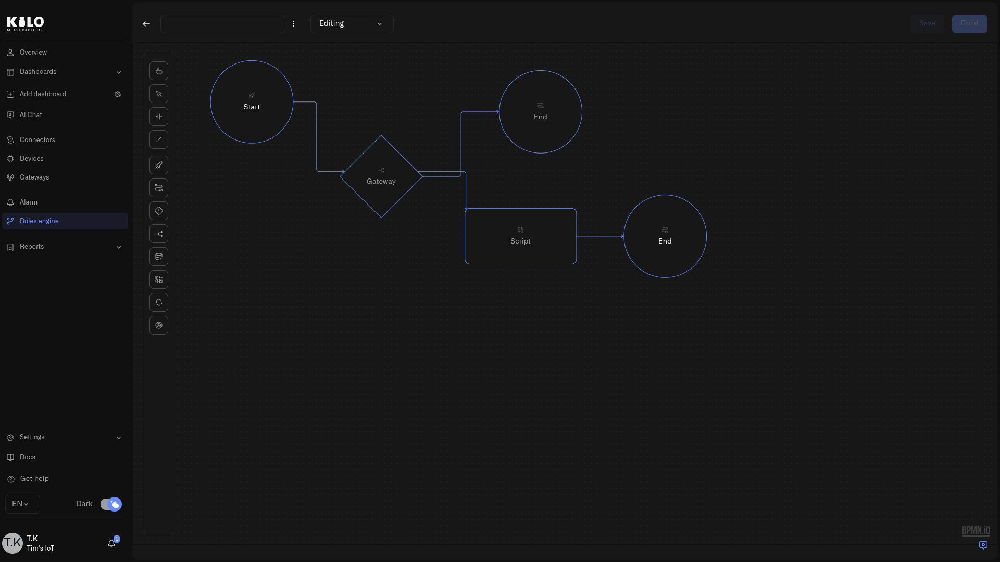

# Rules Engine

The Rules Engine is a visual automation system based on BPMN (Business Process Model and Notation) for monitoring IoT devices in real time. When sensor data meets conditions you define, the engine acts automatically — raising alarms, enriching data from other sensors before making a decision, and **sending commands straight back to your devices**.

That last capability changes what automation means here. A rule no longer just alerts a person to go act — it can take the action itself, the instant a condition is met. A leak sensor used to trigger an alarm and a scramble to the shutoff valve; now the same rule closes the valve automatically and raises the alarm in the same evaluation. Sense, decide, act — end to end, with no one in the loop. See [Running Device Commands](running-device-commands.md).

## How it works

Rules are BPMN 2.0 workflows: visual flowcharts where each node performs a specific job. You connect nodes with flows (arrows) to build the logic. The engine executes this logic every time a bound sensor sends new data.

<figure><figcaption></figcaption></figure>

Every rule follows a managed lifecycle:

```
Create → Edit → Build → Deploy → Running → Stop
```

Changes you make in the visual editor stay in draft until you explicitly build and deploy them. The build step validates your rule — checking the diagram structure, verifying all expressions, and confirming that every path is complete. Only after a successful build can you deploy the rule to start processing live sensor data.

## What you can build

A rule starts with a **Start Event** — either one device's sensor readings, or a condition that has held for a period of time. Each time it fires, the rule executes. Inside the rule, you can:

- **Evaluate conditions** with Exclusive Gateways — route the flow to different branches based on CEL expressions
- **Transform data** with Script Tasks — compute derived values, classify readings, or prepare flags for downstream decisions
- **Fetch data from other sensors** with Enrichment nodes — compare indoor vs. outdoor temperature, correlate humidity with occupancy, or check a reference reading before deciding
- **Raise alarms** with Set Alarm nodes — trigger alarm definitions with dynamic motivation messages, kicking off escalation policies and notifications
- **Act on devices** with Execute Command nodes — send a command (close a valve, push a setpoint, switch a relay) straight to a device when conditions are met, so the rule contains the problem instead of only reporting it. See [Running Device Commands](running-device-commands.md)
- **Handle errors gracefully** with Boundary Error Events — if a step fails (for example, a sensor is offline during enrichment), catch the error and route to a fallback path instead of stopping the entire rule

All conditions and computations use [CEL](https://cel.dev) (Common Expression Language) — a safe, sandboxed expression language designed for evaluating conditions. CEL cannot access files, make network calls, or run loops. It only evaluates expressions against the data you provide.

That balance is deliberate. Most day-to-day rules are assembled by dragging nodes onto the canvas and filling in forms. CEL appears in focused places where the rule needs exact logic: gateway conditions, Script Tasks, dynamic alarm messages, enrichment lookups, and input/output mappings. Through CEL, the rule logic can become very sophisticated — nested conditions, computed severity classifications, multi-sensor delta calculations, and dynamic decision paths that go far beyond simple threshold alerts. You are not forced into arbitrary scripts, but you are also not limited to basic "if value > X" conditions.

## Safety and control

The Rules Engine is designed for environments where unmanaged automation changes are not acceptable:

- **Edit locks** — Only one person can edit a rule at a time. Others see who holds the lock and when it expires. Organization owners can force-unlock if needed.
- **Autosave** — Your work is saved automatically while you edit, with visible status feedback ("Saving...", "Saved", "Autosave Failed").
- **Version history** — Every save creates a version. Versions can be renamed, viewed, and restored. If a change causes unexpected behavior, you can revert to any previous version.
- **Build before deploy** — The build step catches structural errors, invalid expressions, and missing connections before your rule reaches production.
- **Artifacts** — Each build produces a named artifact with timestamps, author, and optional comments. The Artifacts tab shows exactly what's deployed across all your rules.
- **Trash and recovery** — Deleting a rule moves it to trash, not permanent deletion. You can restore rules from trash.
- **Emergency safety** — The system monitors rule execution health and automatically stops rules that encounter sustained errors, preventing cascading failures.

## Section contents

| Page | What it covers |
|---|---|
| [Rules List and Navigation](rules-list-and-navigation.md) | The main Rules Engine page — tabs, actions, and how to navigate |
| [Creating Rules](creating-rules.md) | How to create a new rule from scratch |
| [Visual Editor](visual-editor.md) | The BPMN canvas — palette, properties panel, and toolbar |
| [Debugging Rules](debugging-rules.md) | Step through a rule before deploying it — breakpoints, variables, watches, side effects |
| [Node Reference](node-reference.md) | Every node type with configuration details and examples |
| [Running Device Commands](running-device-commands.md) | The Execute Command node — make a rule act on a device, not just alert |
| [CEL Reference](cel-reference.md) | Expression language types, operators, and patterns |
| [Edit Locks and Team Handoffs](edit-locks-and-team-handoffs.md) | Locking, force-unlock, inactivity, and autosave |
| [Version History and Restore](version-history-and-restore.md) | Version tracking, naming, viewing, and restoring |
| [Builds, Artifacts, and Deployment](builds-artifacts-and-deployment.md) | Building rules, the Artifacts tab, deploying, and stopping |
| [Trash and Recovery](trash-and-recovery.md) | Soft delete, the trash view, and restoring rules |
| [Automation Patterns](automation-patterns.md) | Enterprise automation patterns with CEL examples |
| [Troubleshooting](troubleshooting.md) | Build errors, common issues, and limits |
