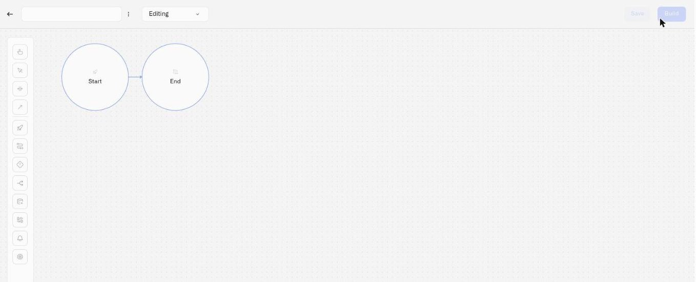

# Creating Rules

This page walks through creating a new automation rule from scratch — from naming it to saving your first version.

## Prerequisites

- You have edit permissions for the Rules Engine in your organization
- Your organization has not reached its subscription rule limit

## Step by step

### 1. Open the rule creation page

From the Rules Engine page, click **Add Rule**. This opens a new rule editor at `/rules/create`, with an empty name field and a starter diagram — a **Start** event already connected to an **End** event.

<figure><figcaption></figcaption></figure>

### 2. Name your rule

The rule name field is at the top of the editor. Click it and type a descriptive name — up to 60 characters. Choose a name that tells your team what the rule monitors and why.

Good naming conventions for operations:
- "Cold storage — temperature breach" 
- "Warehouse B — humidity alert"
- "CO2 monitor — threshold escalation"

### 3. Add a description (optional)

Click the three-dot menu (⋮) next to the rule name and select **Edit description**. A dialog opens with a text area — up to 1,000 characters. Use this to explain the rule's purpose, which facility or zone it covers, or any operational context your team should know.

### 4. Build the workflow

The editor opens with a Start event and an End event already on the canvas. A complete rule needs at least:

1. A **Start Event** — the entry point that uses either one sensor's readings or a saved trigger condition
2. One or more processing nodes (Script Tasks, Gateways, Enrichment, [Set Alarm](node-reference.md#set-alarm))
3. An **End Event** — at least one termination point

Drag nodes from the palette on the left side of the canvas. Connect them with flows (arrows) to define the execution order.

For many rules, this visual structure is the main work: Start Event, one or two decision or transformation steps, then Set Alarm or End Event. When the rule needs exact logic, specific fields accept CEL expressions — for example gateway conditions, Script Task logic, alarm motivation messages, or advanced inputs/outputs. Through CEL, even complex scenarios are possible: multi-step escalation, cross-sensor comparisons, computed derived values, and dynamic alert messages that include live readings.

For a detailed walkthrough of the canvas and available tools, see [Visual Editor](visual-editor.md). For the full list of node types and their configuration, see [Node Reference](node-reference.md).

### 5. Configure the Start Event

Select the Start Event node and click the **pencil** icon that appears beneath it — that opens its properties panel on the right. First choose what starts the rule:

- **Start source** — **Sensor reading** runs the rule whenever one selected sensor reports. **Trigger condition** runs it when a saved [trigger](triggers.md) becomes active. A trigger can act immediately or after a duration, and it can evaluate one device or several devices independently.

A Start Event uses one source or the other, never both.

**With Start source set to Sensor reading**, configure:

- **Device** — Select the device that triggers this rule (searchable dropdown)
- **Sensor** — Select which sensor on that device to monitor (dropdown, enabled after choosing a device)

**With Start source set to Trigger condition**, the Device and Sensor fields are replaced by a single **Trigger condition** selector. Pick the trigger you built on the [Triggers](triggers.md) tab. This is the path for a condition that must be evaluated before the rule starts, whether that condition is immediate or delayed and whether it watches one device or many. The trigger signal does not contain one sensor-event value, so `vars.value` is unavailable; `vars.device_name` identifies the watched device that met the condition.

The selector does not create a trigger. If the trigger does not exist yet, leave the editor, open **Rules Engine → Triggers**, create it, and then return to this rule. After selecting it, click **Save** at the bottom of the Start Event panel to apply the source to the diagram.

Optionally, you can:
- **Enable Schedule** — Toggle to restrict the rule to a specific window. Click **Change schedule** to pick the days and the From/To times, and set the **Time Zone** they are measured in. Schedule is not another start source: it limits when the source you already chose may run the rule. With a duration trigger, the trigger decides when its condition becomes active and the schedule decides whether the rule may run at that time.
- **Add inputs/outputs** — Advanced CEL expressions for data transformation at the Start Event

See [Node Reference](node-reference.md) for full Start Event configuration details.

### 6. Save your rule

After saving the Start Event panel, click the separate **Save** button in the top-right corner of the editor. The rule is saved as a new version (version 1). The autosave indicator shows "Saved" when the save completes.

After saving, the editor switches from creation mode to edit mode. You now have access to the **History** tab, the **Build** button, and the full actions menu.

### 7. Build and deploy (when ready)

Saving a rule does not deploy it. To run the rule against live sensor data, you need to build and deploy it. See [Builds, Artifacts, and Deployment](builds-artifacts-and-deployment.md) for the deployment workflow.

## What happens after creation

- The rule appears in the Rules tab of the Rules Engine page
- Version 1 is recorded in the version history
- You hold an edit lock on the rule — others will see the lock icon
- Autosave is active — changes are saved periodically while you work
- The rule is **not running** until you explicitly build and deploy it

## Next steps

- [Visual Editor](visual-editor.md) — Learn the canvas tools, palette, and properties panel
- [Node Reference](node-reference.md) — See all available node types and how to configure them
- [Builds, Artifacts, and Deployment](builds-artifacts-and-deployment.md) — Build and deploy your rule to production
