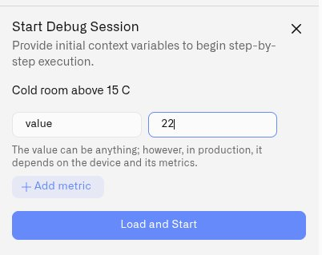
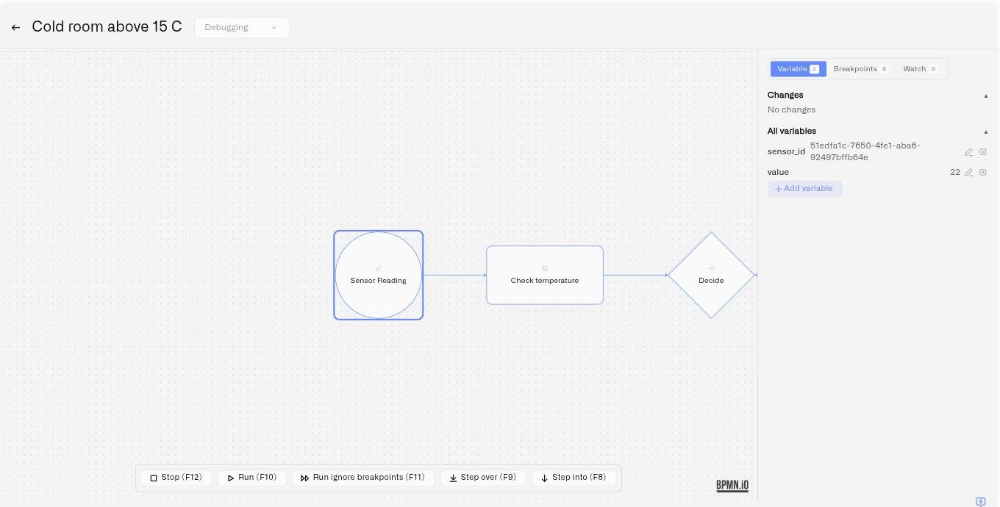
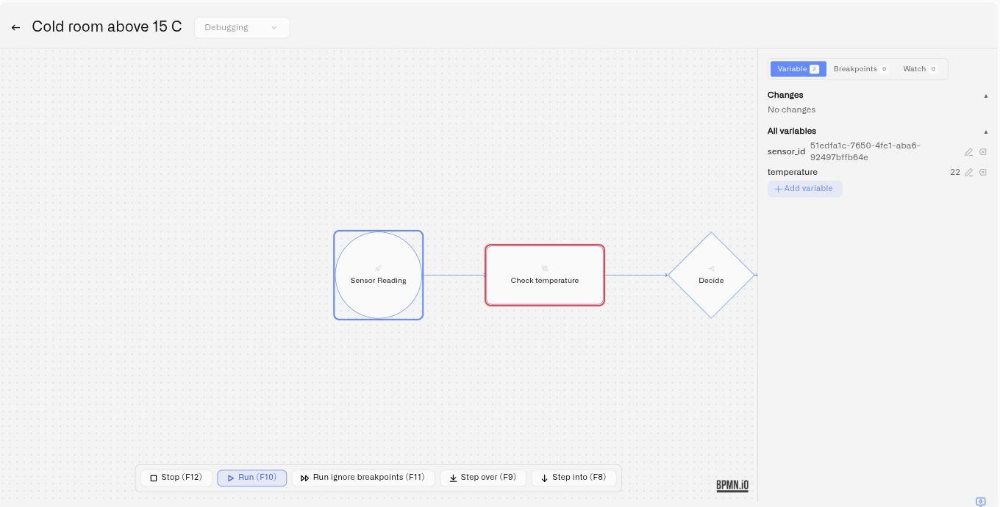
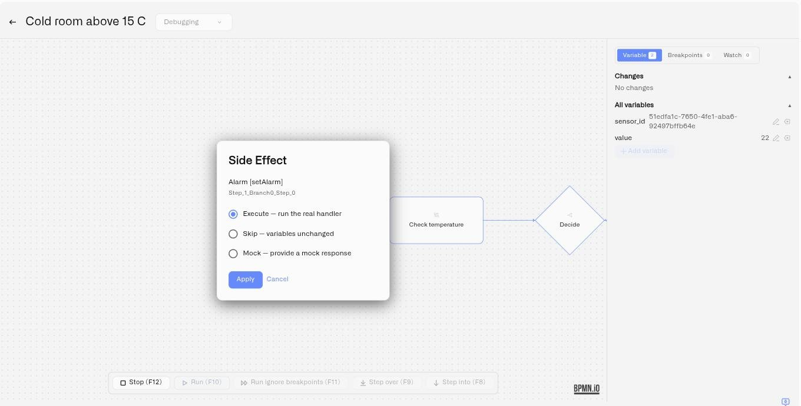

# Debugging Rules

A rule that looks correct on the canvas can still behave in ways you didn't expect — a gateway sends the flow down the wrong branch, an expression evaluates against a data shape you didn't anticipate, a variable holds something other than what you assumed. Debug mode lets you find that out *before* the rule is deployed to production, by running the rule step by step and inspecting exactly what happens at every node.

Debug mode is an interactive debugger built into the visual editor. You feed the rule a test payload, then walk through its execution one node at a time — pausing where you want, watching variables change, checking expressions, and deciding how each side effect is handled. It is the difference between deploying a rule and *hoping*, and deploying a rule you have actually watched run.

## Starting a debug session

1. Open the rule in the [visual editor](visual-editor.md).
2. In the rule editor's top bar, click **Set context** to open the **Start Debug Session** panel. (The top bar also carries a **Start Debug** button, shortcut **F12**.)
3. The panel asks you to **provide initial context variables** — the input the rule will run against. It opens with one row already added, named `value`, and each row is a **Name** and a **Value**:
   * **Name** is the variable name your rule expects (for example `value`, `temperature`, `status`).
   * **Value** is the test reading. It can be a number, `true` / `false`, `null`, text, or JSON — the panel interprets it for you.
4. Click **Add metric** to add more context variables; remove any extra row you don't need.
5. Click **Load and Start**. The rule loads and pauses, ready for the first step.

The initial context stands in for what a device would send in production. Set it to the values you want to test — the edge case, the threshold, the reading you suspect is causing trouble.

<figure><figcaption></figcaption></figure>

### Name each variable exactly as your rule refers to it

Rules read the context through `vars`, so name each row to match the expressions in your rule. A gateway condition written `vars.RH > 70` needs a row named **`RH`** — `humidity` or `value` will not do. If a condition references a name the context does not contain, the rule stops at that element when you reach it.

Copy the names out of your gateway conditions rather than typing them from memory, and check the spelling before you start.

Two rows you do not need to add:

* The panel opens with a row named `value`, which suits rules that read `vars.value` straight from the bound sensor. Rename it if your rule uses a different name.
* `sensor_id` is filled in from the sensor bound to the Start Event, and appears in the Variables tab on its own.

## The session starts paused

Loading a session does not run the rule. It opens the diagram, places execution on the Start Event, and waits for you — **nothing runs until you press Run or one of the Step controls**.

When the session loads you will see the canvas turn read-only, the debug toolbar appear at the bottom of the editor, the debug panel open on the right with your initial variables, and a blue outline on the Start Event. The blue outline shows the session is live and waiting.

<figure><figcaption></figcaption></figure>

If the diagram appears to sit still, press **Run (F10)** to continue to the first breakpoint or to the end, or **Step over (F9)** to advance one element at a time.

## The debug controls

Once a session is loaded, a debug toolbar floats over the bottom of the canvas with five controls. It is not in the header bar next to Save and Build — look at the bottom of the diagram.

* **Run (F10)** — run the rule until it hits a breakpoint or finishes.
* **Step over (F9)** — execute the next node and stop, showing its result.
* **Step into (F8)** — enter the next node and inspect its internals — its inputs, scripts, and outputs — rather than just its result.
* **Run ignore breakpoints (F11)** — run to the end without pausing. It switches every breakpoint off and leaves them off for the rest of the session; re-enable them from the Breakpoints tab when you need them again.
* **Stop (F12)** — end the debug session.

**F12 works at both ends of a session:** press it while editing to start debugging, and again while debugging to stop.

The step controls are available while the session is paused. They are greyed out while the rule is running, while a Side Effect dialog is waiting for an answer, and after a rule failed to load. Stop stays available throughout.

## What the markers on the canvas mean

Elements can carry three different marks during a session:

| Marker | Meaning |
| --- | --- |
| **Blue outline** | Where execution is now. The next step runs here. |
| **Small red dot** above the element | A breakpoint. A filled dot is enabled; a hollow ring is one you have switched off. |
| **Red outline** | The element that raised the most recent error. It clears on the next successful step. |

A red outline is neither a breakpoint nor the current position — it marks the element that failed, and the expression on that element is where to look. See [When a node fails](#when-a-node-fails).

<figure><figcaption></figcaption></figure>

## Breakpoints

A breakpoint pauses execution at a specific node, so you can inspect the state at exactly the point you care about.

* **Set a breakpoint** — click a node on the canvas to toggle a breakpoint on it. Open the **Breakpoints** tab in the debug panel to see them all; the tab header shows a count. During a session every click on the canvas adds or removes a breakpoint, so click an element again to clear one you did not intend.
* **Enable or disable** — each breakpoint has a red indicator dot. Click it to switch the breakpoint off without removing it, and on again later.
* **Conditional breakpoints** — create a plain breakpoint first, then click **Set condition** on it and enter a CEL expression. The breakpoint then pauses execution *only* when that expression is true — for example, only when `vars.value > 30`. A conditional breakpoint is marked with a **Conditional** badge. See [CEL Reference](cel-reference.md) for expression syntax.

Conditional breakpoints are how you debug an intermittent problem: let the rule run normally and stop it only on the reading that triggers the misbehavior.

## Inspecting variables

The **Variable** tab of the debug panel shows the rule's state at the current step, in two sections:

* **Changes** — the variables that were added or changed since the last step, highlighted so you can see at a glance what the node you just executed actually did. Deleted variables are shown struck through.
* **All variables** — the complete current variable set with their values.

While paused, you can also **edit** the state directly: change a variable's value, add a new variable, or delete one. This lets you push the rule down a branch you want to test without having to restart the session with different input.

When you use **Step into** on a node, the Variable tab also shows an element-detail card with that node's **Inputs**, **Scripts**, and **Outputs** — the internal workings of the step, not just its end result.

## Watch expressions and Evaluate

The **Watch** tab keeps an eye on expressions as the rule runs:

* **Add watch** — enter a CEL expression and it is re-evaluated automatically at every step, so you can track a derived value (say, `vars.value - vars.threshold`) without hunting through the variable list.
* **Evaluate** — enter a one-off CEL expression and evaluate it against the current state immediately. Useful for checking a piece of logic — "what would this gateway condition return right now?" — without adding it to the rule.

Both take the same [CEL](cel-reference.md) you write elsewhere in the rule, and both read the rule's state through `vars` — a watch on a variable named `RH` is written `vars.RH`. An expression that will not compile is rejected as you add it, so use the Watch tab to try a condition out before pasting it into a gateway.

## Side effects

Some nodes do more than transform data — they send notifications, raise alarms, or call out to other systems. When debug execution reaches a node with a side effect, a **Side Effect** dialog appears and asks how to handle it. Three options:

<figure><figcaption></figcaption></figure>

* **Execute — run the real handler.** The side effect happens for real, exactly as it would in a deployed rule: an alarm is raised and its recipients are notified, and a command is sent to the physical device.
* **Skip — variables unchanged.** The side effect is skipped and the rule's variables are left as they are.
* **Mock — provide a mock response.** You supply a stand-in response as JSON and the rule continues as if the handler had returned it. The response must be valid JSON — if it isn't, the mock simply isn't applied.

**Execute is selected when the dialog opens**, so change the selection before clicking Apply if you do not want the action to happen for real. This is what lets you debug a rule that sends alerts without actually paging an on-call engineer: choose **Skip** or **Mock** while you're testing the logic, and **Execute** only when you specifically want to verify the real delivery.

Two things to expect once you have answered:

* **Your answer is reused for that node.** If execution reaches the same node again later in the session, the dialog does not reappear and your earlier choice is applied. Choosing **Execute** therefore sends for real on every later pass as well. Start a new session to be asked again.
* **Cancelling puts execution back.** Closing the dialog without choosing returns to just before the node and leaves it unexecuted. Step again and the dialog reappears.

## When a node fails

If a node errors during execution, the failing node is outlined in red on the canvas, so you can see exactly which node went wrong without hunting through a large rule. A **recoverable** error keeps the debug session paused and loaded — you can inspect the variables, adjust state, and continue — while an **unrecoverable** error ends the session.

Most errors come from an expression on the failing node. Open its properties and check three things:

1. **Every name it uses exists in the Variables tab.** `vars.RH > 70` fails if nothing named `RH` was set as initial context or produced by an earlier node. On a gateway this stops the rule at the gateway — it does not send it down the default branch.
2. **The `vars.` prefix is there.** `RH > 70` is not the same as `vars.RH > 70`.
3. **The expression returns the right type.** A gateway condition must produce `true` or `false`.

Paste the expression into **Evaluate** on the Watch tab to try it against the current state.

## Session lifecycle

A debug session runs for **30 minutes**, measured from when it starts — stepping through the rule does not extend it. You'll see a warning shortly before it expires, and a notification if it times out, closes (with the reason), or loses its connection. Start a new session to keep debugging.

Breakpoints are tied to the elements in the diagram you loaded, so reloading the editor can drop them. A notification tells you how many, so you can re-add them.

If starting a session fails, the platform is running its maximum number of debug sessions at that moment. Try again shortly.

## Tips

* Debug the edge cases, not the happy path — set the initial context to the threshold value, the missing field, the out-of-range reading.
* Copy variable names out of your gateway conditions when filling in the initial context instead of typing them from memory.
* Use a conditional breakpoint to catch an intermittent problem: run the rule normally and stop only on the reading that triggers it.
* Edit a variable mid-session to force the rule down a specific branch instead of restarting with new input.
* Keep side effects on **Skip** or **Mock** while you iterate on logic; switch to **Execute** only for a deliberate end-to-end check.
* Once a rule debugs cleanly, build and deploy it — see [Builds and Deployment](builds-artifacts-and-deployment.md).

## See also

* [Visual Editor](visual-editor.md) — The canvas debug mode runs on
* [CEL Reference](cel-reference.md) — Expression syntax for conditional breakpoints and watches
* [Builds and Deployment](builds-artifacts-and-deployment.md) — Ship a rule once it debugs cleanly
* [Troubleshooting](troubleshooting.md) — Build errors and runtime issues
