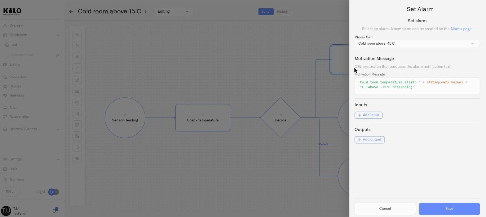

# Node Reference

Every automation rule is built from a set of node types that you drag onto the visual editor canvas, connect with flows, and configure through a properties panel. This page documents each node type — what it does, when to use it, how it appears on the canvas, and every field in its properties panel.

This page documents the nodes currently available in the live palette: **Start Event**, **End Event**, **Script Task**, **Exclusive Gateway**, **Set Alarm**, **Execute Command**, **Enrichment**, and **Boundary Error Event**. Transitional or planned nodes are intentionally excluded until they are part of the live editor surface.

For an overview of the canvas itself — palette, toolbar, and general editing workflow — see [Visual Editor](visual-editor.md).

---

## Start Event

The Start Event is the entry point of every rule. It decides what sets the rule off — either one device's sensor readings or a saved [trigger](triggers.md) that evaluates a condition for one or more devices. Every rule must have exactly one Start Event.

### Visual appearance

A circle with an envelope icon inside it.

### When to use it

Every rule begins here. You cannot build a valid rule without a Start Event.

### Properties panel

Select the Start Event on the canvas — a pencil and a bin icon appear beneath it. Click the **pencil** to open its properties panel on the right.

**Name** — A text field for the node label. Placeholder: *e.g., Fire Alarm*.

**Start source** — A select with two options that decides what the rest of the panel asks for. A Start Event names one source or the other; markup naming both, or neither, is rejected.

| Option | What the rule starts from |
|---|---|
| **Sensor reading** | One device's readings. The rule fires each time that sensor reports. |
| **Trigger condition** | A saved [trigger](triggers.md). Its condition can act immediately or after a duration and can evaluate one or more devices independently. The rule runs when the trigger signals it. |

**Event filter** — Shown when **Start source** is **Sensor reading**. A section headed "Define which devices can initiate this rule." containing two fields:

| Field | Description |
|---|---|
| **Device** | Searchable autocomplete dropdown. Placeholder: *Select device*. Lists all devices in your organization. |
| **Sensor** | Autocomplete dropdown. Placeholder: *Select sensor*. Disabled until a device is chosen. Shows only sensors belonging to the selected device. |

**Trigger condition** — Shown instead of the Event filter when **Start source** is **Trigger condition**. A single autocomplete, placeholder *Select trigger*, listing the triggers defined on the **Triggers** tab.

> Only the first page of triggers is loaded, and the field says so when there are more. If the trigger you need is not in the list, that is why — see [Triggers](triggers.md).

**Enable Schedule** — A toggle switch (Off by default). When turned On, the following fields appear:

| Field | Description |
|---|---|
| **Time Range** | Appears when Schedule is On, headed *"Time Range. Rule is only active during this period:"*. A **Change schedule** button opens the editor, where you pick the days of the week the rule may run and the **From** and **To** times. Outside that window, the rule does not run. For a trigger source, monitoring and countdowns continue; only the attempted rule run is skipped. |
| **Time Zone** | A dropdown listing standard time zones, so the window means the same thing regardless of where the viewer is. |

**Inputs** — Optional. A list of advanced CEL expressions for data preparation. Most rules leave this empty and read the incoming reading directly. Each input has:
- An input name (text field)
- A type indicator (locked to "Expression")
- A CEL expression field
- Add new inputs with the **+ Add input** button. Remove an input with its delete button.

**Outputs** — Optional. Same structure as Inputs, with its own **+ Add output** button. Use outputs to publish named values into `vars` for downstream nodes.

**Save / Cancel** — At the bottom of the panel. Click **Save** to apply changes, or **Cancel** to discard.

### How data flows from the Start Event

The process variables depend on the **Start source**.

**Sensor reading** provides:

| Variable | Contents |
|---|---|
| `vars.value` | The sensor's reported value |
| `vars.sensor_id` | The unique identifier of the sensor |
| `vars.timestamp` | The reading's timestamp |

**Trigger condition** provides:

| Variable | Contents |
|---|---|
| `vars.device_name` | The name of the watched device that satisfied the trigger |
| `vars.subject_kind` | The watched resource type; currently `device` |
| `vars.subject_id` | The unique identifier of the watched device |
| `vars.sensor_id` | The sensor identifier used to associate the run and any alarm with the watched device |
| `vars.detector_id` | The unique identifier of the trigger |
| `vars.timestamp` | The trigger signal time as Unix seconds |

A trigger-started rule does not receive `vars.value`. See [Data available to the rule](triggers.md#data-available-to-the-rule) before converting a sensor-started rule.

The Start Event can also reshape incoming data before the rest of the rule runs:

- **Inputs** create node-local helper variables for this step
- **Outputs** write named values into the process variables that downstream nodes can reference

### Example

A cold-storage compliance rule for a pharmaceutical warehouse binds the Start Event to a temperature probe inside the storage unit. Schedule is left off, since the probe is worth watching around the clock; were it a rule that should only run out of hours, **Change schedule** would set those days and times against the facility's local time zone. No inputs are needed — the raw temperature value is enough for the downstream gateway to evaluate.

---

## End Event

The End Event terminates a flow path. When execution reaches an End Event, that branch of the rule is complete.

### Visual appearance

A circle with a bold (thick) border.

### When to use it

Every branch of your rule must end with an End Event. A rule with multiple branches (after an Exclusive Gateway, for example) needs multiple End Events — one per branch.

### Properties panel

| Field | Description |
|---|---|
| **Name** | A text field for the node label. Typically left as "End" or named to describe the outcome of that branch (e.g., "Normal — no action", "Alarm triggered"). |

No other configuration is required.

### Example

A rule that checks whether a temperature reading is above or below a threshold has two branches exiting an Exclusive Gateway. Each branch ends with its own End Event — one labeled "Within range", the other following a Set Alarm node.

---

## Script Task

The Script Task evaluates a [CEL](https://cel.dev) expression. Use it to transform incoming data, compute derived values, classify readings, or prepare variables for decisions downstream.

### Visual appearance

A rounded rectangle with a script icon (document with lines) in the upper-left corner.

### When to use it

- Convert a raw sensor value into a severity classification
- Compute a difference between two values (after enrichment)
- Prepare a formatted string for an alarm message
- Set a flag that downstream gateways evaluate

### Properties panel

| Field | Description |
|---|---|
| **Name** | A text field for the node label. Default: "Script". Example: "Classify severity". |
| **Script** | A multiline CEL expression field (6 rows). This is where you write the expression to evaluate. |

**Inputs** — A list of input parameters evaluated before the script runs. Each entry has a name, a type indicator (locked to "Expression"), and a CEL expression field. Use these to create local helper variables for the task. Add entries with **+ Add input**. Remove with the delete button.

**Outputs** — Same structure as Inputs, with its own **+ Add output** button. Use these to publish named values for downstream nodes.

**Save / Cancel** — At the bottom of the panel.

### How results are stored

The clearest pattern is to have the Script Task return a **map** (a key-value structure). Each key is merged into the process variables individually. For example, if the Script Task expression is:

```cel
{"level": vars.value > 80 ? "critical" : "normal", "needs_action": vars.value > 80}
```

Then downstream nodes can reference `vars.level` (a string) and `vars.needs_action` (a boolean) independently.

You can also use the task's **Outputs** section to publish additional named values after the script runs. In practice, maps and explicit outputs are the easiest pattern to review, restore, and troubleshoot later.

### Example

An operations team monitoring vibration sensors classifies readings before routing them through a gateway:

```cel
{"severity": vars.value > 90 ? "critical" : vars.value > 70 ? "warning" : "normal"}
```

The downstream Exclusive Gateway then checks `vars.severity == "critical"` on one branch and `vars.severity == "warning"` on another, with a default branch for "normal" readings that routes to an End Event.

---

## Exclusive Gateway

The Exclusive Gateway is a decision point. It evaluates conditions on its outgoing flows and routes execution to exactly **one** branch — the first whose condition is true. This is XOR routing: one and only one path is taken.

### Visual appearance

A diamond shape.

### When to use it

- Route to different actions based on a threshold (above vs. below)
- Branch on a severity classification (critical, warning, normal)
- Check whether enriched data changes the decision
- Provide a default fallback path when no specific condition matches

### Properties panel

Click the Exclusive Gateway on the canvas to open its properties panel. At the top, a notice reads: *"Conditions are evaluated sequentially (top to bottom). The first condition met executes its flow, and all remaining conditions are skipped."*

**Name** — A text field for the node label. Placeholder: *e.g., MSG Smoke*.

**Flows** — A list of all outgoing connections from this gateway. Each flow item shows:

| Element | Description |
|---|---|
| **Drag handle** | Reorder flows by dragging. The order determines evaluation priority — the first matching condition wins. |
| **Flow number** | "Flow 1", "Flow 2", etc. If this flow is the default, a "Default flow" label appears. |
| **System Name** | A text field for the internal flow identifier. |
| **Label** | A text field for the display label on the canvas arrow. Hidden for the default flow. |
| **Color** | A color picker to visually distinguish branches on the canvas. Hidden for the default flow. |
| **Condition (Expression)** | A CEL expression that must evaluate to `true` for this path to execute. Placeholder: *e.g., vars.value > 10*. Hidden for the default flow. |
| **Set as default** | A button that designates this flow as the fallback path. Tooltip: *"Choose one of the conditions to act as the fallback path when all other conditions are False."* |
| **Delete** | Removes the flow. A confirmation dialog warns: *"This will also remove the corresponding connection on the canvas."* |

When you change which flow is the default, a warning appears: *"When changing the default flow, the Condition field will be permanently deleted from the set default flow."* The previously-default flow regains its Condition field.

If the gateway has no outgoing connections yet, the Flows section shows an empty state: *"Draw connections from this gateway on the canvas to add flows."* You must draw connections on the canvas first — flows cannot be added from the properties panel alone.

**Inputs** — Optional. Same structure as the Start Event Inputs section (name, type, CEL expression, + Add input).

**Outputs** — Optional. Same structure as the Start Event Outputs section (name, type, CEL expression, + Add output).

**Save / Cancel** — At the bottom of the panel.

### Do I need the Input and Output parameters?

No. Both are optional, and a gateway that simply checks whether a value is above a threshold needs neither — leave them empty and write `vars.value > 70` straight into the flow condition.

Use them when a condition would otherwise be long, or when you repeat the same calculation across several flows.

**An Input** computes a value before the gateway decides and gives it a short name that the gateway's own flow conditions can use. To convert a Celsius reading once and compare it twice, add an input:

| Field | Value |
| --- | --- |
| Input name | `tempF` |
| Expression | `vars.temperature * 1.8 + 32` |

Then write the flow conditions as `vars.tempF > 158` and `vars.tempF > 104` instead of repeating the conversion in each.

An input belongs to the gateway you defined it on. Later nodes cannot read it.

**An Output** works the other way. It is evaluated after the branch is chosen and writes its result into the rule's variables, so nodes further along can use it — an alarm message can reference `vars.tempF` even though the conversion happened at the gateway.

The same holds wherever Inputs and Outputs appear: an input is a helper for the node you are configuring, an output is how that node passes something on.

### How condition evaluation works

Conditions are evaluated **top to bottom** as ordered in the Flows list. The first condition that returns `true` is the path taken. All remaining conditions are skipped, regardless of whether they would also be true.

The default flow has no condition expression. It executes only when **every other condition evaluates to false**. Every Exclusive Gateway should have a default flow — without one, if no condition matches, the rule execution stalls on that branch.

The default flow covers the case where nothing matched. It does not cover a condition that fails to evaluate: if an expression cannot be evaluated — usually because it references a variable the rule does not have, or returns something other than `true`/`false` — the gateway stops there and the rule goes no further along that path. In a debug session the gateway is outlined in red; see [Debugging Rules](debugging-rules.md#what-the-markers-on-the-canvas-mean).

A gateway also has to branch or merge: give it two or more outgoing flows to make a decision, or two or more incoming flows to bring paths back together. A gateway with one flow in and one flow out is rejected when you build the rule — connect those two nodes directly instead.

### Example

A warehouse humidity rule uses an Exclusive Gateway with three flows:

| Flow | Condition | Leads to |
|---|---|---|
| Flow 1 — Critical | `vars.value > 85` | Set Alarm (Critical humidity breach) |
| Flow 2 — Warning | `vars.value > 70` | Set Alarm (Humidity warning) |
| Flow 3 — Default | *(none)* | End Event (no action) |

Because conditions are evaluated top-to-bottom, a reading of 90% matches Flow 1 and skips Flow 2. A reading of 75% fails Flow 1, matches Flow 2. A reading of 60% fails both and falls through to the default.

---

## Set Alarm

The Set Alarm node triggers an alarm based on a pre-configured Alarm Definition. When execution reaches this node, it creates an alarm event that starts the escalation policy, sends notifications through configured channels, and appears in the alarm inbox.

<figure><figcaption></figcaption></figure>

### Visual appearance

A rounded rectangle with a bell icon in the upper-left corner.

### When to use it

- Trigger a critical alert when a sensor reading crosses a dangerous threshold
- Raise a warning alarm that notifies the operations team through email and SMS
- Generate alarms with dynamic messages that include the actual sensor values

### Prerequisites

Before you can use a Set Alarm node, you must have at least one **Alarm Definition** configured in the Alerts section. Alarm Definitions specify the severity level, escalation steps, notification channels, and recipient policies. The Set Alarm node references an existing definition — it does not create one.

See [Operational Alerting](../alarm/README.md) for how to create and manage Alarm Definitions.

### Properties panel

The panel header reads **"Set alarm"** with the subtext: *"Select an alarm. A new alarm can be created on the Alarms page."* The word "Alarms page" links to the [Alerts and Notifications](../alarm/) section.

| Field | Description |
|---|---|
| **Name** | A text field for the node label. Example: "Trigger critical alarm". |
| **Choose Alarm** | A searchable autocomplete dropdown. Lists existing Alarm Definitions in your organization. Search by alarm name to find the definition you need. |
| **Motivation Message** | A multiline CEL expression field (3 rows). Placeholder: `"Temperature is " + string(vars.temp) + " degrees"`. The expression must evaluate to a string — this text is attached to the alarm event, giving responders context about what triggered the alarm and why. |

**Inputs** — A list of input parameters. Each entry has a name, a type indicator (locked to "Expression"), and a CEL expression field. Add entries with **+ Add input**. Remove with the delete button.

**Outputs** — Same structure as Inputs, with its own **+ Add output** button.

**Save / Cancel** — At the bottom of the panel.

### Motivation message examples

The motivation message is a CEL expression, so you can embed live sensor values and computed variables:

```cel
"Temperature " + string(vars.value) + " degrees exceeds the safety threshold"
```

```cel
"Humidity reading of " + string(vars.value) + "% in Zone A — above " + string(vars.severity) + " level"
```

```cel
"CO2 concentration at " + string(vars.value) + " ppm, exceeding limit by " + string(vars.value - 800) + " ppm"
```

### What happens when the node executes

1. An alarm event is created with the selected Alarm Definition's severity and configuration
2. The motivation message expression is evaluated and attached to the event
3. The alarm's escalation policy begins — notifications are sent through the channels and to the recipients defined in the Alarm Definition
4. The alarm event appears in the alarm inbox for tracking and resolution

The Set Alarm node does **not** define severity, channels, schedules, or escalation itself. Those come from the selected Alarm Definition. The rule decides **when** to trigger; the Alarm Definition decides **how** that alarm is handled.

### Example

A server room environmental monitoring rule reaches the Set Alarm node when temperature exceeds 35 degrees Celsius. The node is configured with an Alarm Definition named "Server Room Overheat" (severity: Critical, escalation: SMS to on-call engineer immediately, email to facility manager after 5 minutes). The motivation message reads:

```cel
"Server room temperature is " + string(vars.value) + " degrees — immediate attention required"
```

---

## Execute Command

The Execute Command node sends a command to a device when the rule reaches it — the action that lets a rule control hardware, not just alert about it. It dispatches one of a device's pre-defined [Device Commands](../devices/commands/) as a downlink, so a rule can shut a valve, push a setpoint, or switch a relay automatically the moment its conditions are met.

For the full workflow, examples, and the act-and-alert pattern, see [Running Device Commands](running-device-commands.md). This entry covers the node's fields.

### Visual appearance

A rounded rectangle with a command icon in the upper-left corner. It sits in the same activity group as Set Alarm and Enrichment.

### When to use it

- Close a valve, switch a relay, or stop a pump the instant a threshold is crossed
- Push a new setpoint to a controller in response to a reading
- Set a value proportionally — e.g. fan speed derived from the measured temperature

### Prerequisites

The target device must be **controllable** (MQTT, or a Class C LoRaWAN device) and must already have **at least one command defined** on its **Commands & States** tab. The node runs existing commands; it does not create them. See [Creating Commands](../devices/commands/creating-commands.md).

### Properties panel

| Field | Description |
|---|---|
| **Name** | A text field for the node label. If left blank, it fills in with the selected command's name. Example: "Shut intake valve". |
| **Device** | A searchable autocomplete dropdown listing the devices in your organization. Selects the device the command is sent to. |
| **Command** | An autocomplete dropdown of the chosen device's defined commands. Disabled until a device is selected. |
| **Parameters** | One row per parameter the selected command expects. Each parameter is supplied as a literal **Value** (validated against the parameter's type and range) or a **CEL Expression** (evaluated at runtime, with `vars` available). |
| **Inputs / Outputs** | Optional named CEL expressions for advanced data shaping, the same pattern as other nodes. |

**Save / Cancel** — At the bottom of the panel. Save is disabled until both a device and a command are selected and every parameter is valid.

### What happens when the node executes

1. Each parameter is resolved — literals as-is, expressions evaluated against the current `vars`.
2. The command is dispatched to the device as a downlink (MQTT or LoRaWAN), exactly as a manual execution would be.
3. The dispatch is recorded in the device's execution history with its outcome (Pending, Confirmed, Delivered, Soft warning, or Failed). Any verification configured on the command applies here too.

Pair an Execute Command node with a [Boundary Error Event](#boundary-error-event) when a failed dispatch should still reach a human via a fallback path.

### Example

A leak-detection rule binds its Start Event to a leak sensor. An Exclusive Gateway routes a "leak detected" reading to an Execute Command node that sends a `close` command to the water shutoff valve, followed by a Set Alarm node that raises a Critical alarm. The water is stopped automatically, and the team is notified that it happened.

---

## Enrichment

The Enrichment node fetches the most recent reading from another sensor. This lets you make decisions based on data from multiple sensors within a single rule, without needing to create separate rules for each one.

### Visual appearance

A rounded rectangle with a download icon in the upper-left corner.

### When to use it

- Compare an indoor temperature reading against the current outdoor temperature
- Check a humidity sensor before deciding whether a temperature spike is concerning
- Correlate a CO2 reading with an occupancy sensor to determine if elevated levels are expected
- Verify a reference sensor before triggering an alarm

### Properties panel

The panel header reads **"Data Enrichment"** with the subtext: *"Attach relevant metadata to the incoming device data before processing."*

| Field | Description |
|---|---|
| **Name** | A text field for the node label. Placeholder: *e.g., Attach Room Temperature to Sensor Data*. |
| **Device** | Searchable autocomplete dropdown. Lists all devices in your organization — the same selector pattern as the Start Event. |
| **Sensor** | Filtered dropdown. Disabled until a device is selected. Shows only sensors belonging to the chosen device. |
| **Output variable** | A text field for the variable name under which the fetched data is stored. Placeholder: *User metadata*. After the node executes, the result is available as `vars.<output_variable>`. |

**Inputs** — A list of input parameters. Each entry has a name, a type indicator (locked to "Expression"), and a CEL expression field. Add entries with **+ Add input**. Remove with the delete button.

**Outputs** — Same structure as Inputs, with its own **+ Add output** button.

**Save / Cancel** — At the bottom of the panel.

### How enriched data is structured

After the Enrichment node executes, the fetched reading is available as `vars.<variable_name>` with the following structure:

| Property | Contents |
|---|---|
| `vars.<variable_name>.sensor_id` | The sensor's identifier |
| `vars.<variable_name>.value` | The most recent reading value |
| `vars.<variable_name>.type` | The sensor's data type |
| `vars.<variable_name>.timestamp_ms` | Timestamp of the reading in milliseconds |

For example, if the variable name is `outdoor_temp`, downstream nodes can reference `vars.outdoor_temp.value` to get the latest outdoor temperature reading.

### Error handling

The Enrichment node can fail if the target sensor is offline, has never reported, or is inaccessible. Always pair an Enrichment node with a **Boundary Error Event** (see below) to handle these failures gracefully. Without error handling, a failed enrichment stops that execution path.

### Example

A data center monitoring rule compares the ambient temperature inside a server room with the building's external temperature sensor. The Enrichment node fetches from the external sensor into a variable called `external_temp`. A downstream Script Task computes the differential:

```cel
{"temp_delta": vars.value - vars.external_temp.value}
```

An Exclusive Gateway then checks whether `vars.temp_delta > 15` — a large differential could indicate an HVAC failure, since the internal temperature is climbing independent of outside conditions.

---

## Boundary Error Event

The Boundary Error Event is an error handler that attaches to a task node. If the task it is attached to fails during execution, the Boundary Error Event catches the failure and routes execution to a fallback path instead of terminating the rule.

### Visual appearance

A small circle with a lightning bolt icon, positioned on the edge of the task node it is attached to. It sits on the border of the parent node rather than as a standalone element on the canvas.

### When to use it

- An Enrichment node fetches from a sensor that might be offline
- A Script Task evaluates an expression that depends on optional data
- A Set Alarm node references an Alarm Definition that might have been deactivated
- Any task where failure should trigger a specific response rather than silence

### How to attach it

Drag a Boundary Error Event from the palette and drop it onto an existing task node (Script Task, Set Alarm, or Enrichment). It snaps to the edge of that node. Then draw a single outgoing connection from the Boundary Error Event to the fallback path — typically another Set Alarm, a Script Task that logs the failure context, or an End Event.

### Rules

- A Boundary Error Event must be attached to a task node. It cannot exist as a standalone node on the canvas.
- It must have exactly **one** outgoing flow.
- It cannot have incoming flows (other than its implicit attachment to the parent task).

### Properties panel

| Field | Description |
|---|---|
| **Name** | A text field for the node label. Default: "Error". Example: "Sensor offline fallback". |
| **Error code** | A text field. Placeholder: *Specify error code here*. Used for labeling and annotation in the editor — see the caveat below. |
| **Message** | A multiline text field (3 rows). Placeholder: *Type error message here*. Used for labeling and annotation in the editor — see the caveat below. |

**Inputs / Outputs** — The properties panel may display Input and Output fields on the Boundary Error Event. However, the automation engine does not process Inputs or Outputs on this node type. If you need to transform data or publish values on the error path, add Inputs and Outputs to the **downstream node** that the boundary event's outgoing flow connects to — for example, the fallback Script Task, Set Alarm, or End Event.

**Save / Cancel** — At the bottom of the panel.

**Important caveat:** The Error code and Message fields are labeling and annotation fields within the editor. They do not enable selective runtime matching by error code. The engine routes **all** errors from the attached task through the boundary event regardless of the code entered. The core supported behavior is the fallback route itself: when the attached task fails for any reason, the error path runs instead of silently stopping that branch.

### Example

A multi-sensor compliance rule enriches indoor readings with an outdoor reference sensor. The Enrichment node for the outdoor sensor has a Boundary Error Event attached. If the outdoor sensor is unreachable:

1. The Boundary Error Event catches the failure
2. Its outgoing flow leads to a Set Alarm node configured with a "Sensor Offline" alarm definition
3. The operations team receives a notification that the outdoor reference sensor is not reporting, so they know the compliance comparison could not be performed

Without the Boundary Error Event, the enrichment failure would silently stop that execution path — and the team would not know the sensor was offline.

---

## Connections (Sequence Flows)

Connections are the arrows between nodes on the canvas. They define the order of execution — data flows along these arrows from one node to the next.

### Drawing connections

Use the **Global Connect Tool** from the palette, or hover over a source node until connection handles appear and drag from the source to the target node.

### Connection rules

| Rule | Details |
|---|---|
| **Start Events** | One outgoing flow. No incoming flows. |
| **End Events** | No outgoing flows. One or more incoming flows. |
| **Task nodes** (Script Task, Set Alarm, Execute Command, Enrichment) | One outgoing flow. One incoming flow (or Boundary Error Event attachment). |
| **Exclusive Gateways** | One incoming flow. Multiple outgoing flows (one per branch). |
| **Boundary Error Events** | Exactly one outgoing flow. No incoming flows (attached implicitly to parent). |

### Conditions on gateway flows

Every outgoing flow from an Exclusive Gateway — except the designated default flow — must have a CEL condition expression. These conditions must evaluate to a boolean (`true` or `false`).

The default flow must **not** have a condition. It executes only when all other conditions evaluate to false.

If you create a flow from a gateway without setting a condition, the build step will flag it as an error and the rule will not build successfully.

### Flow labels and colors

Flows from Exclusive Gateways can have labels and colors (configured in the gateway's properties panel). Use these to make complex diagrams readable at a glance — for example, label one branch "Critical" in red and another "Warning" in amber, with the default "Normal" branch in green.
