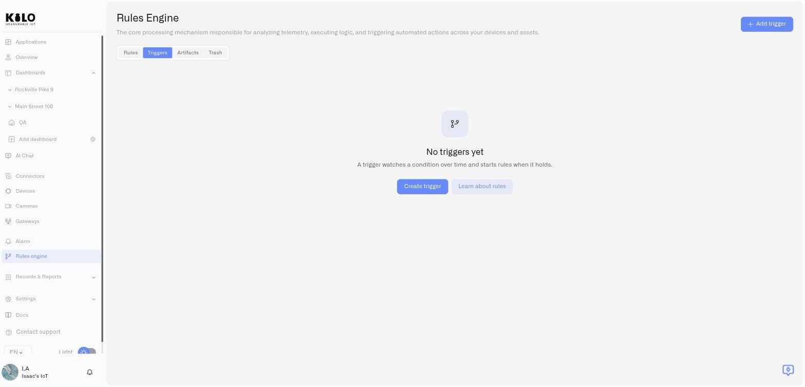
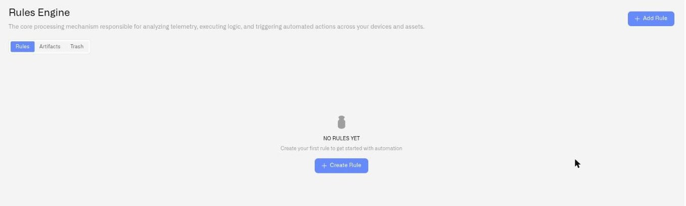

# Rules List and Navigation

The Rules Engine page is your central hub for managing automation rules and their saved trigger conditions. From here you can create triggers; create, view, edit, clone, and delete rules; and deploy built artifacts.

## Getting there

Click **Rules engine** in the sidebar to open the Rules Engine page. The page lives at `/rules` and redirects to `/rules/list`.

## Page layout

The page has a heading, a description, and four tabs:

<figure><figcaption></figcaption></figure>

- **Rules** — All active rules in your organization
- **Triggers** — Saved conditions that can start one or more rules
- **Artifacts** — Build artifacts grouped by rule, with deployment status and controls
- **Trash** — Rules that have been deleted but can still be restored

Each tab is described below. For complete trigger configuration, see [Triggers](triggers.md). For artifacts and deployment, see [Builds, Artifacts, and Deployment](builds-artifacts-and-deployment.md). For trash, see [Trash and Recovery](trash-and-recovery.md).

## Rules tab

The Rules tab shows a table of all active (non-deleted) rules. This is the default view when you open the Rules Engine page.

### Table columns

| Column | What it shows |
|---|---|
| **Name** | The rule name, with its description below. A lock icon appears if the rule is currently being edited by someone. |
| **Last Modified** | Relative time since the last change (e.g., "2 hours ago") |
| **Actions** | Edit, Clone, and Delete buttons for each rule |

### Row actions

Clicking a row opens the rule in **view mode** — a read-only view of the BPMN diagram. This is safe for inspecting a rule without risking any changes.

Each row has three action buttons on the right:

- **Edit** — Opens the rule in edit mode, acquiring an edit lock. Disabled if the rule is locked by another user.
- **Clone** — Creates a copy of the rule with a new name. Disabled if the rule is locked.
- **Delete** — Moves the rule to trash after a confirmation dialog. Disabled if the rule is locked.

### Lock indicators

When another user is editing a rule, a lock icon appears next to the rule name. Hovering over the lock shows a tooltip: *"The rule is in edit mode (locked until [time]). The rule cannot be changed while it is being worked on by another employee of the organization."*

If you are the **organization owner**, the lock icon is clickable — clicking it opens a dialog to force-unlock the rule. This is useful when someone left a rule locked by accident, but be aware that force-unlocking will discard the other user's unsaved changes.

For non-owners, the lock icon is informational only.

### Adding a new rule

Click the **Add Rule** button in the top-right corner of the Rules tab. This navigates to the rule creation page at `/rules/create`.

The button is disabled if your organization has reached its subscription rule limit. A warning appears explaining the limit.

### Empty state

If no rules exist yet, the page shows a message: *"No rules yet"* with a description and a **Create Rule** button.

<figure><figcaption></figcaption></figure>

## Triggers tab

The Triggers tab lists the saved conditions in your organization. Use **Add trigger** to define what normalized device data to watch, whether the condition must last for a set duration, and which devices it applies to.

Saving a trigger does not create or run a rule. After creating it, return to the **Rules** tab, add or edit a rule, and select the trigger in that rule's **Start Event**. The trigger is a Start Event source, not a node in the palette. See [From a trigger to a running rule](triggers.md#from-a-trigger-to-a-running-rule) for the complete sequence.

## Artifacts tab

The Artifacts tab shows all build artifacts, grouped by rule. Each group row shows the rule name and description. Expand a group to see the individual builds, their status, source link, timestamp, author, and comments.

A search field at the top of the tab filters artifact groups by rule name.

This tab is covered in detail in [Builds, Artifacts, and Deployment](builds-artifacts-and-deployment.md).

## Trash tab

The Trash tab shows rules that have been deleted. Each entry shows the rule name, description, deletion time, and a **Restore rule** action. Rules can be restored from here.

This tab is covered in detail in [Trash and Recovery](trash-and-recovery.md).
