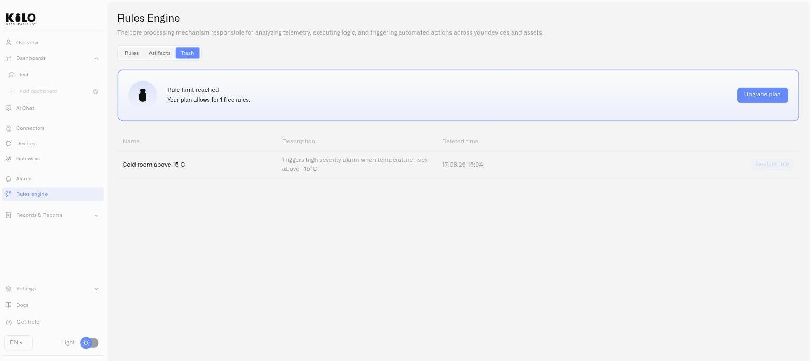

# Trash and Recovery

Deleting a rule does not destroy it immediately. The platform uses soft deletion — removed rules move to a trash area where they can be reviewed and restored. This protects against accidental deletions and gives teams a recovery window before anything is permanently gone.

## Deleting a rule

### Who can delete

Any user with edit permissions on the rule can delete it, provided the rule is not currently locked by another user. If a lock icon appears on the rule, the Delete button is disabled — wait for the lock to be released or ask an organization owner to force-unlock it.

### How to delete

1. Open the **Rules** tab on the Rules Engine page.
2. Find the rule you want to delete.
3. Click the **Delete** button on the rule's row.
4. A confirmation dialog appears:

   > **"Are you sure you want to delete the rule?"**
   > "The rule will be deactivated and stored in the trash. You can restore the rule from the trash."

5. Click **Move to trash** to confirm.

The rule is removed from the active Rules list and appears in the Trash tab. If the rule had a running artifact, the artifact is stopped as part of the deletion.

## The Trash tab

<figure><figcaption></figcaption></figure>
### Getting there

From the Rules Engine page at `/rules`, click the **Trash** tab (the third tab, after Rules and Artifacts).

### What you see

The Trash tab shows a table of all deleted rules that are still within the retention window:

| Column | Description |
|---|---|
| **Name** | The rule name and its description |
| **Deleted time** | When the rule was moved to trash, formatted as "dd.MM.yy HH:mm" |

### Empty state

If no rules have been deleted (or all deleted rules have passed the retention window), the tab shows: *"Trash is empty"* with the message *"Deleted rules will appear here."*

## Restoring a rule

Restoring a rule moves it back to the active Rules list, where it can be edited, built, and deployed again.

### How to restore

1. Open the **Trash** tab on the Rules Engine page.
2. Find the rule you want to restore.
3. Click **Restore rule** on the row.
4. A confirmation dialog appears:

   > "The rule will be activated and moved back to the list of active rules."

5. Click **Restore** to confirm.

The rule reappears in the Rules tab. It comes back **unlocked**, regardless of its lock state when it was deleted.

### What a restored rule looks like

- The rule appears in the Rules tab with its original name, description, and full version history intact.
- The rule is not deployed. Even if the rule had a running artifact before deletion, you need to build and deploy it again to start processing sensor data.
- The rule is unlocked, so any team member with edit permissions can immediately open and work on it.

### Restore limitations

- **Retention window.** Rules remain in trash for a limited time. Once a rule has exceeded the retention window, it is permanently deleted and cannot be recovered.
- **Subscription limits.** Restoring a rule counts against your organization's rule limit. If your organization is at its maximum number of active rules, the restore will not proceed until you free up capacity — either by deleting another active rule or upgrading your plan.

## Best practices

- **Check trash before re-creating a rule.** If a teammate deleted a rule you still need, restoring it is faster than rebuilding from scratch — and preserves the entire version history.
- **Do not rely on trash as an archive.** The retention window is limited. If you want to preserve a rule long-term but keep it inactive, consider stopping its deployed artifact rather than deleting the rule.
- **Coordinate deletions with your team.** Soft delete protects against accidents, but communicating intent prevents confusion about why a rule disappeared from the active list.
