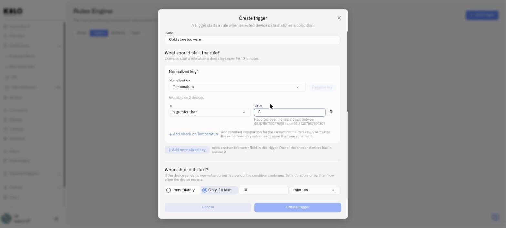
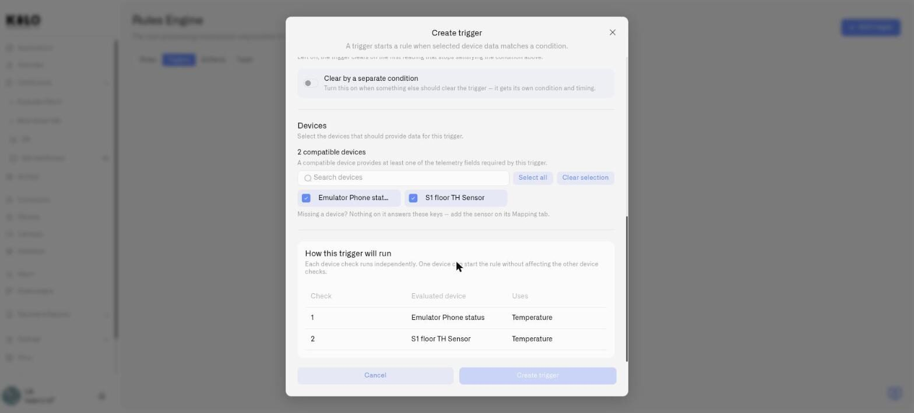
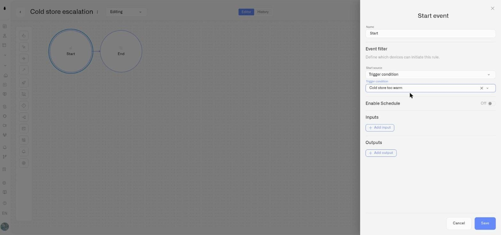

# Triggers

A trigger watches a condition over time and starts rules when it holds.

That sentence contains the two things this page is about, and both of them change what the Rules Engine can express. A rule bound to a sensor reading fires on **an instant** — the moment a value crosses a line. A trigger fires on **a situation** — a condition that was still true after ten minutes. And where a rule reads one device, a trigger watches **a set of devices at once**, evaluating each one separately while you maintain a single definition.

## Why a duration changes what you can automate

Plenty of things worth knowing about are indistinguishable from noise at the instant they happen.

Motion in an underground car park at three in the morning is not, by itself, an event. Residents come home late, collect something from a boot, and leave. A rule that alerts on the first motion report at night alerts constantly, and an alert that cries wolf every night is one nobody reads by the second week — which means the night it matters, it is ignored too.

Motion that is **still going after ten minutes** at three in the morning is an entirely different proposition. Almost nobody spends ten minutes in a car park at that hour on legitimate business. The duration is what separates the two, and until now there was no way to say it.

The same distinction runs through most of the estate:

- A cold-store door **open for four minutes** is someone loading a pallet. **Open for twenty** is a door that did not latch, and a load at risk.
- A pump running **briefly** is normal cycling. Running **continuously for two hours** is a float switch that failed.
- A corridor at **21 °C** is a warm afternoon. **21 °C sustained overnight** is heating that never went into setback.

In each case the raw reading is identical. Only the persistence tells you whether to wake somebody. **This is fundamentally a false-alarm problem** — the goal is not to detect more, it is to stop reporting things that do not matter, so that the reports which do arrive still carry weight.

## Why one trigger beats one rule per device

The second half of the problem is scale. Suppose the car park works, and you now want the same logic on every fire door in the building.

Before, that meant one rule per device. Sixteen doors meant sixteen rules, each an independent copy of the same idea. Change the duration and you change it sixteen times. Miss one and you have a rule estate that quietly disagrees with itself. At two hundred doors it stops being maintainable at all.

A trigger takes the device list as part of its definition. **You describe the condition once and attach the devices you want it to watch** — up to 500 of them. There is one thing to edit, one thing to review, and adding the two-hundred-and-first door is a checkbox rather than another rule.

Critically, grouping does **not** merge the devices you are watching. The main condition is evaluated on each watched device separately: each holds its own countdown, each starts the rule on its own, and one door standing open neither depends on nor interferes with the other fifteen. The rule that runs can tell you **which** door it was.

There is one deliberate exception, and it is useful. When a condition tests more than one reading, the *extra* readings do not have to come from the watched device. A reading can come either from **every watched device individually**, or from **one device that supplies it for all of them**.

Say you want to know about any window left open while the heating is running. The open/closed contact belongs to each window and is checked on each one separately. The heating is a single fact about the building, measured once, and applied to every window in the group — you do not need a heating sensor on each window frame. An outdoor thermometer or a shared occupancy sensor works the same way.

What you cannot do is have it come from *some* of them. Anything between "all of them" and "exactly one" is refused when you save, so a condition cannot end up half-shared by accident.

## Where triggers live

Triggers have their own tab in the Rules Engine, alongside **Rules**, **Artifacts** and **Trash**. Open **Triggers** to see the ones already defined, add a new one, or edit an existing one.

<figure><figcaption></figcaption></figure>

A trigger on its own does nothing visible. It becomes useful when a rule points at it — see [Starting a rule from a trigger](#starting-a-rule-from-a-trigger) below.

<figure><figcaption></figcaption></figure>

## Creating a trigger

Click **Add trigger**. The **Create trigger** dialog opens, with four sections that follow the sentence at the top of this page: *what* the condition is, *when* it counts, *when it stops counting*, and *which devices* it applies to.

Give it a **Name** first. Name it for the situation rather than the reading — "Car park occupied at night", "Fire door held open" — because this is the name you will pick from a list when you build the rule.

### 1. What should start the rule?

This is the condition itself. You build it from **normalized keys** — the metric names your devices report in a common vocabulary, so one condition can span devices from different manufacturers that all measure the same thing.

Click **Add normalized key** and choose the key you want to test. Each key gets its own card, headed **Normalized key 1**, **Normalized key 2** and so on, showing **Available on N devices** so you can see how wide a net that key casts before you go further.

Within a card, set the comparison:

- **Is** — the operator. Numbers offer **equals**, **is greater than** and **is less than**. Strings and booleans offer **equals** only.
- **Value** — what to compare against.

Two buttons extend the condition. **Add check on ‹key›** adds another comparison against the *same* reading — use it when one value needs more than one constraint. **Add normalized key** brings a second reading into the trigger; one of the chosen devices has to answer it.

A trigger may declare **at most 10 normalized keys** by default, and that budget is shared with the clear condition described below.

### 2. When should it start?

This is the duration control, and it is where a trigger stops being an ordinary threshold.

Two choices:

- **Immediately** — the trigger fires as soon as the condition is satisfied. Use this when the reading itself is the event, and you only wanted the grouping.
- **Only if it lasts** — the condition must hold continuously for a period before the trigger fires. Choose the amount and the unit: **seconds**, **minutes**, **hours** or **days**.

A new trigger opens on **Only if it lasts, 10 minutes**, because that is the case this exists for.

By default the duration must be **at least 10 seconds and at most 30 days**. The form will let you type a shorter figure, but saving it is refused — so if a save fails on an otherwise valid trigger, check the duration first.

> **Set the duration longer than the device's reporting interval.** If the device sends no new value during the period, the condition simply continues — the trigger does not reset just because nothing was heard. But a ten-minute window on a sensor that reports every fifteen minutes is decided by a single reading, which defeats the point. Match the window to how often the device actually speaks.

### 3. Clear behavior

By default a trigger clears on the first reading that stops satisfying the condition — the door shuts, the situation is over.

Sometimes that is too twitchy in the other direction. A motion sensor that goes quiet for one reporting interval has not necessarily been vacated. Switch on **Clear by a separate condition** and you get a second, independent condition for the clearing side, with **its own** timing row — so you can require that the all-clear also holds for a period before the trigger releases.

The clear condition draws on the same budget of 10 normalized keys as the raise condition.

### 4. Devices

This is the group. The device list is filtered to devices that can actually answer your condition, so pick the normalized key first — until you do, the section tells you **"Pick a normalized key first — devices depend on it."**

Once a key is chosen you get a count of **compatible devices** — meaning devices that provide at least one of the telemetry fields the trigger needs — a **Search devices** box, and the devices themselves as chips you click to select.

For a large estate, **Select all** takes everything compatible, and **Select all shown** takes the current page when there are more to load. **Clear selection** starts over. **Load more devices** pages through the rest.

A trigger needs **at least one** device and accepts **at most 500** by default. That ceiling counts everything attached to the trigger — the devices you are watching plus any device supplying a shared reading.

If a device you expect is missing, nothing on it answers the keys in your condition. Add the sensor on that device's **Mapping** tab and it will appear.

### Check it before you save

At the bottom of the dialog, **How this trigger will run** lays out exactly what you have built: a table with a row per device, showing each **Check**, the **Evaluated device**, and what it **Uses**.

For the sixteen fire doors, that is sixteen rows and one trigger. The caption states the guarantee plainly — each device check runs independently, and one device can start the rule without affecting the others.

<figure><figcaption></figcaption></figure>

Read this table before saving. It is the cheapest place to notice that you selected forty devices when you meant four.

## Starting a rule from a trigger

A trigger decides *that* something is happening; a rule decides what to do about it. Connect the two in the rule's **Start Event**.

Open the rule, select the Start Event node and click the **pencil** that appears beneath it, then use **Start source** in the properties panel:

- **Sensor reading** — the original behavior. Pick a Device and a Sensor; the rule runs on that device's readings.
- **Trigger condition** — pick a trigger instead. The Device and Sensor fields are replaced by a single **Trigger condition** selector.

A Start Event uses one source or the other, never both.

<figure><figcaption></figcaption></figure>

> The trigger list in that selector loads its first page only, and says so — *"Showing the first N triggers"*. If the trigger you want is not offered, that is why. Naming triggers distinctly and keeping the list tidy is the practical workaround.

### What the rule can read

A trigger-started rule sees a different set of variables from a sensor-started one, and the difference catches people out:

| Variable | What it holds |
|---|---|
| `vars.device_name` | The name of the device that actually fired — this is how one rule reports which of the sixteen doors it was |
| `vars.sensor_id` | The sensor the reading came from |
| `vars.timestamp` | When the condition was met |

**`vars.value` does not exist on a trigger-started rule.** A trigger reports that a condition *held*, not a reading — there is no single value to hand over. A rule written against `vars.value` will fail every time it runs, so if you are converting an existing rule to start from a trigger, this is the line to change.

Use `vars.device_name` in the alarm's **Motivation Message**, which is a CEL expression, to carry the identity through to whoever gets paged:

```
"Motion in " + vars.device_name + " for over 10 minutes"
```

There is no automatic placeholder for this — if you do not put the device name in the message, the alert will not carry it.

## Triggers and schedules compose

**Enable Schedule** on the Start Event is unchanged and still applies to trigger-started rules. The two answer different questions — a trigger's duration governs *how long the condition must hold*, a schedule governs *whether the rule may act* — and it is worth being precise about when each one is decided, because the order surprises people.

**The trigger knows nothing about the schedule.** It watches and counts around the clock, whatever the hour. The schedule is checked **once, at the moment the trigger fires and hands over to the rule** — never while the countdown is running.

That has a consequence worth planning around:

> **Enable Schedule** — 22:00 to 06:00, every day
> **Trigger** — motion detected, only if it lasts 10 minutes
> **Rule** — raise an alarm naming the device

Motion that begins at 21:55 and is still going at 22:05 **does** raise the alarm — the ten minutes started before the window opened, but the trigger fired inside it. Motion that completes at 06:05 does not, even though it began while the window was still open. In other words the schedule filters the *result*, not the watching.

For most operational cases that is the behavior you want: something that runs over the boundary into protected hours is usually exactly what you wanted to hear about. If you need the whole episode to fall inside the window, set the schedule wider than the duration you are requiring.

A trigger the schedule holds back is not silently dropped. It is recorded in the rule's execution history as skipped by schedule, so when you go looking you can see the trigger fired and understand why nothing followed.

## Editing and deleting

**Editing a trigger can reset what it is currently watching.** If your change alters the substance of the condition, any countdown already in progress starts again — a door that has been open eight minutes goes back to zero. You are warned before this happens, so you can choose to make the change at a quiet moment.

**Deleting a trigger is not reversible.** Watching stops, the alarms that trigger raised are cleared, and rules started by it will no longer start. Check what points at a trigger before removing it.

## Tips

- **Name for the situation, not the sensor.** You will pick this from a dropdown in the Start Event; "Fire door held open" tells you what you are wiring, "Door sensor 3 rule" does not.
- **Start wider on the duration than feels right, then tighten.** A ten-minute window that produces no alerts in a week is easier to shorten than a two-minute one is to live with.
- **Put `vars.device_name` in every group alarm.** Without it, a trigger across two hundred doors raises an alarm that does not say which door — the single most likely way to make this feature useless in practice.
- **Group by response, not by hardware.** The right group is the set of devices where you would take the same action. Doors that need a guard dispatched belong together; a door that only needs a maintenance ticket belongs in a different trigger.

## See also

- [Creating Rules](creating-rules.md) — building the rule that a trigger starts
- [Node Reference](node-reference.md) — the Start Event and its full configuration
- [CEL Reference](cel-reference.md) — writing the expressions that read `vars.device_name`
- [Alarm](../alarm/README.md) — what happens once a rule raises something
