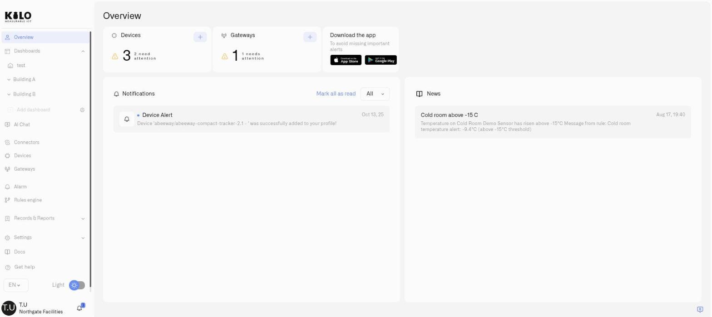

# Settings

Configure your Kilo IoT Server environment. The Settings section in the sidebar covers platform-level preferences and configuration that apply across your deployment.

<figure><figcaption></figcaption></figure>

## What belongs here

- [Profile Settings](profile-settings.md) — Your name, avatar, password, and account management
- [Subscription](subscription.md) — Plan tiers, billing, and SMS credit top-ups
- [Locations](locations.md) — How the site and sub-location hierarchy works, and where it is created
- [API Keys](api-keys.md) — Create scoped keys for external system integrations (the credentials for the [API](../api/README.md) section)

## What is NOT here

Organization management, user permissions, and team membership are accessed from the **user menu** in the bottom-left corner — not from Settings. See the [Account](../account/README.md) section.
