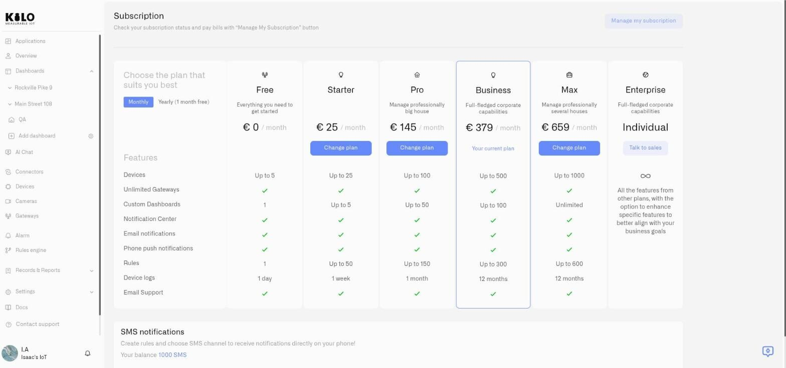
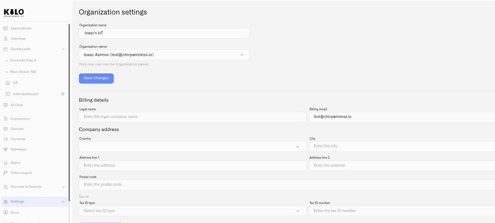

# Billing and Invoices

Kilo IoT supports two ways of paying for a plan, and which one you use is decided once, when the subscription is created.

**By card** is the default and the faster route. You choose a plan, enter card details in the Stripe checkout, and the plan is active the moment the payment clears. Nothing on this page applies to you — your receipts live in the Stripe customer portal, reachable from [Subscription](subscription.md).

**By invoice (bank transfer)** exists because most companies cannot pay a platform subscription on a corporate card. Procurement wants a document with the company's legal name on it, a tax ID, and a bank account to transfer to. That is what this page describes.

<figure><figcaption></figcaption></figure>

## Why it works this way

A card payment and an invoice are different commercial arrangements, not two buttons on the same screen. A card charges immediately, so the plan is active because the money arrived. An invoice is the opposite: the subscription starts, and payment follows within the agreed term. Your team gets the platform straight away and your finance department pays on its own schedule.

That difference has one consequence worth knowing before you start: **on an invoice subscription, an active plan does not mean a paid invoice.** The plan runs while the invoice is open, and if it stays unpaid for 30 days the organization drops to Free-plan limits — see [When an invoice is overdue](#when-an-invoice-is-overdue).

## Before you can be invoiced

An invoice has to be a valid commercial document, which means Kilo needs enough detail to issue one. The platform checks this before it will create an invoice-based subscription, and it checks again if you later edit the details while such a subscription is running — so you find out about a missing field on the form, not after an invoice has failed to issue.

You need:

- **Legal name** — the registered name, not a trading name or an abbreviation
- **Full company address** — country, city, both address lines and postal code
- **Billing email** — where the invoice is sent. Make it a finance mailbox rather than one person's inbox
- **Tax ID** — a type and a number. **Required for companies in the EU-27**

<figure><figcaption></figcaption></figure>

### Adding your company details

1. Go to **Settings → Organization settings**. Only the organization owner can open this page.
2. Scroll to the **Billing details** section, below the organization name and owner.
3. Fill in **Legal name** and **Billing email**, then the **Company address** — Country, City, Address line 1 and 2, Postal code.
4. Under **Tax Id**, choose a **Tax ID type** and enter the **Tax ID number**.
5. Save the section with its own **Save** button.

Billing details are saved **separately from the rest of the page**, so storing them does not disturb your organization name or owner, and renaming the organization later does not touch your billing record.

### The Tax ID and why it is mandatory in the EU

A tax ID is not simply stored. It is verified against the issuing country's register, and because that check runs in the background rather than blocking the form, a small chip beside the **Tax Id** heading tells you where it has got to:

| Chip | What it means |
|---|---|
| **Verification pending** | The check is still running. Carry on; it resolves on its own. |
| **Verified** | The number was accepted. |
| **Not verified** | The number came back invalid. Check it against your registration certificate. |
| **Verification unavailable** | The register could not be reached. This is not a rejection — try again later. |

For companies inside the EU-27 the tax ID is not optional. Kilo IoT bills these subscriptions from the United States, which makes a sale to an EU business a **reverse-charge** transaction: no local VAT is added, and the invoice carries a reverse-charge notice with both parties' numbers instead. That treatment is only valid if your number is on the document, which is why the subscription will not be issued without it.

Outside the EU-27 there is no equivalent requirement. Many countries have no VAT-registration number at all, and an invoice is perfectly valid without one.

> Kilo IoT verifies the number you supply. Whether reverse charge is the correct treatment for your business is a question for your own accountant.

## Choosing to pay by invoice

The payment method is set when the subscription is created, and what you see depends on where you are starting from:

- **No paid subscription yet.** Choosing a plan opens the **Choose payment method** dialog, with **Pay by card** preselected. Choose **Pay by invoice (bank transfer)** and continue. If your billing details are incomplete, that option is disabled and the dialog offers a **Go to organization settings** button instead — fill the section in first and come back.
- **Already paying by card.** Choosing a different plan takes you straight to the Stripe checkout, as it always has. No extra screen appears.
- **Already paying by invoice.** Changing plan shows a confirmation of the change and nothing about payment methods — the arrangement is already settled.

**The method cannot be switched by self-service afterwards.** Moving an existing subscription between card and invoice is a manual operation. If you need to change, contact Kilo IoT rather than cancelling and starting again, which would interrupt your deployment.

## Receiving and paying an invoice

Once the subscription is created, the invoice is issued and sent to your billing email. It arrives as a **PDF attachment** and as a link to a **hosted invoice page** that stays up to date.

The hosted page carries the bank details to pay against, including an account reference **issued specifically for your organization**. Because that reference is yours alone, an incoming transfer is matched to your account automatically — no remittance advice to email, nobody reconciling it by hand.

Pay it as your finance team pays any other supplier invoice. When the transfer lands, the invoice is reconciled and marked **paid** on its own.

**Invoices are settled in full.** There is no partial payment: until the transferred amount covers the invoice, it stays open. A small shortfall caused by intermediary bank charges is tolerated, so a transfer that arrives a rounding amount short is not left hanging.

## The Invoices page

Organizations that pay by invoice get an **Invoices** page listing every invoice raised, its status, and a link to the PDF and the payment page for each one. Reach it from **Subscription**.

The page is only shown to organizations that are actually billed this way. If you pay by card you will not see it, because your receipts are in the Stripe customer portal instead.

## Changing plan on an invoice subscription

Upgrades and downgrades apply **in place** — the existing subscription is amended rather than cancelled and rebuilt, so nothing about your deployment is interrupted.

- **Upgrading** raises your limits immediately and issues an invoice for the difference for the remainder of the current period.
- **Downgrading** credits the unused difference to your account balance, and that credit is drawn down by your next invoice rather than refunded.

Renewals need no action: at each period Kilo issues and sends the next invoice automatically, and if your balance already covers it, it is settled from that balance.

One limit is worth planning around: **the billing currency cannot be changed in place.** Moving an existing subscription to a different currency means cancelling and recreating it, which needs Kilo IoT's involvement.

## When an invoice is overdue

Invoices carry a **14-day payment term**, and nothing is cut off the moment that passes.

**Reminders.** You are emailed four times around the due date: two days before it, on the day itself, and again a week and a fortnight after. Inside the platform a **Payment required** notice appears with a button that opens the invoice.

**What still works.** Your plan and every one of its limits stay fully intact while the invoice is open. The only things blocked are changing plan and starting a new subscription while a debt is outstanding — you keep running exactly as before.

**What happens at 30 days.** Thirty days after the invoice was **issued** — counted from the issue date, not the due date — the organization drops to **Free-plan limits** in a single step. There is no gradual tightening and no second or third stage. The subscription stays visible, the notice stays, and the Invoices page stays available so the debt can still be settled.

**Paying restores everything.** Settle the invoice and the subscription returns to active with its plan and limits back, automatically. Nobody has to be asked to re-enable it.

> **This applies to invoice billing only.** A card subscription never drops to Free limits — an unpaid card payment freezes the account instead. If you pay by card, none of the above describes your situation.

Note also that the retry logic behind failed card payments has no equivalent here: a bank transfer either arrives or it does not, so there is nothing to retry. Clearing the invoice is what restores the plan.

## See also

- [Subscription](subscription.md) — plan tiers, what each one includes, and the limits they apply
- [Organization Settings](../account/organization-settings.md) — where the Billing details section lives
- [Users and Permissions](../account/users-and-permissions.md) — who in your organization can see and change billing
