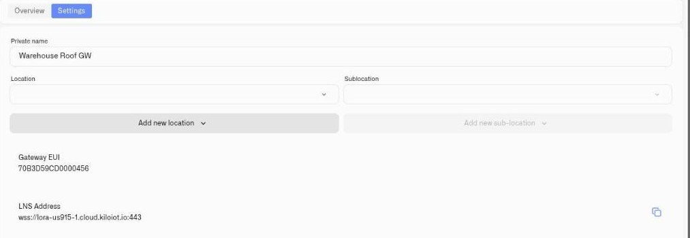
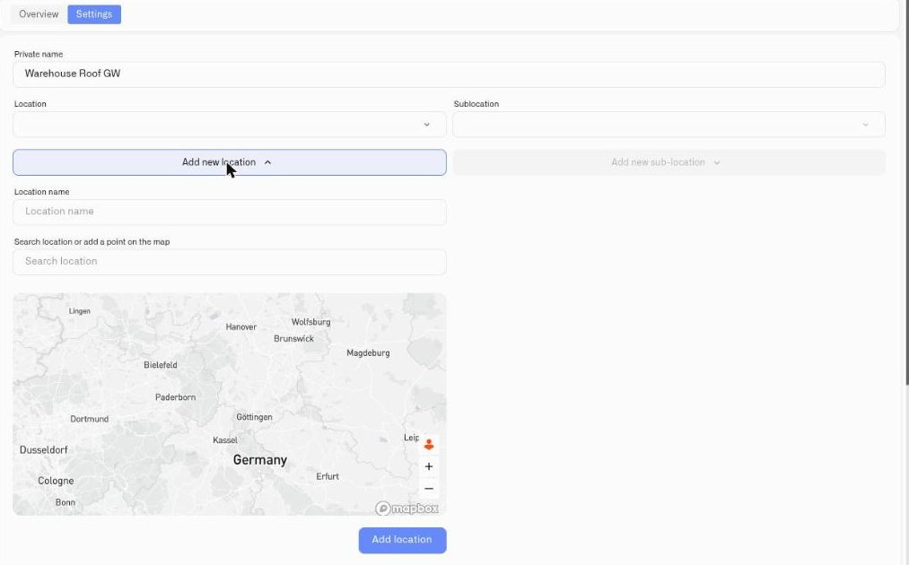

# Locations

Locations give your Kilo IoT Server deployment a spatial structure. By organizing gateways and devices into locations and sub-locations, you create a hierarchy that mirrors your real-world infrastructure — sites, buildings, floors, zones, or any other geographic grouping that makes sense for your operations.

This organizational layer matters as deployments scale. When you manage hundreds of devices across multiple sites, being able to filter by location, assign hardware to specific zones, and see where your infrastructure is deployed makes the difference between operational clarity and data chaos. Locations also carry the coordinates that put your hardware on a map.

## Where locations are managed

There is no separate Locations page in the sidebar. Locations are created and assigned **from the record they belong to** — open a gateway or a device, and go to its **Settings** tab. Two dropdowns sit under the name field:

* **Location** — the top-level site.
* **Sublocation** — the level below it. It stays disabled until a Location is chosen, because a sub-location only exists inside a parent.

Beneath each dropdown is an **Add new location** / **Add new sub-location** button for creating one on the spot.

<figure><figcaption></figcaption></figure>

## Creating a location

1. Open the gateway or device and switch to its **Settings** tab.
2. Click **Add new location**. The form expands in place.
3. Enter a **Location name** — for example "Warehouse Berlin", "Building 3", "Farm North".
4. Set the position, either by typing into **Search location or add a point on the map** and picking a result, or by clicking the point directly on the map.
5. Click **Add location**.

The location is created and becomes selectable in the **Location** dropdown, for this record and every other one in the organization.

<figure><figcaption></figcaption></figure>

**Naming convention:** use names that are meaningful at a glance to your operations team. Include the site or function — "Cold Storage B" is more useful than "Location 2."

## Creating a sub-location

1. Select a **Location** first — the sub-location controls stay disabled until you do.
2. Click **Add new sub-location**.
3. Enter the name and confirm.

Sub-locations create a hierarchy within a location — floors within a building, zones within a warehouse, rooms within a facility.

## Assigning a record to a location

On the same Settings tab, pick a **Location** (and optionally a **Sublocation**) from the dropdowns and click **Save changes**. The assignment then shows up wherever locations are surfaced — the **Location / Sub-location** column on the Gateways list, and the location filters above it, which include a **No location** filter for finding hardware that has not been placed yet.

## Enterprise examples

| Deployment | Location structure |
|------------|-------------------|
| Multi-site warehouse network | Locations: each warehouse. Sub-locations: zones (receiving, cold storage, staging). |
| Office building portfolio | Locations: each building. Sub-locations: floors. |
| Agricultural operation | Locations: each farm or field. Sub-locations: irrigation zones, greenhouses, barns. |
| Retail chain | Locations: each store. Sub-locations: stockroom, sales floor, HVAC zone. |

## What's next

Once locations are in place, the coordinates you set are what put a gateway or device on a map — see [Map Widget](../dashboards/adding-widgets/map-widget.md). Device assignment is part of the [Device Management](../devices/device-management.md) workflow.
