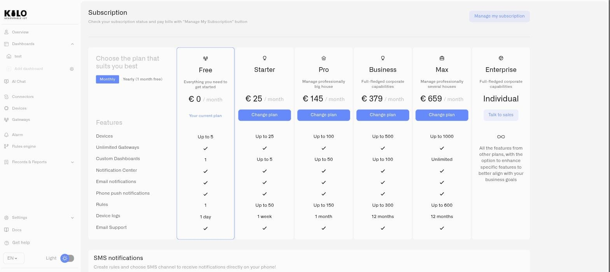

# Subscription

The Subscription page lets you view your current plan, compare available tiers, and manage billing. It is the central place to understand what your plan includes and to upgrade when your deployment outgrows its current limits.

## Accessing Subscription

Navigate to **Settings > Subscription** in the sidebar.

## Plan Tiers

Kilo IoT Server offers a free tier alongside paid tiers that scale up to a custom **Enterprise** plan. Each step up raises the ceilings your deployment runs against — devices, custom dashboards, rules, and how far back device logs are retained — and unlocks more of the notification and support features. Pricing is per month.

| Tier | Price | Devices | Custom dashboards | Rules | Device-log retention |
|---|---|---|---|---|---|
| **Free** | €0 | Up to 5 | 1 | 1 | 1 day |
| **Starter** | €25 | Up to 25 | Up to 5 | Up to 50 | 1 week |
| **Pro** | €145 | Up to 100 | Up to 50 | Up to 150 | 1 month |
| **Business** | €379 | Up to 500 | Up to 100 | Up to 300 | 12 months |
| **Max** | €659 | Up to 1000 | Unlimited | Up to 600 | 12 months |
| **Enterprise** | Individual | Custom | Custom | Custom | Custom |

Beyond these ceilings, the plan comparison on the Subscription page also shows which tiers include unlimited gateways, the Notification Center, email and push notifications, and email support. The free tier lets you explore the platform with no payment details required; the **Enterprise** tier carries everything from the other plans with the option to raise specific limits to fit your operation, on individual pricing and terms.

<figure><figcaption></figcaption></figure>

## Upgrading Your Plan

To move onto a paid plan, choose the tier you want on the plan comparison and click **Upgrade Plan**. This takes you straight to the Stripe checkout, where you enter payment details and activate the plan — there is no separate confirmation step in between. All payment processing is handled by Stripe, and plan changes take effect immediately. Plan limits apply from the moment a plan is active.

For the **Enterprise** tier, click **Talk to sales** to reach the Kilo IoT team for custom pricing and terms.

## Plan limits

Each plan caps how much of the platform you can use — devices, custom dashboards, rules, and history retention. Limits apply from the moment a plan is active, and the platform enforces them as you work rather than at billing time.

**Dashboards are a common limit to hit.** When you reach the number of custom dashboards your plan allows and try to add another, Kilo tells you the **Dashboard limit reached** and explains that your plan allows up to your tier's count. From there you can **Upgrade Plan** to raise the limit, or remove an existing dashboard to free a slot. The same applies to other capped resources — the comparison matrix shows the ceiling for each one, so you can size the right tier before you hit it.

## Managing an Existing Subscription

Current subscribers see a **Manage my subscription** button. This opens the Stripe customer portal, where you can:

- Update your payment method
- View invoices and payment history
- Cancel or modify your subscription

## SMS Credits

If your plan supports SMS notifications, the Subscription page includes an SMS add-on section showing your current credit balance and the per-message cost. To purchase additional credits:

1. Enter the desired quantity in the top-up form.
2. The minimum purchase is 0.50 EUR.
3. Confirm the purchase — credits are added to your balance and remain valid for one year.
